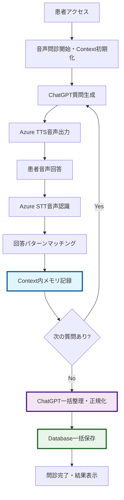

# 医療問診票アプリ実装設計書 (med_questionnaire)

## 📋 概要

ChatGPTベースの対話型発熱患者問診システム。既存のsocket-chatインフラを活用し、医療問診専用の対話フローを実装する。

## 🎯 実装方針

### 基本アーキテクチャ
- **フロントエンド**: SocketChatComponentをベースとした専用問診ページ
- **バックエンド**: chat構造を模倣したmed_questionnaire専用モジュール  
- **対話エンジン**: ChatGPTを活用した構造化問診フロー
- **データ管理**: Prismaによる問診結果の永続化
- **音声統合**: socket-chatの音声機能を完全統合した音声中心の問診

### 音声ファーストアプローチ
**医療問診の特性上、音声による質問・回答を基本とする:**
- **音声質問**: ChatGPTの質問をAzure Speech Serviceで自動読み上げ
- **音声回答**: 患者の回答をAzure Speech-to-Textで認識・テキスト化
- **WebSocket音声**: socket-chatと同じWebSocketベース音声通信
- **音声優先UI**: 音声での操作を前提としたインターフェース設計
- **バックアップ入力**: 音声認識失敗時のテキスト入力フォールバック

### 再利用可能コンポーネント
既存socketChatから以下を活用:
- `SocketChatInput`: 入力インターフェース（音声入力統合）
- `SocketChatMessage`: メッセージ表示
- `MarkdownPreview`: レスポンス表示
- `SpeechControls`: 音声制御コンポーネント
- `useWebSocketChat`: WebSocket通信ロジック（カスタマイズ）
- `useAzureSpeech`: Azure音声認識フック
- `useConversation`: 会話状態管理フック

### Utils共通化方針
**軽量な機能テーマフォルダーを維持するため、汎用性のある機能をutils化:**
- **音声関連**: speech処理の共通ロジック
- **バリデーション**: 医療データ検証の共通パターン  
- **データ変換**: 回答正規化・パターンマッチング
- **WebSocket**: 問診専用WebSocket拡張
- **AI統合**: ChatGPT問診特化ヘルパー

## 🏗️ システム構成

### フロントエンド構造
```
frontend/src/
├── pages/
│   └── MedQuestionnaire.tsx          # 音声問診専用ページ
├── components/
│   └── medQuestionnaire/
│       ├── VoiceQuestionnaireChat.tsx    # 音声問診チャットコンポーネント
│       ├── QuestionnaireProgress.tsx     # 進捗表示
│       ├── VoiceSpeechControls.tsx       # 問診専用音声制御
│       ├── QuestionnaireForm.tsx         # 構造化入力フォーム（音声バックアップ）
│       └── QuestionnaireSummary.tsx      # 問診結果サマリー
├── hooks/
│   ├── useMedQuestionnaire.ts        # 問診専用フック（音声統合）
│   └── useVoiceQuestionnaire.ts      # 音声問診専用フック
└── types/
    └── medQuestionnaire.ts           # 型定義

# 既存socketChatから再利用
├── components/socketChat/
│   ├── SocketChatInput.tsx           # 再利用: 音声入力統合済み
│   ├── SocketChatMessage.tsx         # 再利用: メッセージ表示
│   ├── SpeechControls.tsx            # 再利用: 音声制御ベース
│   └── MarkdownPreview.tsx           # 再利用: レスポンス表示
├── hooks/
│   ├── useAzureSpeech.ts             # 再利用: Azure音声認識
│   ├── useWebSocketChat.ts           # 再利用: WebSocket通信
│   └── useConversation.ts            # 再利用: 会話状態管理
└── contexts/
    └── ConversationProvider.tsx      # 再利用: 会話コンテキスト
```

### バックエンド構造  
```
backend/src/med_questionnaire/
├── index.ts                          # メインエントリーポイント
├── routes.ts                         # Express ルーティング
├── controllers/
│   ├── questionnaireController.ts    # API コントローラー
│   ├── voiceQuestionnaireController.ts # 音声問診専用コントローラー
│   └── contextController.ts          # Context管理専用コントローラー
├── services/
│   ├── questionnaireService.ts       # 問診ビジネスロジック（軽量化）
│   ├── questionFlowService.ts       # 質問フロー管理（軽量化）
│   ├── fastQuestionnaireService.ts  # 高速Context管理サービス
│   └── finalizationService.ts       # 一括整理・保存サービス
├── types.ts                          # 型定義（Context構造、API型など）
├── webSocket/
│   └── questionnaireSocketHandler.ts # WebSocket専用ハンドラー（Context対応）
├── context/
│   ├── questionnaireSystemContext.ts # ChatGPT用システムコンテキスト
│   └── finalizationContext.ts       # 一括整理用プロンプト
├── schemas/
│   └── questionnaireSchemas.ts       # Zodバリデーションスキーマ
└── seedData/
    ├── questionTemplates.ts          # 質問テンプレートシードデータ
    └── answerPatterns.ts             # 回答パターンシードデータ

# Utils共通化により移動される機能
backend/src/utils/
├── medicalData/
│   ├── answerPatternMatcher.ts       # 回答パターンマッチング
│   ├── medicalDataValidator.ts       # 医療データ検証
│   ├── answerNormalizer.ts           # 回答正規化
│   └── contextDataManager.ts         # Context内データ管理
├── speech/
│   ├── speechWebSocketHandler.ts     # 音声WebSocket共通処理
│   ├── azureSpeechIntegration.ts     # Azure Speech統合
│   └── voiceQuestionnaireUtils.ts    # 音声問診ユーティリティ
├── chatgpt/
│   ├── medicalPromptBuilder.ts       # 医療問診プロンプト生成
│   ├── responseParser.ts             # ChatGPT回答解析
│   ├── questionnaireAIService.ts     # 問診AI統合サービス
│   └── finalizationAIService.ts     # 一括整理AI処理
├── questionnaire/
│   ├── templateManager.ts            # 質問テンプレート管理
│   ├── flowController.ts             # 問診フロー制御
│   ├── dataExporter.ts               # 問診結果エクスポート
│   ├── contextManager.ts             # 高速Context管理
│   └── sessionManager.ts             # セッション状態管理
└── performance/
    ├── memoryOptimizer.ts            # メモリ使用量最適化
    ├── responseTimeTracker.ts        # レスポンス時間計測
    └── contextCleanup.ts             # Context自動クリーンアップ
```

## 📝 問診フロー設計

### 問診段階定義
1. **基本情報収集** (Stage 1)
   - 氏名、生年月日、性別、住所
   - 来院方法、PCR検査希望

2. **症状確認** (Stage 2)  
   - 体温、発熱開始時期
   - 症状チェックリスト（咳、鼻水、喉の痛み等）

3. **ワクチン接種歴** (Stage 3)
   - 接種回数、接種日、ワクチン種類

4. **接触・渡航歴** (Stage 4)
   - 感染者との接触、海外渡航歴

5. **医療歴確認** (Stage 5)
   - 既往歴、服薬歴、アレルギー歴
   - 他院受診歴

6. **生活習慣** (Stage 6)
   - 飲酒、喫煙歴

7. **確認・完了** (Stage 7)
   - 入力内容確認、問診完了

### ChatGPT問診コンテキスト

#### システムプロンプト設計
```typescript
export class QuestionnaireSystemContext {
  static buildSystemContext(
    stage: QuestionnaireStage, 
    questionTemplate: QuestionTemplate,
    answerPatterns: AnswerPattern[]
  ): string {
    return `
あなたは○○病院の問診システムです。発熱患者の構造化問診を行います。

# 基本原則
1. 一度に1つの質問のみ行う
2. 患者の回答に基づいて次の質問を決定
3. 必要な情報を過不足なく収集
4. 医療従事者向けの正確なデータを生成

# 現在のステージ: ${stage}
# 質問情報
- 質問キー: ${questionTemplate.questionKey}
- 質問タイプ: ${questionTemplate.questionType}
- データフィールド: ${questionTemplate.dataField}
- 必須項目: ${questionTemplate.isRequired ? 'はい' : 'いいえ'}

# AI判断コンテキスト
${questionTemplate.aiContext || ''}

# 患者回答例（AI判断参考）
${questionTemplate.answerExample1 ? `例1: ${questionTemplate.answerExample1}` : ''}
${questionTemplate.answerExample2 ? `例2: ${questionTemplate.answerExample2}` : ''}
${questionTemplate.answerExample3 ? `例3: ${questionTemplate.answerExample3}` : ''}
${questionTemplate.answerExample4 ? `例4: ${questionTemplate.answerExample4}` : ''}
${questionTemplate.answerExample5 ? `例5: ${questionTemplate.answerExample5}` : ''}

# 既知の回答パターン
${answerPatterns.map(pattern => 
  `- 入力: "${pattern.inputPattern}" → 正規化: "${pattern.normalizedValue}" (信頼度: ${pattern.confidence})`
).join('\n')}

# 質問テンプレート
${questionTemplate.questionText}

# バリデーションルール
${JSON.stringify(questionTemplate.validationRules, null, 2)}

# 選択肢（該当する場合）
${questionTemplate.choices ? JSON.stringify(questionTemplate.choices) : 'なし'}

# レスポンス形式
{
  "question": "患者への質問文（テンプレートをベースに調整）",
  "questionType": "${questionTemplate.questionType}",
  "choices": ${questionTemplate.choices || 'null'}, // choiceタイプの場合
  "dataField": "${questionTemplate.dataField}",
  "answerHints": ["患者向けの回答ヒント1", "ヒント2"], // 回答例から生成
  "validationMessage": "入力形式の説明",
  "isRequired": ${questionTemplate.isRequired},
  "confidence": 0.0-1.0, // 回答解析の信頼度
  "isComplete": false|true,
  "nextQuestionKey": "次の質問キー名"
}

# 回答解析指示
患者の回答を受け取った際は、既知の回答パターンと照合し、最も適切な正規化された値を返してください。
新しいパターンを発見した場合は、学習データとして提案してください。
    `;
  }
  
  static buildAnswerAnalysisContext(
    userAnswer: string,
    questionTemplate: QuestionTemplate,
    answerPatterns: AnswerPattern[]
  ): string {
    return `
# 回答解析タスク
患者回答: "${userAnswer}"
質問: ${questionTemplate.questionText}
データ型: ${questionTemplate.questionType}

# 既知パターンとの照合
${answerPatterns.map(pattern => 
  `パターン: ${pattern.inputPattern} → ${pattern.normalizedValue} (信頼度: ${pattern.confidence})`
).join('\n')}

# 解析結果形式
{
  "rawAnswer": "${userAnswer}",
  "normalizedValue": "正規化された値",
  "dataType": "${questionTemplate.questionType}",
  "confidence": 0.0-1.0,
  "isValid": true|false,
  "validationErrors": ["エラーメッセージ"],
  "suggestedPattern": {
    "inputPattern": "新しいパターン（正規表現）",
    "normalizedValue": "正規化値",
    "patternType": "standard|variation|edge_case"
  },
  "needsFollowUp": true|false,
  "followUpReason": "追加質問が必要な理由"
}
    `;
  }
}
```

### 質問テンプレート例

#### 基本情報収集（basic_info）
```typescript
// 氏名質問例
{
  stage: "basic_info",
  questionKey: "patient_name",
  questionText: "お名前（ふりがな）を教えてください。",
  questionType: "free_text",
  dataField: "fullName",
  aiContext: "患者の氏名とふりがなを収集。漢字とひらがなの両方を記録。",
  answerExample1: "田中太郎（たなかたろう）",
  answerExample2: "山田花子（やまだはなこ）です",
  answerExample3: "佐藤　一郎　(さとういちろう)",
  answerExample4: "鈴木美香 すずきみか",
  answerExample5: "田中太郎と申します。読み方はたなかたろうです。",
  validationRules: {
    minLength: 2,
    maxLength: 100,
    required: true
  }
}

// 体温質問例
{
  stage: "symptoms", 
  questionKey: "current_temperature",
  questionText: "現在の体温を教えてください。",
  questionType: "number",
  dataField: "currentTemperature",
  aiContext: "体温を摂氏で記録。小数点1位まで。35-42度の範囲が一般的。",
  answerExample1: "38.5度",
  answerExample2: "37.2℃",
  answerExample3: "39度くらい",
  answerExample4: "38.8",
  answerExample5: "熱は38度5分です",
  validationRules: {
    min: 35.0,
    max: 42.0,
    decimalPlaces: 1
  }
}

// 症状選択例
{
  stage: "symptoms",
  questionKey: "current_symptoms", 
  questionText: "現在の症状で当てはまるものを教えてください。",
  questionType: "choice",
  dataField: "symptoms",
  choices: ["咳", "鼻水", "喉の痛み", "関節痛", "味覚異常", "嗅覚異常", "腹痛", "下痢", "呼吸苦", "倦怠感", "頭痛", "めまい"],
  aiContext: "複数選択可能。症状の有無を正確に把握。",
  answerExample1: "咳と喉の痛み、倦怠感があります",
  answerExample2: "頭痛が少しあります",
  answerExample3: "咳、鼻水、関節痛",
  answerExample4: "特にありません",
  answerExample5: "咳がひどくて、熱っぽい感じがします",
  validationRules: {
    allowMultiple: true,
    allowNone: true
  }
}
```

## 🎤 音声統合設計

### 高速問診フロー概要（Context管理による待ち時間最小化）


### Context管理による高速化
**各質問回答時にDBアクセスせず、メモリContextで管理:**
- **即座の次質問**: 回答→Context記録→即座に次の質問生成
- **待ち時間最小化**: DB書き込み待機なしで問診継続
- **一括処理**: 問診完了時にChatGPTが全回答を整理・正規化
- **確実な保存**: 整理済みデータを一括でDB保存
```

## 🚀 高速Context管理システム

### 問診Context構造
```typescript
interface QuestionnaireContext {
  sessionId: string;
  patientId?: string;
  startedAt: Date;
  currentStage: QuestionnaireStage;
  currentQuestionIndex: number;
  
  // メモリ内回答記録（DB保存なし）
  answerHistory: Array<{
    questionKey: string;
    questionText: string;
    rawAnswer: string;
    recognizedText?: string; // 音声認識結果
    confidence?: number;
    timestamp: Date;
    stage: string;
  }>;
  
  // 進捗管理
  completedStages: string[];
  totalQuestions: number;
  answeredQuestions: number;
  
  // 一括整理用データ
  finalNormalizedData?: {
    [fieldName: string]: any;
  };
}
```

### 高速回答記録システム
```typescript
class FastQuestionnaireService {
  private contextStore = new Map<string, QuestionnaireContext>();
  
  // 即座の回答記録（DB書き込みなし）
  async recordAnswerToContext(
    sessionId: string, 
    questionKey: string,
    rawAnswer: string,
    recognizedText?: string
  ): Promise<void> {
    const context = this.contextStore.get(sessionId);
    if (!context) throw new Error('Session not found');
    
    // メモリ内即座記録
    context.answerHistory.push({
      questionKey,
      questionText: await this.getQuestionText(questionKey),
      rawAnswer,
      recognizedText,
      confidence: recognizedText ? 0.95 : 1.0,
      timestamp: new Date(),
      stage: context.currentStage
    });
    
    context.answeredQuestions++;
    
    // 即座に次の質問準備（DB待ちなし）
    await this.prepareNextQuestion(context);
  }
  
  // 問診完了時のChatGPT一括整理
  async finalizeQuestionnaire(sessionId: string): Promise<MedQuestionnaire> {
    const context = this.contextStore.get(sessionId);
    if (!context) throw new Error('Session not found');
    
    // ChatGPTに全回答を渡して正規化依頼
    const normalizedData = await this.chatGPTService.normalizeAllAnswers(
      context.answerHistory
    );
    
    // 一括DB保存
    const savedQuestionnaire = await this.saveToDatabase({
      sessionId,
      normalizedData,
      rawAnswerHistory: context.answerHistory
    });
    
    // Context削除
    this.contextStore.delete(sessionId);
    
    return savedQuestionnaire;
  }
}
```

### ChatGPT一括整理プロンプト
```typescript
export class QuestionnaireSystemContext {
  static buildFinalizationContext(answerHistory: AnswerRecord[]): string {
    return `
# 問診回答一括整理タスク

あなたは医療問診の回答を整理・正規化する専門システムです。
患者の全回答を受け取り、構造化されたデータベース形式に変換してください。

## 回答履歴
${answerHistory.map((answer, index) => `
${index + 1}. 質問: ${answer.questionText}
   回答: ${answer.rawAnswer}
   ${answer.recognizedText ? `音声認識: ${answer.recognizedText}` : ''}
   段階: ${answer.stage}
   時刻: ${answer.timestamp}
`).join('\n')}

## 整理要件
1. 同じ意味の回答は統合（例：「男性」「男」→「男性」）
2. 数値は適切な型に変換（例：「38度5分」→38.5）
3. 日付は標準形式に統一（例：「昨日の夕方」→相対日付計算）
4. 症状は配列形式で整理
5. 空回答・不明回答は null で統一

## 出力形式（JSON）
{
  "basicInfo": {
    "fullName": "正規化された氏名",
    "gender": "男性|女性|その他",
    "birthDate": "YYYY-MM-DD",
    "address": "住所",
    "phoneNumber": "電話番号",
    "emergencyContact": "緊急連絡先"
  },
  "visitInfo": {
    "transportMethod": "来院方法",
    "pcrTestDesired": true|false
  },
  "vitals": {
    "height": 数値,
    "weight": 数値,
    "morningTemperature": 数値,
    "currentTemperature": 数値,
    "feverStartDate": "発熱開始時期"
  },
  "symptoms": ["症状1", "症状2"],
  "vaccination": {
    "count": 数値,
    "history": [{"date": "YYYY-MM-DD", "type": "ワクチン種類"}]
  },
  "contactHistory": {
    "suspectedContact": true|false,
    "closeContact": true|false,
    "overseasTravel": true|false,
    "travelContactHistory": true|false
  },
  "medicalHistory": {
    "otherHospitalVisit": true|false,
    "chronicTreatment": true|false,
    "treatmentDetails": "詳細",
    "surgeryHistory": true|false
  },
  "medication": {
    "otcMedication": true|false,
    "medicationDetails": "薬剤詳細",
    "allergies": true|false,
    "allergyDetails": "アレルギー詳細"
  },
  "lifestyle": {
    "drinkingHabits": "飲酒習慣",
    "smokingHabits": "喫煙習慣",
    "smokingHistory": "喫煙歴詳細"
  },
  "metadata": {
    "totalQuestions": ${answerHistory.length},
    "completionTime": "問診所要時間",
    "confidence": "全体的な回答信頼度（0-1）"
  }
}
    `;
  }
}
```

### 音声WebSocket通信
**socket-chatと同じWebSocketインフラを活用:**
```typescript
// 高速音声問診WebSocketメッセージ
interface VoiceQuestionnaireMessage extends WebSocketMessage {
  type: 'voice_question' | 'voice_answer' | 'speech_status' | 'questionnaire_progress' | 'context_updated' | 'finalization_start' | 'questionnaire_complete';
  data: {
    // 音声質問
    questionAudio?: {
      audioBuffer: ArrayBuffer;
      questionText: string;
      questionKey: string;
      stage: string;
      questionIndex: number;
    };
    // 音声回答（Context即座記録）
    answerAudio?: {
      audioBuffer: ArrayBuffer;
      recognizedText: string;
      confidence: number;
      contextRecorded: boolean; // Context記録完了フラグ
      nextQuestionReady: boolean; // 次質問準備完了フラグ
    };
    // Context更新通知
    contextUpdate?: {
      answeredQuestions: number;
      totalQuestions: number;
      currentStage: string;
      memoryUsage: number; // Context内記録数
    };
    // 問診完了・一括整理
    finalization?: {
      status: 'processing' | 'completed' | 'error';
      totalAnswers: number;
      processingTime?: number;
      savedRecordId?: string;
    };
    // 音声ステータス
    speechStatus?: {
      isListening: boolean;
      isSpeaking: boolean;
      isProcessing: boolean;
      isContextRecording: boolean; // Context記録中フラグ
    };
    // 高速進捗表示
    progress?: {
      currentStage: string;
      completedQuestions: number;
      totalQuestions: number;
      percentage: number;
      estimatedTimeRemaining: number; // 残り予想時間（秒）
    };
  };
}
```

### Azure Speech Service統合
**既存のAzure Speech実装を完全活用:**
```typescript
// 音声問診専用設定
interface VoiceQuestionnaireConfig {
  // 音声認識設定
  speechToText: {
    language: 'ja-JP';
    recognitionMode: 'Interactive'; // 短い回答に最適
    profanityOption: 'Masked';
    enableDictation: true;
  };
  // 音声合成設定  
  textToSpeech: {
    language: 'ja-JP';
    voice: 'ja-JP-NanamiNeural'; // 優しい女性音声
    speakingRate: '0.9'; // 少しゆっくり
    pitch: '+0Hz';
    style: 'gentle'; // 医療現場に適した優しいトーン
  };
  // 問診専用設定
  questionnaire: {
    autoQuestionReading: true; // 質問の自動読み上げ
    answerTimeoutMs: 10000; // 回答タイムアウト
    retryOnNoMatch: 3; // 認識失敗時のリトライ回数
    confirmationRequired: false; // 回答確認（シンプル化）
  };
}
```

### 音声UI/UX設計
**医療現場に特化した音声インターフェース:**
```typescript
interface VoiceQuestionnaireUI {
  // 音声状態表示
  speechIndicator: {
    listeningAnimation: 'pulsing-microphone';
    speakingAnimation: 'sound-waves';
    processingAnimation: 'thinking-dots';
    readyState: 'gentle-glow';
  };
  // 音声フィードバック
  audioFeedback: {
    questionStart: 'soft-chime'; // 質問開始音
    listeningStart: 'gentle-beep'; // 聞き取り開始音
    answerReceived: 'confirmation-ding'; // 回答受信音
    errorSound: 'soft-error-tone'; // エラー音（優しい）
  };
  // 緊急時バックアップ
  fallbackOptions: {
    textInputButton: 'large-emergency-button';
    repeatQuestionButton: 'replay-icon';
    helpButton: 'assistance-icon';
    skipQuestionButton: 'next-arrow';
  };
}
```

## 🔒 基本セキュリティ要件（技術検証用）

### データ保護（最小限実装）
```typescript
// 技術検証用の基本的なデータ保護
interface BasicDataSecurity {
  storage: {
    database: 'standard-prisma-encryption';
    sessions: 'temporary-storage-only';
  };
  transmission: {
    api: 'https-only';
    websocket: 'wss-encrypted';
  };
  retention: {
    questionnaireData: '30-days'; // 技術検証期間
    voiceData: 'session-only';    // セッション終了時削除
  };
  access: {
    authentication: 'basic-jwt';
    sessionTimeout: '2-hours';    // 技術検証用延長
  };
}
```

## ⚡ エラーハンドリング（技術検証用）

### 基本的なエラー対応
```typescript
interface BasicErrorHandling {
  speechRecognitionFailure: {
    maxRetries: 2;
    fallbackAction: 'show-text-input';
    userGuidance: '音声認識に失敗しました。テキスト入力をお試しください';
  };
  speechSynthesisFailure: {
    fallbackAction: 'display-text-only';
    retryOption: 'manual-replay-button';
  };
  networkInterruption: {
    localCaching: 'basic-localstorage-save';
    resumeStrategy: 'resume-from-current-question';
  };
  apiServiceFailure: {
    fallbackMode: 'static-question-templates';
    userNotification: 'simple-error-message';
  };
}
```

### 簡易データ保護
```typescript
interface SimpleDataProtection {
  autoSave: {
    frequency: 'per-question-completion';
    storage: 'browser-localstorage';
    cleanup: 'session-end-or-24hours';
  };
  sessionManagement: {
    timeout: '2-hours';
    warningTime: '10-minutes-before';
    recovery: 'basic-session-restore';
  };
}
```

## 🔧 技術仕様

### データベーススキーマ (Prisma)
```prisma
model MedQuestionnaire {
  id                    String   @id @default(cuid())
  sessionId            String   @unique
  patientId            String?
  
  // 基本情報
  fullName             String?
  birthDate            DateTime?
  gender               String?
  address              String?
  phoneNumber          String?
  emergencyContact     String?
  transportMethod      String?
  pcrTestDesired       Boolean?
  
  // 体温・症状
  height               Int?
  weight               Int?
  currentTemperature   Float?
  morningTemperature   Float?
  feverStartDate       DateTime?
  symptoms             Json? // 症状チェックリスト
  
  // ワクチン接種歴
  vaccinations         Json? // 接種歴配列
  
  // 接触・渡航歴
  suspectedContact     Boolean?
  closeContact         Boolean?
  overseasTravel       Boolean?
  travelContactHistory Boolean?
  
  // 医療歴
  otherHospitalVisit   Boolean?
  chronicTreatment     Boolean?
  treatmentDetails     String?
  previousHospitalHistory Boolean?
  surgeryHistory       Boolean?
  
  // 服薬・アレルギー
  overtcMedication     Boolean?
  medicationDetails    String?
  allergies            Boolean?
  allergyDetails       String?
  
  // 生活習慣
  drinkingHabits       String?
  smokingHabits        String?
  smokingHistory       String?
  
  // メタデータ
  currentStage         String   @default("basic_info")
  isCompleted          Boolean  @default(false)
  completedAt          DateTime?
  
  createdAt            DateTime @default(now())
  updatedAt            DateTime @updatedAt
  
  @@map("med_questionnaires")
}

model QuestionnaireMessage {
  id              String   @id @default(cuid())
  sessionId       String
  messageType     String   // "question" | "answer" | "system"
  content         String
  metadata        Json?    // 構造化データ
  timestamp       DateTime @default(now())
  
  questionnaire   MedQuestionnaire @relation(fields: [sessionId], references: [sessionId])
  
  @@map("questionnaire_messages")
}

model QuestionTemplate {
  id                    String   @id @default(cuid())
  stage                 String   // "basic_info", "symptoms", "vaccination", etc.
  questionKey           String   // "patient_name", "fever_temperature", etc.
  questionText          String   // AI用の質問テンプレート
  questionType          String   // "free_text", "choice", "date", "number", "boolean"
  dataField             String   // 対応するMedQuestionnaireのフィールド名
  isRequired            Boolean  @default(true)
  order                 Int      // ステージ内での質問順序
  
  // AI判断用の情報
  aiContext             String?  // AIが理解すべきコンテキスト情報
  validationRules       Json?    // バリデーションルール（数値範囲、文字列長等）
  followUpConditions    Json?    // 次の質問への条件分岐
  
  // 回答例（AI判断用）
  answerExample1        String?  // 回答例1
  answerExample2        String?  // 回答例2  
  answerExample3        String?  // 回答例3
  answerExample4        String?  // 回答例4
  answerExample5        String?  // 回答例5
  
  // 選択肢（choice型の場合）
  choices               Json?    // ["選択肢1", "選択肢2", ...]
  
  isActive              Boolean  @default(true)
  createdAt             DateTime @default(now())
  updatedAt             DateTime @updatedAt
  
  @@unique([stage, questionKey])
  @@map("question_templates")
}

model AnswerPattern {
  id                    String   @id @default(cuid())
  questionTemplateId    String
  patternType           String   // "standard", "variation", "edge_case"
  inputPattern          String   // 患者の入力パターン（正規表現対応）
  normalizedValue       String   // 正規化された値
  dataType              String   // "string", "number", "boolean", "date"
  confidence            Float    @default(1.0) // AI判断の信頼度
  
  // AI学習用メタデータ
  frequency             Int      @default(1) // この回答パターンの出現頻度
  lastUsed              DateTime @default(now())
  
  questionTemplate      QuestionTemplate @relation(fields: [questionTemplateId], references: [id], onDelete: Cascade)
  
  createdAt             DateTime @default(now())
  updatedAt             DateTime @updatedAt
  
  @@map("answer_patterns")
}
```

### API エンドポイント設計

#### RESTful API
```typescript
// 問診セッション管理
POST   /api/med-questionnaire/sessions      # 新規問診開始
GET    /api/med-questionnaire/sessions/:id  # 問診状況取得
PUT    /api/med-questionnaire/sessions/:id  # 問診データ更新
DELETE /api/med-questionnaire/sessions/:id  # 問診削除

// 問診データ操作
GET    /api/med-questionnaire/:sessionId/data     # 問診データ取得
PUT    /api/med-questionnaire/:sessionId/data     # 部分データ更新
POST   /api/med-questionnaire/:sessionId/complete # 問診完了

// 問診結果
GET    /api/med-questionnaire/:sessionId/summary  # 問診結果サマリー
POST   /api/med-questionnaire/:sessionId/export   # 問診結果エクスポート

// 質問テンプレート管理
GET    /api/med-questionnaire/templates          # 全質問テンプレート取得
GET    /api/med-questionnaire/templates/:stage   # ステージ別質問テンプレート取得
POST   /api/med-questionnaire/templates          # 新規質問テンプレート作成
PUT    /api/med-questionnaire/templates/:id      # 質問テンプレート更新
DELETE /api/med-questionnaire/templates/:id      # 質問テンプレート削除

// 回答パターン管理
GET    /api/med-questionnaire/templates/:id/patterns    # 質問別回答パターン取得
POST   /api/med-questionnaire/templates/:id/patterns    # 新規回答パターン追加
PUT    /api/med-questionnaire/patterns/:id              # 回答パターン更新
DELETE /api/med-questionnaire/patterns/:id              # 回答パターン削除

// AI支援機能
POST   /api/med-questionnaire/ai/parse-answer           # 回答の自動解析・正規化
POST   /api/med-questionnaire/ai/suggest-followup       # 次の質問提案
POST   /api/med-questionnaire/ai/validate-answer        # 回答妥当性チェック
```

#### WebSocket API
```typescript
// WebSocket接続パス
/ws/med-questionnaire/:sessionId

// メッセージ形式
{
  type: "user_answer" | "ai_question" | "stage_change" | "completion",
  sessionId: string,
  data: {
    content: string,
    metadata?: QuestionnaireMetadata
  }
}
```

### フロントエンド状態管理
```typescript
interface QuestionnaireState {
  sessionId: string | null;
  currentStage: QuestionnaireStage;
  messages: QuestionnaireMessage[];
  collectedData: Partial<MedQuestionnaireData>;
  isCompleted: boolean;
  isLoading: boolean;
  error: string | null;
}

// カスタムフック
const useMedQuestionnaire = () => {
  const [state, setState] = useState<QuestionnaireState>(initialState);
  
  const startQuestionnaire = () => { /* セッション開始 */ };
  const sendAnswer = (answer: string) => { /* 回答送信 */ };
  const updateData = (data: Partial<MedQuestionnaireData>) => { /* データ更新 */ };
  const completeQuestionnaire = () => { /* 問診完了 */ };
  
  return { state, startQuestionnaire, sendAnswer, updateData, completeQuestionnaire };
};
```

## 🧪 テスト戦略

### 単体テスト (Vitest)
```typescript
// サービス層テスト
describe('QuestionnaireService', () => {
  test('should start new questionnaire session', async () => {
    const session = await questionnaireService.startSession();
    expect(session.currentStage).toBe('basic_info');
  });
  
  test('should validate answer and progress stage', async () => {
    const result = await questionnaireService.processAnswer(sessionId, answer);
    expect(result.nextStage).toBeDefined();
  });
});

// ChatGPT連携テスト
describe('ChatGPTService', () => {
  test('should generate appropriate question for stage', async () => {
    const question = await chatGPTService.generateQuestion('basic_info', context);
    expect(question.questionType).toBeDefined();
  });
});
```

### 統合テスト
```typescript
// WebSocket通信テスト
describe('Questionnaire WebSocket', () => {
  test('should handle full questionnaire flow', async () => {
    const ws = new WebSocket('/ws/med-questionnaire/test-session');
    // 全問診フローの動作確認
  });
});

// API エンドポイントテスト  
describe('Questionnaire API', () => {
  test('should create and manage questionnaire session', async () => {
    const response = await request(app)
      .post('/api/med-questionnaire/sessions')
      .expect(201);
  });
});
```

## 🚀 デプロイ・運用考慮事項

### セキュリティ要件
- **個人情報保護**: 医療データの暗号化
- **アクセス制御**: 医療従事者のみアクセス可能
- **監査ログ**: 全操作の記録・追跡
- **データ保持**: 医療法に準拠した保管期間

### パフォーマンス最適化
- **WebSocket接続プール**: 効率的な接続管理
- **ChatGPTレート制限**: API使用量制御
- **データベース最適化**: インデックス・クエリ最適化
- **キャッシュ戦略**: 頻繁なアクセスデータのキャッシュ

### 監視・ロギング
- **問診完了率**: 途中離脱率の監視
- **レスポンス時間**: ChatGPT API応答時間
- **エラー率**: システムエラー・バリデーションエラー
- **データ品質**: 収集データの完全性チェック

## 🔧 開発タスク

### Phase 1: 基盤構築・Utils共通化
- [ ] **Utils共通化**: utils/配下に共通機能を移動・作成
  - [ ] utils/medicalData/ - 医療データ処理
  - [ ] utils/speech/ - 音声処理共通機能
  - [ ] utils/chatgpt/ - ChatGPT統合共通機能
  - [ ] utils/questionnaire/ - 問診フロー共通機能
- [ ] **バックエンド基本構造作成**（軽量化後）
- [ ] **Prismaスキーマ定義・マイグレーション**（QuestionTemplate, AnswerPattern含む）
- [ ] **質問テンプレートシードデータ作成**（完了済み）
- [ ] **回答パターンシードデータ作成**（完了済み）
- [ ] **基本エラーハンドリング実装**

### Phase 2: 高速Context管理・音声統合実装  
- [ ] **高速Context管理**: メモリベース回答記録システム
- [ ] **Context専用サービス**: fastQuestionnaireService実装
- [ ] **音声WebSocket拡張**: Context対応の音声問診WebSocket
- [ ] **Azure Speech統合**: 既存音声機能の問診特化
- [ ] **types.ts作成**（Context構造、音声API型定義）
- [ ] **ChatGPT一括整理**: finalizationService実装
- [ ] **音声問診フロー管理**（Context・utils活用）
- [ ] **即座応答システム**: DB待ちなし次質問生成
- [ ] **音声問診UI実装**（Context進捗表示対応）

### Phase 3: 高速化・音声UX・統合テスト
- [ ] **Context管理パフォーマンステスト**: メモリ使用量・応答速度計測
- [ ] **一括保存パフォーマンステスト**: ChatGPT整理・DB保存時間計測
- [ ] **音声優先インターフェース完成**（Context進捗表示）
- [ ] **フォールバック機能**（音声→テキスト入力）
- [ ] **フロントエンド・バックエンド統合**（Context同期）
- [ ] **全音声問診フローテスト**（待ち時間最小化検証）
- [ ] **音声認識精度テスト**
- [ ] **Azure Speech負荷テスト**
- [ ] **Context メモリリーク検証**: 長時間稼働時の安定性確認

### Phase 4: 技術検証・デモ準備
- [ ] **デモシナリオ作成**: 音声問診フローのデモンストレーション
- [ ] **パフォーマンス測定**: 音声認識・ChatGPT応答時間の計測
- [ ] **技術検証レポート**: 音声統合の実現性・課題の文書化
- [ ] **基本ログ・監視**: システム動作状況の把握
- [ ] **デプロイメント準備**: 検証環境向け設定
- [ ] **技術文書整備**: 検証結果・学習事項の記録

## 🎯 Utils共通化による利点

### 軽量な機能フォルダー
- **med_questionnaire/**: 問診固有のロジックのみに集中
- **再利用性向上**: 他の医療機能でも音声・データ処理を活用可能
- **保守性向上**: 共通機能の修正が全体に反映
- **テスト効率**: utils単位での単体テスト実装

### 技術検証の重要ポイント
- **socket-chat踏襲**: 既存の安定した音声インフラを最大活用
- **音声統合検証**: ChatGPT + Azure Speech の組み合わせ実現性
- **高速化検証**: Context管理による待ち時間最小化の効果測定
- **一括処理検証**: ChatGPT一括整理の精度・パフォーマンス評価
- **基本的な堅牢性**: 音声認識失敗時のシンプルなフォールバック
- **技術的実現性**: リアルタイム音声問診の技術的課題検証
- **メモリ効率性**: 長時間問診におけるContext管理の安定性

### 実装時の注意事項（技術検証用）
1. **音声ファースト**: テキスト入力は補助的な位置づけ
2. **Context優先**: DB書き込み待ちによる遅延を徹底排除
3. **既存コード活用**: socket-chatの音声機能を可能な限り再利用
4. **Utils先行**: 共通機能をutils化してから個別機能を実装
5. **段階的実装**: Context管理→音声統合→一括保存→エラーハンドリング
6. **パフォーマンス計測**: 各段階で応答時間・メモリ使用量を記録
7. **検証重視**: 高速化効果と技術的課題を定量的に評価

## 📚 関連ドキュメント・参考資料

- **問診台本**: プロジェクトルートの対話台本ファイル
- **socket-chat実装**: `backend/src/chat/` および `frontend/src/components/socketChat/`
- **音声機能**: `backend/src/speech/` および `frontend/src/hooks/useAzure*.ts`
- **CLAUDE.md**: バックエンド開発ルール
- **Prismaスキーマ**: `backend/prisma/schema.prisma`

---

**本設計書に基づき、技術検証を目的とした音声優先・utils共通化の段階的な実装を進めてください。各Phase完了時には技術的実現性の検証と課題の記録を行い、音声統合の知見を蓄積してください。**