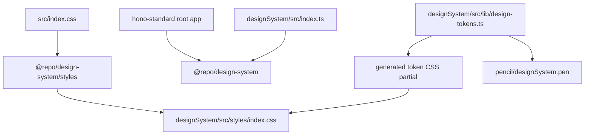

# designSystem 利用経路リファクタリング計画

作成日: 2026-06-12

## 目的

`hono-standard` ルートアプリから `designSystem` を workspace package として正しく利用できる状態にする。現在は `@repo/design-system` の React component import と、`../designSystem/src/styles/index.css` への source 直参照が混在しているため、CSS/token の公開経路を package export に寄せ、design token の生成先・公開先・利用側 import を一致させる。

この計画では、特に以下を完了条件にする。

1. ルートアプリが `designSystem/src/**` を直接 import しない。
2. `@repo/design-system/styles` から公開 CSS を読み込める。
3. `designSystem/src/lib/design-tokens.ts` 由来の token が、実際に公開される CSS に反映される。
4. Shadow を design token として扱い、`shadow-sm` などの利用が token 経由になる。45度刻みの direction shadow も token として公開する。
5. ルートの `pnpm verify` と designSystem 単体の検証で破綻しない。

## 確認済みの現状

### workspace / package

- ルートの `pnpm-workspace.yaml` は `.` と `designSystem` を workspace package として含めている。
- ルートの `package.json` は `@repo/design-system: workspace:*` を dependency として持つ。
- `designSystem/package.json` の package name は `@repo/design-system`。
- `designSystem/package.json` は `./styles` を `./dist/design-system.css` に export している。

### ルートアプリ側の利用

- React components は `@repo/design-system` から import されている。
  - `src/routes/index.tsx`
  - `src/routes/__root.tsx`
  - `src/routes/showcase.tsx`
- CSS は package export ではなく、`src/index.css` で `../designSystem/src/styles/index.css` を直接 import している。
- `src/routes/showcase.tsx` には app 側の任意色・任意 shadow が残っている。
  - `bg-emerald-500 text-white hover:bg-emerald-600`
  - `shadow-lg shadow-primary/5`

### designSystem 側の token / CSS

- `src/index.ts` は `./styles/index.css` を import している。
- `src/styles/index.css` は `variables.css` と `themes.css` を import し、Tailwind v4 `@theme` で color / radius / spacing token を登録している。
- `scripts/generate-tokens.mts` は `src/styles.css` を更新するが、公開 entry の `src/styles/index.css` とは接続されていない。
- `src/styles.css` には `--shadow-*` があるが、公開 entry 側の `src/styles/index.css` / `variables.css` には shadow token 登録がない。
- `src/lib/design-tokens.ts` には `SHADOW_PRESETS` と `applyDensityAndScaleTokens()` があるが、`applyDensityAndScaleTokens()` は `--shadow-md` だけを書き換える。

### 未定義または旧 token 参照

以下は現行の公開 CSS で定義・登録されていない可能性が高い。

- `theme-*` 系 class
  - `border-theme-text-primary`
  - `border-theme-danger`
  - `text-theme-border`
  - `border-theme-object-primary`
  - `border-theme-accent`
  - `peer-disabled:text-theme-disabled-text`
- CSS 変数
  - `--theme-text-secondary`
  - `--panel-p-sm`, `--panel-p-md`, `--panel-p-lg`
  - `--stack-gap-sm`, `--stack-gap-md`, `--stack-gap-lg`
  - `--list-item-height`
  - `--z-backdrop`, `--z-modal`, `--z-portal`, `--z-tooltip`

## 目標アーキテクチャ



設計方針:

- ルートは package として `@repo/design-system` を使う。source path は参照しない。
- `designSystem/src/styles/index.css` を公開 CSS の唯一の entry とする。
- token 生成スクリプトの CSS 出力先を、公開 entry から import される generated partial に変更する。
- Tailwind v4 の `@theme` に登録する token 名を、コンポーネント利用 class と一致させる。

## リファクタリング手順

### Stage 1: CSS 公開経路を package export に寄せる

1. ルートの `src/index.css` を次の形に変更する。

   ```css
   @import "tailwindcss";
   @import "@repo/design-system/styles";
   @import "@fontsource-variable/geist";
   ```

2. `../designSystem/src/styles/index.css` への直参照を削除する。
3. ルート `tsconfig.json` の `@repo/design-system` paths は、開発中の型解決として残すか、package export 検証後に削除する。削除する場合は Vite / TS が workspace package の `exports` と `types` で解決できることを先に確認する。
4. `src/routes/-design-system.tsx` のコメント内にある古い参照は、必要なら後続で整理する。実行経路ではないためこの stage の必須対象にしない。

完了条件:

- ルートアプリの CSS が package export 経由で designSystem CSS を読む。
- `rg "../designSystem/src/styles" .` が実行経路で 0 件になる。

### Stage 2: designSystem の CSS entry を一本化する

1. `designSystem/src/styles.css` を現行の公開 entry として扱わない。
2. `scripts/generate-tokens.mts` の CSS 出力先を `src/styles/generated-tokens.css` に変更する。
3. `src/styles/index.css` で `generated-tokens.css` を import する。

   ```css
   @import "tailwindcss";
   @import "./variables.css";
   @import "./generated-tokens.css";
   @import "./themes.css";
   ```

4. `generated-tokens.css` は color/theme token のみを生成し、手書きの density / sizing / utility 定義とは分離する。
5. 既存の `src/styles.css` は、移行後に参照がないことを確認して削除するか、互換用として残す場合は deprecated コメントを追加する。

完了条件:

- token 生成先と package で配布される CSS が一致する。
- `pnpm -C designSystem build` 後に `dist/design-system.css` に generated token が含まれる。

### Stage 3: token 命名と selector を統一する

1. テーマ切替 API と CSS selector を揃える。
   - 現状の `applyColorTheme()` は `html.theme-light` / `html.theme-dark` class を付ける。
   - 公開 CSS は `:root[data-theme="dark"]` 形式。
2. どちらかに統一する。ルート app と README が `data-theme` 前提なので、まずは `data-theme` に寄せる。
3. `applyColorTheme()` は class 操作ではなく `rootElement.dataset.theme = theme` に変更する。
4. generated token CSS も `:root[data-theme="..."]` selector で出す。
5. 3軸 theme class が必要な場合も `data-theme="light-slate-blue"` のように data attribute へ寄せる。

完了条件:

- README、`themes.css`、`applyColorTheme()`、generated CSS の selector 方針が一致する。
- `html.theme-*` と `:root[data-theme=*]` が同じ目的で混在しない。

### Stage 4: 未定義 token を定義するか既存 token へ置換する

1. `theme-*` 系 class は新規定義せず、原則として shadcn/Tailwind v4 token へ置換する。

   | 現在の参照 | 置換候補 |
   |:--|:--|
   | `border-theme-text-primary` | `border-foreground` または `border-border` |
   | `border-theme-danger` | `border-destructive` |
   | `text-theme-border` | `text-border` または `text-muted-foreground` |
   | `border-theme-object-primary` | `border-primary` |
   | `border-theme-accent` | `border-accent` または `border-primary` |
   | `peer-disabled:text-theme-disabled-text` | `peer-disabled:text-muted-foreground` |
   | `--theme-text-secondary` | `--muted-foreground` |

2. `--panel-p-*`, `--stack-gap-*`, `--list-item-height` は `variables.css` に明示定義する。既存の `--control-*` / `--ui-*` と意味が重複する場合は、コンポーネント側を既存 token に寄せる。
3. `--z-*` は `variables.css` に定義する。
   - `--z-backdrop`
   - `--z-modal`
   - `--z-portal`
   - `--z-tooltip`
4. `Button.tsx` の `text-info-text` は `text-info-foreground` に置換する。

完了条件:

- `rg "theme-|theme-text|info-text|panel-p|stack-gap|list-item-height|z-modal|z-portal|z-tooltip|z-backdrop" designSystem/src` の結果が、定義済み token か意図した利用だけになる。
- Tailwind が未登録 class を生成しない状態になる。

### Stage 5: Shadow token を導入する

1. `variables.css` に shadow token を追加する。

   ```css
   :root {
     --ds-shadow-none: none;
     --ds-shadow-xs: 0 1px 2px 0 rgb(0 0 0 / 0.05);
     --ds-shadow-sm: 0 1px 3px 0 rgb(0 0 0 / 0.10), 0 1px 2px -1px rgb(0 0 0 / 0.10);
     --ds-shadow-md: 0 4px 6px -1px rgb(0 0 0 / 0.10), 0 2px 4px -2px rgb(0 0 0 / 0.10);
     --ds-shadow-lg: 0 10px 15px -3px rgb(0 0 0 / 0.10), 0 4px 6px -4px rgb(0 0 0 / 0.10);
     --ds-shadow-xl: 0 20px 25px -5px rgb(0 0 0 / 0.15), 0 8px 10px -6px rgb(0 0 0 / 0.10);
     --ds-shadow-top-right-md: 4px -4px 8px -2px rgb(0 0 0 / 0.12);
   }
   ```

2. `src/styles/index.css` の `@theme` に Tailwind v4 shadow token を登録する。direction は `top`, `top-right`, `right`, `bottom-right`, `bottom`, `bottom-left`, `left`, `top-left` の45度刻みで、`sm`, `md`, `lg` scale を持つ。

   ```css
   @theme {
     --shadow-none: var(--ds-shadow-none);
     --shadow-xs: var(--ds-shadow-xs);
     --shadow-sm: var(--ds-shadow-sm);
     --shadow-md: var(--ds-shadow-md);
     --shadow-lg: var(--ds-shadow-lg);
     --shadow-xl: var(--ds-shadow-xl);
     --shadow-top-right-md: var(--ds-shadow-top-right-md);
   }
   ```

3. `SHADOW_PRESETS` は単一の `--shadow-md` を上書きするのではなく、shadow scale 全体を上書きできる形に変更する。

   ```ts
   export const SHADOW_PRESETS = {
     none: {
       label: 'None',
       values: {
         '--ds-shadow-sm': 'none',
         '--ds-shadow-md': 'none',
         '--ds-shadow-lg': 'none',
         '--ds-shadow-xl': 'none',
       },
     },
     subtle: { ... },
     medium: { ... },
     strong: { ... },
   } as const;
   ```

4. `applyDensityAndScaleTokens()` は preset の `values` をループして CSS 変数へ反映する。
5. コンポーネント内の標準 `shadow-sm`, `shadow-md`, `shadow-lg`, `shadow-xl` はそのまま利用可能にする。Tailwind class 名は維持し、値だけ token 化する。
6. `shadow-[...]` は意味に応じて token class へ置換する。
   - `ChatDock` panel: `shadow-xl`
   - `ChatDock` button: `shadow-lg`
   - `ui/alert`: `shadow-sm`
7. `drop-shadow-md` は text readability 用の別種なので、今回の box-shadow token 化対象からは外す。必要なら `--drop-shadow-*` を別 stage で扱う。

完了条件:

- `rg "shadow-\\[" designSystem/src/components` が 0 件、または例外理由付きの箇所だけになる。
- `shadow-sm/md/lg/xl` が Tailwind v4 `@theme` の `--shadow-*` 経由で解決される。
- `applyDensityAndScaleTokens({ shadow })` で主要な shadow scale が変化する。

### Stage 6: ルート showcase の consumer 側直値を減らす

1. `src/routes/showcase.tsx` の consumer override を designSystem token に寄せる。
   - `bg-emerald-500 text-white hover:bg-emerald-600 border-none` は `variant="success"` など designSystem 側 API に置換する。
   - `shadow-lg shadow-primary/5` は `shadow-lg` だけにするか、designSystem 側で提供する semantic card variant に寄せる。
2. showcase は利用例なので、任意色・任意 shadow を残す場合は「consumer customization の例」として明示的に分離する。

完了条件:

- showcase が designSystem の token/API 利用例として読める。
- consumer 側で token 未適用に見える override が残らない。

### Stage 7: README / docs の package 名と import 例を更新する

1. `designSystem/README.md` の `@gxp/design-system` を現行 package 名 `@repo/design-system` に更新する。
2. CSS import 例を `@repo/design-system/styles` に更新する。
3. Tailwind preset 例は Tailwind v4 の `@import "@repo/design-system/styles"` 方針に合わせて更新する。`tailwind.preset.js` を残す場合は Tailwind v3 互換用と明記する。
4. 既存の `docs/design-system-sync-plan.md` は、CSS 出力先が `src/styles.css` 前提になっているため、Stage 2 完了後に `generated-tokens.css` 前提へ追従する。

完了条件:

- README の package 名、CSS import、workspace 利用例が実装と一致する。
- 古い `@gxp/design-system` 記述が残らない。

## 実装順序

1. Stage 1: ルート CSS import を package export に切り替える。
2. Stage 2: generated token CSS の出力先を公開 entry に接続する。
3. Stage 3: theme selector を `data-theme` に統一する。
4. Stage 5: Shadow token を `variables.css` と `@theme` に追加する。
5. Stage 4: 未定義 token / 旧 class を置換・定義する。
6. Stage 6: ルート showcase の consumer override を整理する。
7. Stage 7: README / docs を追従する。

Stage 4 と Stage 5 は近いが、Shadow は今回の主目的なので先に token scale を確定し、その後に全体の未定義参照を掃除する。

## 検証手順

各 stage の最後に最低限以下を実行する。

```bash
pnpm -C designSystem type-check
pnpm -C designSystem test run
pnpm build:frontend
```

全 stage 完了後に以下を実行する。

```bash
pnpm verify
pnpm -C designSystem build
```

CSS / token 経路の確認:

```bash
rg "../designSystem/src/styles" .
rg "shadow-\\[" designSystem/src/components
rg "theme-|theme-text|info-text" designSystem/src
rg "panel-p|stack-gap|list-item-height|z-modal|z-portal|z-tooltip|z-backdrop" designSystem/src/styles designSystem/src/components
```

期待値:

- `../designSystem/src/styles` は実行経路から消える。
- `shadow-[...]` は 0 件、または例外理由付きの箇所だけになる。
- `theme-*` 系の旧 token class は消える。
- `panel-p`, `stack-gap`, `list-item-height`, `z-*` は定義済み変数として確認できる。

視覚確認:

1. `pnpm dev` でルート app を起動する。
2. `/showcase` を開き、Button / Card / Select / Tabs / Switch / Progress が崩れていないことを確認する。
3. `pnpm -C designSystem storybook` を起動し、Button / Card / Dialog / Dropdown / Tooltip / Drawer / ChatDock の shadow が意図通り反映されることを確認する。
4. `applyDensityAndScaleTokens()` を使う Storybook story または小さな検証 route を用意し、`shadow: none | subtle | medium | strong` の切替で `shadow-*` class の表示が変わることを確認する。

## リスクと注意点

- Tailwind v4 の `@theme` は CSS 変数登録が中心なので、Tailwind v3 向けの `tailwind.preset.js` と同じ前提で考えない。
- `src/styles.css` は現状の生成先だが、実際の公開 entry ではない。ここを SSoT と誤認すると、生成は成功してもルート app に反映されない。
- `@repo/design-system` の component import はすでに workspace package 経由だが、ルート `tsconfig.json` の paths が `designSystem/src` を指しているため、型解決だけ source 直結になっている。package export 検証後に削除可否を判断する。
- Shadow は `box-shadow` と `drop-shadow` を分ける。今回の対象は `box-shadow`。
- `theme-*` 系 class を互換 alias として残すと未適用箇所が見えにくくなるため、基本は既存 semantic token へ置換する。

## 完了定義

- ルート app は `@repo/design-system` と `@repo/design-system/styles` だけで designSystem を利用できる。
- designSystem の token 生成結果が package CSS に入る。
- Shadow token が Tailwind class 経由で利用される。
- 未定義 token 参照が残っていない。
- `pnpm verify` と `pnpm -C designSystem build` が成功する。
