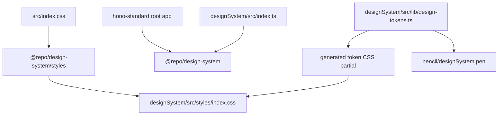

# designSystem 利用経路リファクタリング記録

作成日: 2026-06-12

## 現在の状態

`hono-standard` ルートアプリは `designSystem` を workspace package として利用する。React component は `@repo/design-system`、CSS は `@repo/design-system/styles` を経由し、root app から `designSystem/src/**` を直接 import しない。

現在の完了条件:

1. ルートアプリが `designSystem/src/**` を直接 import しない。
2. `@repo/design-system/styles` から公開 CSS を読み込める。
3. `designSystem/src/lib/design-tokens.ts` 由来の token が、実際に公開される CSS に反映される。
4. Shadow を design token として扱い、`shadow-sm` などの利用が token 経由になる。45度刻みの direction shadow も token として公開する。
5. ルートの `bun run verify` と designSystem 単体の検証で破綻しない。

## 確認済みの実装

### workspace / package

- ルートの `package.json` は Bun workspaces として `designSystem` を workspace package に含めている。
- ルートの `package.json` は `@repo/design-system: workspace:*` を dependency として持つ。
- `designSystem/package.json` の package name は `@repo/design-system`。
- `designSystem/package.json` は `./styles` を `./dist/design-system.css` に export している。

### ルートアプリ側の利用

- React components は `@repo/design-system` から import されている。
  - `src/routes/index.tsx`
  - `src/routes/__root.tsx`
  - `src/routes/showcase.tsx`
- CSS は `src/index.css` で `@repo/design-system/styles` を import している。
- Vite は workspace 開発時だけ `@repo/design-system/styles` を `designSystem/src/styles/index.css` に解決する。
- `src/routes/showcase.tsx` は公開 component API と semantic token class の利用例として扱う。

### designSystem 側の token / CSS

- `src/index.ts` は `./styles/index.css` を import している。
- `src/styles/index.css` は `variables.css`、`themes.css`、`generated-tokens.css` を import し、Tailwind v4 `@theme` で color / z-index / radius / spacing / shadow token を登録している。
- `scripts/generate-tokens.mts` は `src/styles/generated-tokens.css` と `pencil/designSystem.pen` を更新する。
- `variables.css` は `--panel-p-*`、`--stack-gap-*`、`--list-item-height`、`--z-*`、`--ds-shadow-*` を定義している。
- `src/lib/design-tokens.ts` の `SHADOW_PRESETS` は shadow scale と direction shadow をまとめて更新できる `values` を持ち、`applyDensityAndScaleTokens()` が各 CSS 変数へ反映する。

### 残す開発時 alias

- `vite.config.ts` の `@repo/design-system/styles` alias は、workspace 開発中に CSS source entry を直接読ませるために残す。
- `tsconfig.json` の `@repo/design-system` paths は、workspace 開発時の型解決用に残す。package export だけで型解決できる状態を検証できたら削除を判断する。
- `scripts/sync-design-system.ts` は固定の同期元 URL を持たない。同期時は第一引数または `DESIGN_SYSTEM_REPO` で repository を明示する。

## 目標アーキテクチャ



設計方針:

- ルートは package として `@repo/design-system` を使う。source path は参照しない。
- `designSystem/src/styles/index.css` を公開 CSS の唯一の entry とする。
- token 生成スクリプトの CSS 出力先を、公開 entry から import される generated partial に変更する。
- Tailwind v4 の `@theme` に登録する token 名を、コンポーネント利用 class と一致させる。

## 完了したリファクタリング

### Stage 1: CSS 公開経路を package export に寄せる

1. ルートの `src/index.css` は次の形にする。

   ```css
   @import "tailwindcss";
   @import "@repo/design-system/styles";
   @import "@fontsource-variable/geist";
   ```

2. `../designSystem/src/styles/index.css` への直参照を削除する。
3. ルート `tsconfig.json` の `@repo/design-system` paths は、開発中の型解決として残す。
4. コメントだけの `src/routes/-design-system.tsx` は不要な route 残骸として削除する。

完了条件:

- ルートアプリの CSS が package export 経由で designSystem CSS を読む。
- `rg "../designSystem/src/styles" .` が実行経路で 0 件になる。

### Stage 2: designSystem の CSS entry を一本化する

1. `designSystem/src/styles.css` は現行の公開 entry として扱わない。
2. `scripts/generate-tokens.mts` の CSS 出力先は `src/styles/generated-tokens.css`。
3. `src/styles/index.css` で `generated-tokens.css` を import する。

   ```css
   @import "tailwindcss";
   @import "./variables.css";
   @import "./generated-tokens.css";
   @import "./themes.css";
   ```

4. `generated-tokens.css` は color/theme token のみを生成し、手書きの density / sizing / utility 定義とは分離する。
5. `src/styles.css` を再導入しない。CSS entry は `src/styles/index.css` に集約する。

完了条件:

- token 生成先と package で配布される CSS が一致する。
- `bun run --cwd designSystem build` 後に `dist/design-system.css` に generated token が含まれる。

### Stage 3: token 命名と selector を統一する

1. テーマ切替 API と CSS selector を揃える。
   - `applyColorTheme()` は `rootElement.dataset.theme = ...` を更新する。
   - `themes.css` と `generated-tokens.css` は `:root[data-theme="..."]` selector を使う。
2. 3軸 theme も `data-theme="light-slate-blue"` のように data attribute へ寄せる。

完了条件:

- README、`themes.css`、`applyColorTheme()`、generated CSS の selector 方針が一致する。
- `html.theme-*` と `:root[data-theme=*]` が同じ目的で混在しない。

### Stage 4: 未定義 token を定義するか既存 token へ置換する

1. `theme-*` 系 class は新規定義せず、原則として design system / Tailwind v4 token へ置換する。

   | 現在の参照 | 置換候補 |
   |:--|:--|
   | `border-theme-text-primary` | `border-foreground` または `border-border` |
   | `border-theme-danger` | `border-destructive` |
   | `text-theme-border` | `text-border` または `text-muted-foreground` |
   | `border-theme-object-primary` | `border-primary` |
   | `border-theme-accent` | `border-accent` または `border-primary` |
   | `peer-disabled:text-theme-disabled-text` | `peer-disabled:text-muted-foreground` |
   | `--theme-text-secondary` | `--muted-foreground` |

2. `--panel-p-*`, `--stack-gap-*`, `--list-item-height` は `variables.css` に明示定義する。
3. `--z-*` は `variables.css` に定義し、`src/styles/index.css` の `@theme` で `z-*` utility に接続する。
   - `--z-backdrop`
   - `--z-modal`
   - `--z-portal`
   - `--z-tooltip`
4. `Button.tsx` の `text-info-text` は `text-info-foreground` に置換する。

完了条件:

- `rg "theme-|theme-text|info-text|panel-p|stack-gap|list-item-height|z-modal|z-portal|z-tooltip|z-backdrop" designSystem/src` の結果が、定義済み token か意図した利用だけになる。
- Tailwind が未登録 class を生成しない状態になる。

### Stage 5: Shadow token を導入する

1. `variables.css` に shadow token を追加する。

   ```css
   :root {
     --ds-shadow-none: none;
     --ds-shadow-xs: 0 1px 2px 0 rgb(0 0 0 / 0.05);
     --ds-shadow-sm: 0 1px 3px 0 rgb(0 0 0 / 0.10), 0 1px 2px -1px rgb(0 0 0 / 0.10);
     --ds-shadow-md: 0 4px 6px -1px rgb(0 0 0 / 0.10), 0 2px 4px -2px rgb(0 0 0 / 0.10);
     --ds-shadow-lg: 0 10px 15px -3px rgb(0 0 0 / 0.10), 0 4px 6px -4px rgb(0 0 0 / 0.10);
     --ds-shadow-xl: 0 20px 25px -5px rgb(0 0 0 / 0.15), 0 8px 10px -6px rgb(0 0 0 / 0.10);
     --ds-shadow-top-right-md: 4px -4px 8px -2px rgb(0 0 0 / 0.12);
   }
   ```

2. `src/styles/index.css` の `@theme` に Tailwind v4 shadow token を登録する。direction は `top`, `top-right`, `right`, `bottom-right`, `bottom`, `bottom-left`, `left`, `top-left` の45度刻みで、`sm`, `md`, `lg` scale を持つ。

   ```css
   @theme {
     --shadow-none: var(--ds-shadow-none);
     --shadow-xs: var(--ds-shadow-xs);
     --shadow-sm: var(--ds-shadow-sm);
     --shadow-md: var(--ds-shadow-md);
     --shadow-lg: var(--ds-shadow-lg);
     --shadow-xl: var(--ds-shadow-xl);
     --shadow-top-right-md: var(--ds-shadow-top-right-md);
   }
   ```

3. `SHADOW_PRESETS` は単一の `--shadow-md` を上書きするのではなく、shadow scale 全体を上書きできる形に変更する。

   ```ts
   export const SHADOW_PRESETS = {
     none: {
       label: 'None',
       values: {
         '--ds-shadow-sm': 'none',
         '--ds-shadow-md': 'none',
         '--ds-shadow-lg': 'none',
         '--ds-shadow-xl': 'none',
       },
     },
     subtle: { ... },
     medium: { ... },
     strong: { ... },
   } as const;
   ```

4. `applyDensityAndScaleTokens()` は preset の `values` をループして CSS 変数へ反映する。
5. コンポーネント内の標準 `shadow-sm`, `shadow-md`, `shadow-lg`, `shadow-xl` はそのまま利用可能にする。Tailwind class 名は維持し、値だけ token 化する。
6. `shadow-[...]` は意味に応じて token class へ置換する。
   - `ChatDock` panel: `shadow-xl`
   - `ChatDock` button: `shadow-lg`
   - `ui/alert`: `shadow-sm`
7. `drop-shadow-md` は text readability 用の別種なので、今回の box-shadow token 化対象からは外す。必要なら `--drop-shadow-*` を別 stage で扱う。

完了条件:

- `rg "shadow-\\[" designSystem/src/components` が 0 件、または例外理由付きの箇所だけになる。
- `shadow-sm/md/lg/xl` が Tailwind v4 `@theme` の `--shadow-*` 経由で解決される。
- `applyDensityAndScaleTokens({ shadow })` で主要な shadow scale が変化する。

### Stage 6: ルート showcase の consumer 側直値を減らす

1. `src/routes/showcase.tsx` の consumer override を designSystem token に寄せる。
   - `bg-emerald-500 text-white hover:bg-emerald-600 border-none` は `variant="success"` など designSystem 側 API に置換する。
   - `shadow-lg shadow-primary/5` は `shadow-lg` だけにするか、designSystem 側で提供する semantic card variant に寄せる。
2. showcase は利用例なので、任意色・任意 shadow を残す場合は「consumer customization の例」として明示的に分離する。

完了条件:

- showcase が designSystem の token/API 利用例として読める。
- consumer 側で token 未適用に見える override が残らない。

### Stage 7: README / docs の package 名と import 例を更新する

1. `designSystem/README.md` の package 名は `@repo/design-system`。
2. CSS import 例は `@repo/design-system/styles`。
3. Tailwind preset 例は Tailwind v4 の `@import "@repo/design-system/styles"` 方針に合わせる。`tailwind.preset.js` を残す場合は Tailwind v3 互換用と明記する。
4. `docs/design-system-sync-plan.md` は、CSS 出力先を `generated-tokens.css` 前提で記述する。

完了条件:

- README の package 名、CSS import、workspace 利用例が実装と一致する。
- 古い package 名の記述が残らない。

## 残タスク

1. `bun run verify` と `bun run --cwd designSystem build` で current implementation を検証する。
2. package export だけで型解決できることを検証できたら、`tsconfig.json` の designSystem source paths を削除するか判断する。
3. Storybook で Button / Card / Dialog / Dropdown / Tooltip / Drawer / ChatDock の shadow と theme 表示を確認する。
4. `designSystem/pencil/designSystem.pen` と `generatedVariants.ts` の同期差分がないことを確認する。

## 検証手順

各 stage の最後に最低限以下を実行する。

```bash
bun run --cwd designSystem type-check
bun run --cwd designSystem test run
bun run build:frontend
```

全 stage 完了後に以下を実行する。

```bash
bun run verify
bun run --cwd designSystem build
```

CSS / token 経路の確認:

```bash
rg "../designSystem/src/styles" .
rg "shadow-\\[" designSystem/src/components
rg "theme-|theme-text|info-text" designSystem/src
rg "panel-p|stack-gap|list-item-height|z-modal|z-portal|z-tooltip|z-backdrop" designSystem/src/styles designSystem/src/components
```

期待値:

- `../designSystem/src/styles` は実行経路から消える。
- `shadow-[...]` は 0 件、または例外理由付きの箇所だけになる。
- `theme-*` 系の旧 token class は消える。
- `panel-p`, `stack-gap`, `list-item-height`, `z-*` は定義済み変数として確認できる。

視覚確認:

1. `bun run dev` でルート app を起動する。
2. `/showcase` を開き、Button / Card / Select / Tabs / Switch / Progress が崩れていないことを確認する。
3. `bun run --cwd designSystem storybook` を起動し、Button / Card / Dialog / Dropdown / Tooltip / Drawer / ChatDock の shadow が意図通り反映されることを確認する。
4. `applyDensityAndScaleTokens()` を使う Storybook story または小さな検証 route を用意し、`shadow: none | subtle | medium | strong` の切替で `shadow-*` class の表示が変わることを確認する。

## リスクと注意点

- Tailwind v4 の `@theme` は CSS 変数登録が中心なので、Tailwind v3 向けの `tailwind.preset.js` と同じ前提で考えない。
- `src/styles.css` を再導入すると公開 entry から外れやすい。CSS entry は `src/styles/index.css`、生成 token は `src/styles/generated-tokens.css` に集約する。
- `@repo/design-system` の component import はすでに workspace package 経由だが、ルート `tsconfig.json` の paths が `designSystem/src` を指しているため、型解決だけ source 直結になっている。package export 検証後に削除可否を判断する。
- Shadow は `box-shadow` と `drop-shadow` を分ける。今回の対象は `box-shadow`。
- `theme-*` 系 class を互換 alias として残すと未適用箇所が見えにくくなるため、基本は既存 semantic token へ置換する。

## 完了定義

- ルート app は `@repo/design-system` と `@repo/design-system/styles` だけで designSystem を利用できる。
- designSystem の token 生成結果が package CSS に入る。
- Shadow token が Tailwind class 経由で利用される。
- 未定義 token 参照が残っていない。
- `bun run verify` と `bun run --cwd designSystem build` が成功する。
