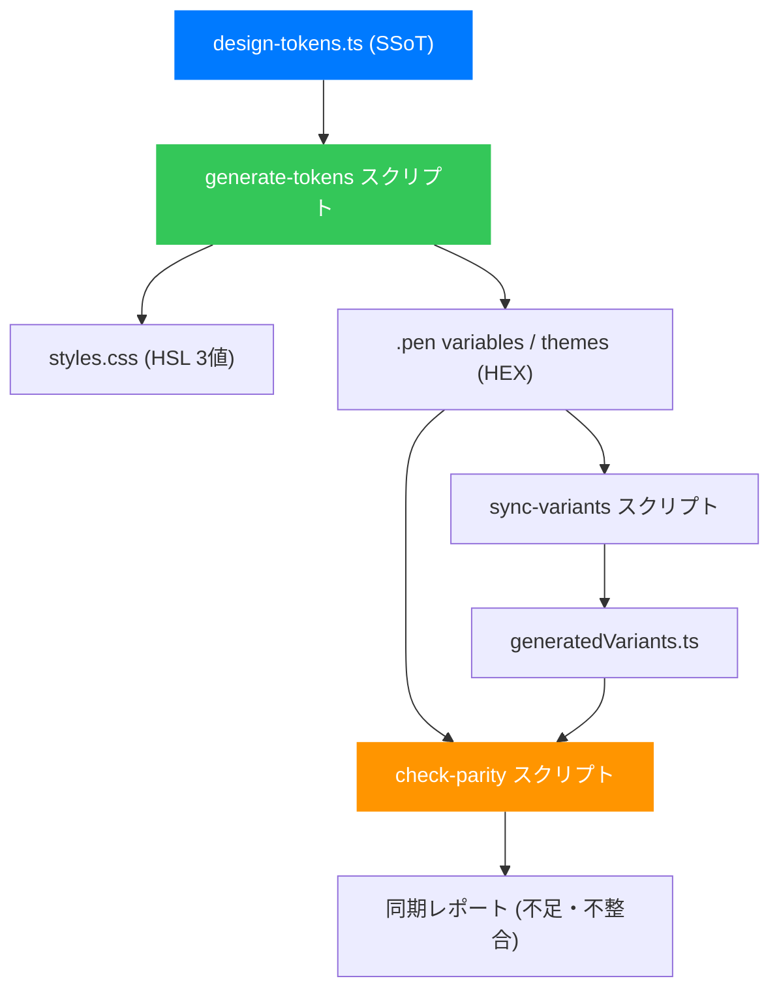

# デザインシステム同期計画 (v2.1)

## 1. 概要

本計画は、Pencil.dev (`.pen`) と React (shadcn/ui + Tailwind CSS) ベースのコードベースを高い精度で同期させるための技術的計画を定義する。

### 基本方針

| 項目 | 決定 |
|:--|:--|
| **SSoT（信頼される唯一の情報源）** | `design-tokens.ts` (TypeScript) |
| **生成方向** | `design-tokens.ts` → `styles.css` + `.pen` variables / themes (一方向生成) |
| **Pencil バージョン** | 2.9 現行運用 + バージョン抽象化レイヤーで 3.x 移行に備える |
| **コンポーネント命名** | `.pen` は PascalCase (`IconButton`)、コードは kebab-case (`icon-button.tsx`)、自動変換 |
| **テーマ対応** | **Mode / Base / Accent の3軸を同期対象とする** |
| **ビジュアル検証** | Playwright スクリーンショット (専用フォルダ + `.gitignore`) |
| **コンポーネント網羅性** | コード側の全コンポーネントは `.pen` への定義を必須とする |

### アーキテクチャ図



---

## 2. 前提条件

- **Pencil バージョン**: 2.9 (現行)。パーサは抽象化し 3.x 移行に備える。
- **コードベース**: TypeScript, React, Tailwind CSS, shadcn/ui。
- **デザイントークン管理**: `designSystem/src/lib/design-tokens.ts`。
- **CSS 出力**: `designSystem/src/styles.css` (HSL 3値形式、shadcn/ui 準拠)。
- **テスト基盤**: Storybook 10, Vitest, Playwright (Design System 専用設定)。

---

## 3. Stage 0: 現状の整理と命名規則の統一

### 3.1 `.pen` コンポーネント命名の PascalCase 統一

現状の `.pen` 内の名前をスペースなし PascalCase に統一する。

| 現在の `.pen` 名 | 変更後 | 対応コードファイル |
|:--|:--|:--|
| `Icon Button` | `IconButton` | `icon-button.tsx` |
| `Breadcrumb Item` | `BreadcrumbItem` | `breadcrumb.tsx` |
| `Input Group` | `InputGroup` | `input-group.tsx` |
| `Input OTP Group` | `InputOtpGroup` | `input-otp.tsx` |
| `List Item` | `ListItem` | `list.tsx` |
| `List Search Box` | `ListSearchBox` | `list.tsx` |
| `Pagination Item` | `PaginationItem` | `pagination.tsx` |
| `Select Group` | `SelectGroup` | `select.tsx` |
| `Sidebar Item` | `SidebarItem` | `sidebar.tsx` |
| `Tab Item` | `TabItem` | `tabs.tsx` |
| `Textarea Group` | `TextareaGroup` | `textarea.tsx` |

### 3.2 自動変換ルール

```
PascalCase → kebab-case: 大文字境界にハイフンを挿入し全小文字化
例: IconButton → icon-button
    InputOtpGroup → input-otp-group
```

### 3.3 `.pen` 未登録コンポーネントの追加

以下のコンポーネントは現在 `.pen` に定義がないため、順次追加する。

| コンポーネント | コードファイル | 優先度 |
|:--|:--|:--|
| Card | `card.tsx` | 🔴 高（頻出） |
| Dialog | `dialog.tsx` | 🔴 高 |
| Table | `table.tsx` | 🔴 高 |
| Label | `label.tsx` | 🟡 中 |
| Separator | `separator.tsx` | 🟡 中 |
| Tooltip | `tooltip.tsx` | 🟡 中 |
| Progress | `progress.tsx` | 🟡 中 |
| DropdownMenu | `dropdown-menu.tsx` | 🟡 中 |
| DataTable | `data-table.tsx` | 🟢 低 |
| RadioGroup | `radio-group.tsx` | 🟢 低 |

---

## 4. Stage 1: トークン同期パイプライン

### 4.1 SSoT の構造設計 (3軸対応)

`design-tokens.ts` を拡張し、Mode / Base / Accent の3軸をサポートするマスター定義を追加する。

```typescript
// --- design-tokens.ts 拡張イメージ ---

/** 3軸の定義 */
export const THEME_AXES = {
  Mode: ['Light', 'Dark'],
  Base: ['Neutral', 'Gray', 'Stone', 'Zinc', 'Slate'],
  Accent: ['Default', 'Red', 'Rose', 'Orange', 'Green', 'Blue', 'Yellow', 'Violet'],
} as const;

/** カラートークンのマスター定義 (HEX形式で管理) */
export const COLOR_TOKENS = {
  primary: {
    base: '#007AFF', // デフォルト値
    themes: [
      { mode: 'Dark', value: '#3B9AFF' },
      { accent: 'Rose', value: '#E11D48' },
      { mode: 'Dark', accent: 'Rose', value: '#FB7185' },
    ]
  },
  // ... 他の30+トークン
} as const;
```

### 4.2 生成スクリプト: `generate-tokens.mts` (部分パッチ更新)

> [!IMPORTANT]
> **Pencil ファイルの部分更新戦略**
> `.pen` ファイルには手動で編集されたコンポーネント定義 (`children`) が含まれるため、ファイル全体を上書きせず、JSONを解析して **`variables` と `themes` キーのみを部分置換 (Partial Patch)** する。

**処理手順**:
1. `designSystem.pen` を読み込み、JSONとしてパースする。
2. `design-tokens.ts` から生成した `variables` と `themes` オブジェクトで、既存の値を上書きする。
3. `children` や `imports` などの他のキーは一切変更せず保持する。
4. 変更後のオブジェクトをJSONとしてファイルに書き戻す。

### 4.3 `styles.css` 内の自動生成マーカー

```css
/* === AUTO-GENERATED: DO NOT EDIT BELOW === */
/* Source: design-tokens.ts / Run: pnpm generate-tokens */

:root, html.theme-light { /* Mode=Light, Base=Neutral, Accent=Default */
  --primary: 211 100% 50%;
}

html.theme-dark-slate-rose { /* Mode=Dark, Base=Slate, Accent=Rose */
  --primary: 341 77% 62%;
}

/* === END AUTO-GENERATED === */
```

---

## 5. Stage 2: コンポーネント同期の強化

### 5.1 `sync-variants.mjs` の拡張

既存スクリプトに以下のバリデーションを追加する。

1. **PascalCase 命名バリデーション**: スペース入りの名前を検出し、コード側の命名規則との不一致を警告する。
2. **コードファイル存在チェック**: PascalCase → kebab-case 変換後のファイルが `designSystem/src/components/ui/` に存在するか確認する。
3. **逆方向チェック（コード → .pen）**: コードにあって `.pen` にないコンポーネントを検知し、網羅率を100%に近づける。

---

## 6. Stage 3: Pencil バージョン抽象化

### 6.1 アダプタインターフェース

`.pen` の内部仕様変更に耐えるため、バージョンごとのアダプタ (v2.9 / v3.x) を用意する。

```typescript
export interface PenFileAdapter {
  parse(raw: unknown): NormalizedPenDocument;
  serialize(doc: NormalizedPenDocument): unknown;
  updateVariablesAndThemes(raw: unknown, vars: any, themes: any): unknown;
}
```

---

## 7. Stage 4: テーマ軸の拡張 (3軸マッピング)

### 7.1 テーマクラス名の自動生成ルール

`.pen` の3軸の組合せを CSS クラス名に展開する。

```typescript
function themeAxesToClassName(axes: Record<string, string>): string {
  const parts = ['theme'];
  if (axes.Mode) parts.push(axes.Mode.toLowerCase());
  if (axes.Base && axes.Base !== 'Neutral') parts.push(axes.Base.toLowerCase());
  if (axes.Accent && axes.Accent !== 'Default') parts.push(axes.Accent.toLowerCase());
  return parts.join('-'); // 例: theme-dark-slate-rose
}
```

---

## 8. Stage 5: ビジュアル検証 (Design System 専用基盤)

### 8.1 Playwright 実行基盤の構築

> [!IMPORTANT]
> Root の e2e テストと分離するため、`designSystem/` 配下に専用の Playwright 設定を構築する。

- **新規作成**: `designSystem/playwright.config.ts`
  - `testDir`: `./e2e`
  - `use.baseURL`: `http://localhost:6006` (Storybook)
  - `reporter`: 専用のディレクトリに出力。
- **保存先**: `designSystem/.screenshots/` (gitignore 対象)。

---

## 9. 実行順序と優先度

| Stage | 優先度 | 主な内容 |
|:--|:--|:--|
| **Stage 0** | 🔴 即時 | 命名統一、`.pen` への未登録コンポーネント追加 |
| **Stage 1** | 🔴 高 | **3軸対応**トークン生成スクリプト、**部分更新パッチ**の実装 |
| **Stage 2** | 🔴 高 | 双方向存在チェック、バリデーション強化 |
| **Stage 3** | 🟡 中 | 3.x 移行を見据えたアダプタ化 |
| **Stage 4** | 🟡 中 | 3軸組合せによる CSS クラス生成とプレセット拡充 |
| **Stage 5** | 🟢 低 | **専用 Playwright 基盤**によるスクリーンショット検証 |

---

## 10. 競合解決と運用ルール

- **SSoT**: 常に `design-tokens.ts` が真実。
- **.pen 更新**: スクリプトが `variables` と `themes` のみを更新するため、**デザイナーによるレイアウト作業 (children) とエンジニアによるトークン更新が競合しない。**
- **検証**: 変更後は `pnpm pencil:check` および Storybook で必ず目視確認を行う。
