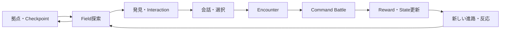
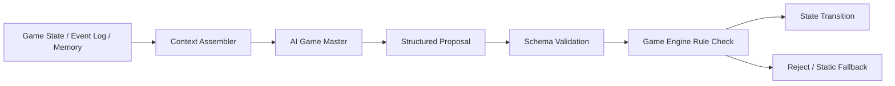
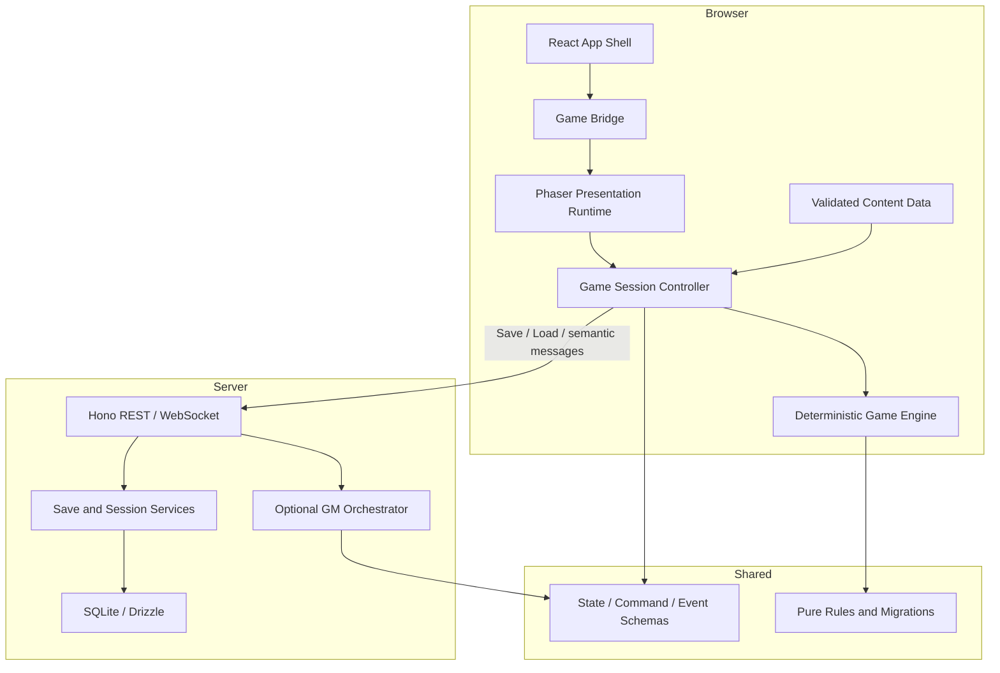

# Echoes at Dawn ゲームコンセプト・設計原則

| 項目 | 内容 |
| --- | --- |
| 文書種別 | 上位コンセプト仕様 |
| 状態 | Baseline draft |
| 対象 | `hono-standard` 内で開発するブラウザ向け2D RPG |
| 現在の舞台 | Signal Ruins |
| 更新日 | 2026-08-10 |

## 1. この文書の役割

この文書は、個別機能の実装方法を決める手順書ではない。ゲーム全体が何を目指し、どのような設計判断を優先するかを定義する、後続仕様の上位文書である。

今後作成するGame Session、Save、Map、Event、Battle、Progression、UI、Audio、AI Game Masterなどの実装計画書は、本書を判断基準とする。個別計画が本書と矛盾する場合、無意識に実装で解消せず、先に本書または個別計画のどちらを変更するか決定する。

本文中の用語は次の強さで扱う。

- **必須**: 後続計画で原則として変更してはならない。
- **推奨**: 明確な理由がない限り採用する。
- **許容**: 状況に応じて採用できる。

このプロジェクトは再利用テンプレートや`variant/*`として設計しない。一つのゲーム作品と、それを継続開発するためのアプリケーションとして設計する。

## 2. エグゼクティブサマリー

`Echoes at Dawn`は、失われた信号技術の遺構を巡る3人の旅を描く、ブラウザ向けの2D群像劇RPGである。

探索で世界の痕跡を読み、会話と選択で仲間との関係を変化させ、時間ゲージ式のコマンド戦闘で各人物の役割を組み合わせる。物語、探索、戦闘を別々のモードとして消費させるのではなく、同じGame StateとStory Flagの上で相互に意味を持たせる。

短期的には、Signal Ruinsの縦切りを「起動して動くだけのデモ」から「保存し、再開し、進行できる最小のゲーム」へ育てる。長期的には、決定論的なGame Engineを核に保ちながら、物語表現を補助するAI Game Masterを追加できる構造を目指す。

## 3. 現在地

現時点では、次の縦切りが動作している。

```text
Login
  ↓
Signal Ruinsを探索
  ↓
信号地点で会話Event
  ↓
時間ゲージ式のside-view Battle
  ↓
勝利してFieldへ復帰
```

既に存在する基盤は次のとおりである。

- ReactからPhaserを遅延起動し、unmount時に破棄するlifecycle境界
- 320×192の内部解像度とpixel-art表示
- Field、Event、BattleのScene分離
- keyboard入力をGame Actionへ変換するInputManager
- 描画runtimeに依存しないfield ruleとbattle rule
- React/Honoの認証済みゲームroute
- SQLite、Drizzle、REST APIを備えたbackend
- typecheck、lint、unit test、coverage、build、Playwrightによる品質ゲート

一方、Sceneをまたぐ単一Game Session、save/load、データ駆動map、event script、成長、inventory、audioなどは未整備である。現在の縦切りを捨てて作り直すのではなく、動作する経路を保ちながら一つずつ置き換える。

## 4. プロダクトビジョン

### 4.1 プレイヤーに提供する体験

プレイヤーは、崩壊した世界の情報を拾い集める観測者であり、同時に3人の旅の判断を担う指揮者である。

目指す感覚は次のとおり。

- 静かな遺構を進み、何かが起きる前の緊張を感じる。
- 背景、短い会話、環境音から、説明されすぎない世界を想像する。
- 戦闘中は待たされるのではなく、時間ゲージを読みながら次の手を準備する。
- 仲間を単なる能力値の集合ではなく、それぞれの意思と関係を持つ人物として認識する。
- 小さな選択や発見がGame Stateに残り、その後の会話、戦闘、探索へ返ってくる。

### 4.2 作品の立ち位置

表現上の軸は、16-bit時代の群像劇型コマンドRPGが持つ、簡潔な画面構成、役割の明確なparty、劇的な場面転換である。ただし、特定の既存作品を再現することは目的としない。

固有のキャラクター、地名、シナリオ、UI、音楽、sprite、背景、iconを制作し、既存作品の画面構成や素材をそのまま模倣しない。

### 4.3 成功状態

最初の完成目標は、次の一連の体験が一つの保存可能なSessionとして成立することである。

```text
New Game / Load
  → Field探索
  → 発見・会話・選択
  → Encounter
  → Battle
  → Reward / State変化
  → Checkpoint Save
  → 終了
  → 同じ状態から再開
```

各要素の量よりも、この循環が途切れず、選択と結果が保存されることを優先する。

## 5. 体験設計の柱

### 5.1 世界を読む探索

Fieldは目的地まで歩くだけの廊下にしない。地形、光、音、配置物、短いinteractionによって、その場所で何が起きたかを推測できるようにする。

必須原則:

- 重要な進路とinteraction可能地点は、文字説明だけに頼らず視覚または音で示す。
- 衝突判定と見た目を一致させ、見えない壁を常態化させない。
- 発見にはStory Flag、item、関係値、shortcutなど、少なくとも一つの意味を持たせる。
- mapの広さより、固有の場所として記憶できる密度を優先する。

### 5.2 人物関係が残る会話

会話は次の目的のうち一つ以上を担う。

- 世界の状況を示す。
- 登場人物の価値観や関係を変化させる。
- プレイヤーへ判断材料を渡す。
- 次の探索または戦闘の意味を変える。

選択肢は、正解を当てるquizではなく、誰を信じるか、何を優先するかを表すものとする。選択結果は可能な限りStory FlagやRelationshipへ保存し、後続sceneから参照可能にする。

### 5.3 読み合いのある時間ゲージ戦闘

Battleは3人partyによる時間ゲージ式command battleを基本とする。command選択中はlogical timeを停止するwait型を標準とし、反射速度より状況判断を重視する。

必須原則:

- 現在HP、行動可能状態、選択中actor、target、command結果を読み取れる。
- characterごとの役割と固有Abilityを明確にする。
- 通常攻撃だけの連打が常に最適にならないよう、resource、敵行動、状態変化を設計する。
- animation時間とlogical battle timeを混同しない。
- 同じ初期state、入力列、乱数seedから同じ結果を再現できる。

### 5.4 選択が次へつながる成長

成長は数値を増やすだけではなく、partyの戦い方と物語上の関係を変える。

成長要素は段階的に導入し、初期段階では次の順序を推奨する。

1. Battle RewardとEXP
2. LevelとAbility習得
3. Itemとresource管理
4. Equipmentによるbuild差
5. RelationshipやStory FlagによるAbility変化

複数の成長軸を同時に導入して調整不能になることを避ける。

## 6. 世界観と物語の方向性

### 6.1 世界の核

世界には、かつて遠距離へ意思や記憶を伝えた「信号技術」の遺構が残っている。その多くは停止しているが、完全に沈黙したわけではない。

Signal Ruinsは、この世界と物語の入口である。青い石造遺構、酸化した機構、真鍮の観測装置、夜明け前の光をvisual identityとする。

### 6.2 主題

中心テーマは次の三つである。

- **記憶**: 残された情報は真実か、それとも誰かが選んだ記録か。
- **接続**: 離れた人や時代を結ぶことは、理解につながるのか。
- **選択**: 正解が見えない状況で、誰と何を守るのか。

### 6.3 群像劇の原則

- 一人の万能な主人公だけで物語を解決しない。
- party memberごとに異なる知識、目的、恐れを持たせる。
- 対立は善悪だけでなく、価値観と優先順位の差から生じさせる。
- 戦闘能力と人物像を可能な範囲で接続する。
- party memberの離脱や視点変更を将来許容するが、初期基盤で複雑な分岐partyを前提にしない。

## 7. 基本ゲームループ



短期loopは移動、発見、戦闘、rewardで構成する。中期loopはmap攻略、character成長、物語進行で構成する。長期loopは複数の地域で集めた情報と人間関係が、重要な選択へ収束する構造を目指す。

どのsystemも単独のcollectionとして閉じず、少なくとも一つの別systemへ結果を返す。

## 8. 各ゲーム領域のコンセプト

### 8.1 Field

Fieldはgridに基づく4方向移動を基本とする。内部のruleはtile単位で扱い、描画はpixel単位で補間・演出できるよう分離する。

将来的に必要な概念:

- Map IDと入口ID
- collision、terrain、interaction、event trigger
- party位置と向き
- camera zone
- encounter tableまたは固定encounter
- checkpointと復帰位置
- map固有のvisual/audio metadata

### 8.2 EventとDialogue

EventはSceneへhard-codeされた会話配列ではなく、宣言的なscriptとして表現する。最低限、台詞、話者、待機、移動、表情、選択肢、flag条件、flag更新、item操作、戦闘開始、Scene遷移を組み合わせられることを目指す。

任意のJavaScriptをcontent dataとして実行する方式は採用しない。許可されたcommandの集合として表現し、validationとtestを可能にする。

### 8.3 Battle

BattleはGame StateからBattle Stateを開始し、Battle ResultをGame Stateへ戻す一時的なsubsystemである。Battle Scene自体をHP、EXP、itemの唯一の保存場所にしない。

将来的な構成要素:

- party、enemy group、action gauge
- command、Ability、item、defend、escape
- target rule
- damage、heal、resource cost
- status effect、buff、debuff、attribute
- enemy AI
- reward、defeat、retry
- visual effectへ渡すsemantic battle event

### 8.4 Progression

Characterのbase dataとsaveごとの成長stateを分離する。Ability、item、equipment、enemyなどのmaster dataは安定したIDで参照し、表示名を識別子として使用しない。

能力値計算はpure functionに集約し、UI、Battle Scene、Save処理が個別に異なる計算を持たない。

### 8.5 Menu

Pause Menuは単なる設定画面ではなく、partyの現在状態とプレイヤーの選択を確認する場所である。初期構成はStatus、Item、Ability、Equipment、Save、Settingsを想定するが、未実装機能の空画面を先行して作らない。

## 9. Visual、UI、Audioの方向性

### 9.1 Visual identity

- 内部解像度は320×192を基準とする。
- 通常表示は可能な限り整数倍率で拡大する。
- paletteはobsidian navy、slate blue、oxidized teal、brass gold、muted coral、warm ivoryを中心とする。
- 背景、sprite、HUDで光源、outline密度、pixel粒度を揃える。
- 既存作品のasset、UI、icon、固有symbolを流用または模倣しない。

### 9.2 読みやすさ

pixel-artらしさを理由に情報を読みにくくしない。

- 小さい文字には専用bitmap fontまたは検証済みpixel fontを使う。
- HP低下、行動可能、target、status effectを色だけで表現しない。
- 重要な文字と背景のcontrastを確保する。
- flash、shake、particleは意味を持つ場面に限定し、低減設定を用意できる構造にする。

### 9.3 Animation

Animationは情報伝達を優先する。最低限、idle、walk、attack、ability、hit、defeatを区別する。

見栄えのためにGame State更新をanimation完了へ依存させない。Game Engineがsemantic eventを発行し、presentation layerがそのeventを演出へ変換する。

### 9.4 Audio

AudioはBGM、environment、UI、battle effect、voiceを別busとして扱える構造を目指す。Scene切り替えごとに必ずBGMを停止するのではなく、曲の継続、crossfade、再開位置をAudio Managerが判断する。

音声がなくても情報を失わず、字幕またはvisual feedbackで代替できることを必須とする。

## 10. AI Game Masterの位置づけ

AI Game Masterは将来の拡張であり、core game完成の前提条件ではない。AIが利用不能でも、固定contentによって探索、会話、戦闘、保存、再開が完結しなければならない。

### 10.1 AIに許可する役割

- 状況に応じた台詞や描写の候補生成
- 既存Story FlagとMemoryに基づく反応の提案
- 許可済みevent commandの組み合わせ提案
- player inputのintent分類
- 定型contentを補うvariation生成

### 10.2 AIに許可しない役割

- Game Stateを直接書き換えること
- validationを通さずitem、HP、flag、rewardを生成すること
- frame単位の移動、collision、animation、cameraを制御すること
- system ruleやsave schemaを実行中に変更すること
- secret、認証情報、他userのsessionをcontextへ含めること

### 10.3 AI統合原則

AI outputは信頼できない提案として扱う。Schemaで検証し、許可されたcommandへ変換し、Game Engineが適用可能性を判定した場合だけstateへ反映する。



生成に使ったcontext、prompt version、model/provider、proposal、採否を追跡可能にする。timeout、rate limit、cost上限、静的fallbackを個別計画で定義する。

## 11. 技術設計思想

### 11.1 単一のGame Stateを中心に置く

Field、Event、Battle、Menuが別々の真実を持たない。一つのGame Sessionがversion付きGame Stateを所有し、各modeは必要なsliceを読み、明示的なcommandを通じて更新する。

React state、Phaser object、database rowを同時に正本としない。あるSessionでどこがauthorityを持つかを一つに定める。

### 11.2 RuleとPresentationを分離する

以下はPhaser、React、DOM、networkへ依存しないpure TypeScriptを基本とする。

- 移動可否
- Event条件
- Battle計算
- 成長と能力値計算
- item、equipment、reward
- Story Flag transition
- Save migration

Phaserは描画、input取得、animation、camera、audio cue、Scene lifecycleを担当する。Reactはroute、authentication、game shell、Canvas外UI、error boundaryを担当する。

### 11.3 CommandとEventで接続する

外部からGame Stateへ直接mutationしない。

```text
Input / UI / Network / AI
        ↓
     Command
        ↓
 Deterministic Game Engine
        ↓
 New State + Semantic Events
        ↓
 Phaser / React / Save / Event Log
```

Commandはプレイヤーまたは外部systemの意図、Eventは確定した結果を表す。animation名やDOM eventをdomain eventとして保存しない。

### 11.4 Serializableであることを優先する

Game StateはJSONとしてserialize可能でなければならない。class instance、function、Phaser object、DOM reference、循環参照を保存対象へ含めない。

すべてのsaveは少なくともschema version、content version、save revisionを識別できる構造を持つ。schema変更時は破棄ではなくmigrationを基本とする。

### 11.5 決定論と再現可能性

乱数を使うruleはseed付きRNGを経由し、RNG stateをSessionに含める。test、replay、障害調査では、初期snapshotとcommand列から結果を再現できることを目標とする。

時刻は描画frameの実時間をdomain ruleへ直接混入せず、Game Engineへ渡すlogical deltaまたは明示的なclockとして扱う。

### 11.6 データ駆動と安定ID

Map、Event、Dialogue、Ability、Item、Equipment、Enemy、Encounterは、可能な範囲でdataとして定義する。表示文字列ではなく安定IDで参照し、読み込み時にschema validationする。

データ駆動化は、すべてを汎用化することではない。少なくとも二つの実例が現れるまで、過剰な抽象化を避ける。

### 11.7 段階的な置き換え

大規模な一括rewriteを避け、常に一つ以上のplayable pathを維持する。新しい基盤を導入するときは、Signal Ruinsの既存経路を最初のconsumerとして移行し、移行完了後に旧経路を除去する。

### 11.8 Failureを正常系として設計する

asset取得失敗、save競合、network切断、AI timeout、破損saveは起こり得る。無限loadingや白画面ではなく、retry、fallback、直前の安全なsnapshot復帰を設計する。

## 12. システム境界



### 12.1 Reactの責務

- route、authentication、loading、fatal error
- Phaser instanceの生成と破棄
- Canvas外のshell、account、settings入口
- DOMが適切なaccessibility UI

Reactの再renderとPhaser game loopをframe単位で同期しない。sprite位置やanimation frameをReact stateへ保存しない。

### 12.2 Phaserの責務

- Canvas描画
- keyboard、gamepad、touch入力の取得
- sprite、animation、camera、particle
- audio cueのpresentation
- Scene lifecycle

Phaser Sceneに永続Game Stateやruleの正本を置かない。

### 12.3 Shared Game Domainの責務

- Game State、Command、Eventの型とschema
- field、event、battle、progression rule
- save migration
- deterministic simulation

Browser API、Phaser、React、database driverへ依存しない。

### 12.4 Backendの責務

- authenticationとuser単位のauthorization
- save slot、settings、master dataのHTTP API
- session開始、再開、semantic eventのWebSocket protocol
- revision管理、idempotency、sequence
- optional AI GMのorchestration

frame単位の移動、camera、animation、asset転送をbackendへ送らない。

### 12.5 Storageの責務

- userとsave slotの関連
- version付きsnapshot
- 必要に応じたsemantic event log
- AI利用時の安全なaudit metadata

SQLiteのsingle-writer contractを維持する。複数processや複数hostが同じfile DBへ直接書き込む構成は対象外とする。

## 13. State、Save、Sessionの原則

### 13.1 Game Stateの概念構造

```text
GameState
├ metadata
│  ├ schemaVersion
│  ├ contentVersion
│  └ rngState
├ location
│  ├ mapId
│  ├ entranceId / checkpointId
│  └ partyPosition
├ party
│  ├ members
│  ├ inventory
│  └ equipment
├ story
│  ├ chapter
│  ├ scene
│  ├ flags
│  └ relationships
├ world
│  ├ mapState
│  ├ openedObjects
│  └ encounterState
└ activeMode
   ├ field
   ├ event
   └ battle
```

これは概念構造であり、そのまま一つの巨大schemaへ固定する指示ではない。後続計画でownershipと更新単位を具体化する。

### 13.2 Save

- SaveはGame Stateの安全なsnapshotを中心とする。
- 書き込みはrevisionを持ち、古いclientによる上書きを検出する。
- autosaveとmanual saveの役割を分ける。
- 破損またはmigration失敗時に、直前の安全なsaveへ戻れる余地を持たせる。
- authentication user以外のsaveを読み書きできないことをserverで保証する。

### 13.3 Session

Game Sessionは実行中のGame State、command受付、semantic event発行、save coordinationを束ねる。画面遷移ごとにSessionを作り直さない。

WebSocketを導入する場合は、message ID、session ID、sequence、protocol versionを持たせる。切断を異常終了と決めつけず、最後に適用したsequenceからresumeできる設計を優先する。

## 14. Input設計原則

ゲームロジックは`ArrowUp`や`KeyZ`ではなく、`UP`、`DOWN`、`LEFT`、`RIGHT`、`CONFIRM`、`CANCEL`、`MENU`などのActionを受け取る。

入力にはcontextを持たせる。

- Field Context
- Dialogue Context
- Battle Context
- Menu Context
- Paused Context

同じ物理buttonが複数contextへ同時に作用しないよう、active contextと入力lockを一元管理する。keyboard、gamepad、touchは同じActionへmappingし、key repeatや押しっぱなしの扱いもInput layerで統一する。

## 15. Content制作原則

- content dataはschema validationを通してからruntimeへ渡す。
- IDは公開後に安易に変更しない。
- map、event、battleを個別に作るだけでなく、一つのplayable sliceとして検証する。
- 仮素材と完成素材をmanifest上で識別できるようにする。
- assetの出典、生成方法、利用条件を追跡可能にする。
- 外部著作物の無断利用、既存ゲームassetの抽出、固有UIの複製を禁止する。
- AI生成assetを利用する場合も、人間による選定、整合性確認、project内への保存を必須とする。

## 16. 品質設計

品質は実装完了後の確認ではなく、各計画の一部として定義する。

### 16.1 Correctness

- Game Engineの主要ruleをunit testできる。
- 同じsnapshot、command、seedから同じtransitionを得られる。
- Scene遷移後もGame Stateが失われない。
- Save後にprocessを再起動して同じ状態へ復帰できる。
- 無効なcommandやcontent dataを拒否できる。

### 16.2 Visual

- Field、Event、Battleでpaletteとpixel密度が一貫する。
- 320×192、2倍、3倍表示で重要情報が欠けない。
- 主要Sceneにvisual regression用の基準画像を持てる。
- collision、interaction、targetが視覚的に理解できる。

### 16.3 Performance

- 毎frameの入力と描画にnetwork round tripを要求しない。
- desktopでは60fpsを目標とし、対応mobileでは安定した30fps以上を最低目標とする。
- 初期bundleとgame runtimeを分離し、ゲームを開かないuserへPhaserを強制loadしない。
- 各実装計画でasset容量、memory、loading時間への影響を記載する。

### 16.4 Accessibility

- keyboardだけで主要操作を完結できる。
- 操作割り当てを将来変更できるAction abstractionを維持する。
- 色以外でもselection、danger、statusを識別できる。
- flash、shake、音量、文字速度を調整できる構造を阻害しない。
- Canvas内だけでは不足する情報に、必要に応じてDOMの代替表現を用意する。

### 16.5 Reliability

- React StrictModeによる再mountでPhaser instanceを残さない。
- asset load失敗、save失敗、network切断をUIで通知する。
- retryで二重rewardや二重event適用が発生しない。
- fatal error時に原因を隠してNew Gameへ戻さない。

### 16.6 SecurityとPrivacy

- save、session、settings APIはserver-sideでauthorizationする。
- clientから送られたGame Stateを無条件に正本として保存しない。
- WebSocket messageもschema validation、size制限、rate limitの対象とする。
- promptやAI contextへsecret、cookie、不要な個人情報を含めない。
- AI生成contentをそのままHTMLとして描画しない。

### 16.7 Repository Gate

通常の変更は最低限、次を満たす。

```bash
bun run verify
bun run verify:e2e
```

純粋なrule変更にはunit test、save変更にはmigration test、SceneまたはUI変更にはbrowser smokeまたはvisual確認を追加する。Coverage thresholdを回避するためにdomain codeを除外対象へ移動しない。

## 17. Observabilityと開発支援

製品UIとdebug機能を分け、development時に次を確認できる構造を目指す。

- current map、tile座標、Scene、input context
- Game State schema version、save revision
- active Story Flagと直近semantic event
- Battle State、action gauge、RNG seed
- FPS、texture、asset load状態
- session ID、sequence、reconnect状態

任意map移動、event開始、battle開始、flag更新、全回復などのdeveloper commandを許容するが、productionで無効化または厳格に保護できなければならない。

## 18. 非目標

現段階では、次を基盤完成の条件にしない。

- MMORPGまたは多数playerの同期
- 複数server processをまたぐrealtime session cluster
- frame単位のserver-authoritative action game networking
- PostgreSQL、Redis、Kafka、vector databaseの先行導入
- RAGや長期Memoryを、通常のStory Flagより先に導入すること
- 完全自動生成された無限世界
- AIがrule、reward、saveを直接変更する構成
- 3D化、物理simulation、自由camera
- native mobile app専用実装
- 大量のmapやcharacterを、content pipeline完成前に制作すること
- 特定の既存RPGを再現すること

将来必要になった場合も、実測された問題と明確な体験上の価値を示してから対象へ加える。

## 19. 段階的ロードマップ

各段階は、前段階のplayable pathを保ちながら進める。段階内の詳細は個別実装計画書で定義する。

### Stage 1: Persistent Vertical Slice

目的: 現在の縦切りを、一つのSessionとして保存・再開可能にする。

対象:

- Game Session Controller
- version付きGame State
- local save/load
- checkpoint
- Scene間state継承
- seed付きRNG

完了条件:

- FieldからBattleを経てFieldへ戻っても同じGame Stateが継続する。
- 終了後にcheckpointから再開できる。
- save migrationの最小testがある。

### Stage 2: Data-driven World

目的: Signal Ruinsをhard-codeされたSceneから、検証可能なcontent dataへ移行する。

実装状態: Complete。map/event bundleの遅延読込、`signal-ruins`と`relay-camp`、build/runtime共通validation、loading/error/Retryまで実装済み。

対象:

- map schemaとloader
- collision、entrance、interaction、event trigger
- event scriptとdialogue data
- Story FlagとRelationship
- asset manifestとloading/error画面

完了条件:

- Signal Ruinsの既存経路がdataから構築される。
- 同じ仕組みで二つ目の小規模mapまたはeventを追加できる。
- 不正なcontent dataが起動時またはbuild時に検出される。

### Stage 3: RPG Core

目的: Battleの結果がpartyの継続的な成長へつながるようにする。

実装状態: Complete。EXP/Level/Ability、HP/MP、Item/Inventory、Equipment、Reward/Retry、field menu操作、save v5 migrationまで実装済み。

対象:

- EXP、Level、Ability
- MPまたはAbility resource
- Item、Inventory
- Equipmentと能力値計算
- Battle Reward、Game Over、Retry

完了条件:

- 戦闘rewardがGame Stateへ反映され、save/load後も維持される。
- Menuからparty状態と所持品を確認・操作できる。
- 能力値計算がUIとBattleで一致する。

### Stage 4: Tactical Battle

目的: 通常攻撃以外の判断が意味を持つ戦闘へ拡張する。

実装状態: Complete。属性、buff/debuff/継続damage、target rule、複数敵、敵AI pattern、item/escape、boss行動予告、演出event、balance simulationまで実装済み。

対象:

- status effect、buff、debuff、attribute
- target rule
- enemy AIと行動pattern
- encounter group
- battle effectとanimation event
- balance simulation

完了条件:

- 複数の有効な戦術が存在する。
- seed固定の自動simulationで停止や不正stateが発生しない。
- UIだけでcommand結果と次の危険を判断できる。

### Stage 5: Complete Player Interface

目的: keyboard以外を含め、長時間遊べる操作と設定を整える。

実装状態: Complete。keyboard / standard gamepad / touchを共通Game Actionへ統合し、key configuration、high-resolution bitmap font、Chrome向けOpus/MP3 Audio Manager、音量・文字速度・reduced motion・high contrast・fullscreen・画面倍率設定を実装済み。

対象:

- 共通Window/Menu system
- gamepad、touch、key configuration
- bitmap font
- audio manager
- settingsとaccessibility
- fullscreenと画面倍率

完了条件:

- keyboardとgamepadで同じplayable pathを完了できる。
- 音量、文字速度、主要演出を設定できる。
- 主要解像度でUIの欠けがない。

### Stage 6: Server-backed Session

目的: 認証userのsaveとsemantic Game Sessionをbackendへ接続する。

対象:

- save slot REST API
- revision、idempotency、authorization
- Game Session Protocol
- WebSocket接続、sequence、resume
- event logと障害復旧

完了条件:

- 別browser sessionから認証userのsaveを再開できる。
- 一時切断後に二重適用なくresumeできる。
- frame単位処理はbrowser内に残っている。

実装状況（2026-08-11）:

- Server-backed save経路は実装済み。認証user単位のSQLite save slot、REST API、optimistic revision、idempotency operation log、別browser再開を備える。
- 既存browser saveはserver slotが空の場合のみ自動移行し、以後はserverをauthority、localStorageを障害時backupと未送信operation queueとして扱う。
- 一時切断またはresponse loss後は同じidempotency keyで再送し、競合時は最新server revisionを取得して一度だけrebaseする。frame単位処理は引き続きbrowser内に置く。
- WebSocketは、remote semantic commandを必要とする機能が導入される時点まで接続しない。現段階のcheckpoint同期に不要な常時接続を追加せず、protocol上必要なrevision・operation identity・resume semanticsをRESTで先に固定する。

### Stage 7: Optional AI Game Master

目的: 固定contentを壊さず、文脈に応じた物語variationを追加する。

対象:

- provider interface
- Context Assembler
- structured proposal schema
- prompt/context version管理
- policy、timeout、cost、fallback
- auditとquality evaluation

完了条件:

- AI無効時も同じchapterを完了できる。
- AI outputがGame Engineを迂回してstateを変更できない。
- timeoutまたは不正output時に静的contentへ復帰できる。

### Stage 8: Production Readiness

目的: content追加を継続できる品質と運用性を確立する。

対象:

- visual regression
- asset/content validation
- performance budget
- save backupとrecovery
- monitoring、security、deployment
- content authoring workflow

完了条件:

- release用の品質gateが自動化されている。
- 既存saveを維持したままcontent updateできる。
- 障害時の復旧手順と責任範囲が文書化されている。

## 20. 後続の実装計画書

本書から、次の計画書を順次作成する。配置先は`spec/plans/`を基本とする。

| ID | 計画書 | 主な対応Stage |
| --- | --- | --- |
| 01 | Game Session・State・Save | Stage 1 |
| 02 | Map・Content Data・Asset Loading | Stage 2 |
| 03 | Event・Dialogue・Story Flag | Stage 2 |
| 04 | Character Growth・Inventory・Equipment | Stage 3 |
| 05 | Battle System・Enemy AI・Reward | Stage 3–4 |
| 06 | Menu・Input・Accessibility | Stage 5 |
| 07 | Visual Animation・Audio | Stage 4–5 |
| 08 | Save API・Game Session Protocol | Stage 6 |
| 09 | AI Game Master・Provider | Stage 7 |
| 10 | Tooling・Performance・Production | Stage 8 |

### 20.1 各計画書に必須の項目

各計画書は少なくとも次を含める。

1. 目的とプレイヤー価値
2. 本書のどの原則を満たすか
3. 現状と問題
4. ScopeとNon-goals
5. UX flowとacceptance criteria
6. State、Command、Event、Content schemaへの影響
7. ownershipとsystem境界
8. 依存関係と導入順序
9. 既存縦切りからのmigration方法
10. failure、recovery、security
11. unit、integration、E2E、visual検証
12. performanceとaccessibilityへの影響
13. rollout、削除する旧経路、完了条件
14. 未決事項と採用しなかった代替案

### 20.2 計画を承認する判断基準

計画は次の問いに答えられる場合だけ実装へ進める。

- プレイヤー体験のどの問題を解決するか。
- Game Stateのauthorityはどこか。
- ruleとpresentationの境界を守っているか。
- save/load後に意味が維持されるか。
- 失敗時にどの状態へ戻るか。
- Signal Ruinsの既存playable pathをどう維持するか。
- testと目視確認で何を証明するか。
- 今実装しない範囲が明確か。

## 21. 設計判断チェックリスト

新しい機能、library、serviceを追加するときは、次を確認する。

- その機能はcore loopのどこへ結果を返すか。
- 既存のGame Stateで表現できるか、新しいstateが本当に必要か。
- Sceneまたはcomponentのlocal stateで済むpresentation情報ではないか。
- pure ruleとしてtest可能か。
- save schemaとcontent versionへ影響するか。
- networkやAIがなくても最低限動作するか。
- retryや二重入力に対して安全か。
- 固有IDとschema validationを持つか。
- asset、bundle、memory、frame timeをどれだけ増やすか。
- keyboard、gamepad、touch、視認性へ悪影響がないか。
- 特定作品の模倣ではなく、本作のテーマとvisual identityを強めるか。
- 一つの縦切りで完成を検証してから横展開できるか。

## 22. 用語

| 用語 | 意味 |
| --- | --- |
| Game State | 保存・再現可能なゲーム進行の正規状態 |
| Game Session | 実行中のGame Stateとcommand/event/save coordinationを束ねる単位 |
| Command | player、UI、network、AIからGame Engineへ渡す意図 |
| Semantic Event | rule適用後に確定した意味のある結果 |
| Presentation Event | animation、audio、cameraなど保存を必要としない演出指示 |
| Content Data | map、event、Ability、Itemなどの検証可能な定義データ |
| Master Data | 複数saveで共有され、安定IDで参照される静的定義 |
| Story Flag | 物語上の事実または選択結果を表す永続state |
| Checkpoint | 安全な再開地点とsave timingの組み合わせ |
| AI Game Master | Game Stateを直接変更せず、構造化された物語提案を行うoptional subsystem |

---

本書の目的は、将来の選択肢を最大化することではなく、ゲームとして一貫した選択を積み重ねられるようにすることである。抽象化、network、AI、content量より先に、プレイヤーの選択が意味を持ち、安全に保存され、再び体験へ返ってくることを優先する。
