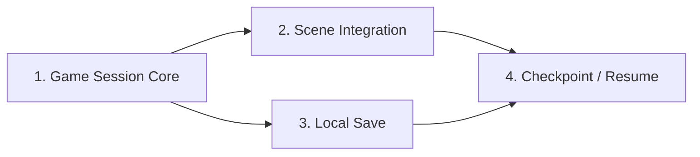

# Stage 1: Persistent Vertical Slice

## 目的

現在のSignal Ruins縦切りを、Field、Event、Battleごとに状態を作り直すdemoから、一つのGame Sessionとして状態が継続し、保存・再開できる最小のゲームへ移行する。

このStageは[ゲームコンセプト・設計原則](../../game-concept.md)のStage 1を具体化する。新しいRPG機能やcontent量を増やす前に、Game Stateのauthorityと永続化境界を固定する。

## Delivery Plan

| 順序 | 計画書 | 状態 | 成果 |
| --- | --- | --- | --- |
| 1 | [Game Session Core](01-game-session-core.md) | Complete | Phaser非依存のGame State authority、Command/Event、lifecycle、seed付きRNG |
| 2 | [Scene Session Integration](02-scene-session-integration.md) | Complete | Field→Event→Battle→Fieldで同じSessionを共有 |
| 3 | [Local Save and Migration](03-local-save-and-migration.md) | Complete | version付きsnapshot、local repository、migration、破損検知 |
| 4 | [Checkpoint and Resume Flow](04-checkpoint-and-resume-flow.md) | Complete | New/Continue、autosave、browser reload後の再開 |

## Stage共通の不変条件

- Game Stateの正本をPhaser Scene、React state、storageへ分散させない。
- RuleとSession CoreはPhaser、React、DOM、storage APIへ依存しない。
- StateはJSONとしてserialize可能であることを維持する。
- State変更はCommandを経由し、結果をSemantic Eventとして表現する。
- 既存のSignal Ruins playable pathを各Delivery完了時に維持する。
- Save、UI、Scene統合をDelivery 1へ先行実装しない。
- testやmigrationを機能実装と別Deliveryへ先送りしない。

## Stage完了条件

- FieldからBattleを経てFieldへ戻っても同じGame Stateが継続する。
- checkpoint snapshotを保存し、browser reload後に復元できる。
- 同じsnapshot、Command列、RNG seedから同じ結果を得られる。
- 旧version snapshotの最小migration testがある。
- `bun run verify`と`bun run verify:e2e`が成功する。

## Stage実装結果

- 一つの`GameSession`がField、Event、Battleの正規stateを所有し、Scene間で同じsession IDを維持する。
- Battle勝利時のparty HP、Story Flag、field位置、checkpointが同一Game Stateへ反映される。
- version付きsave envelope、Zod runtime validation、legacy v1 migration、破損・非対応versionの分類を実装した。
- ログインuserごとにlocal autosaveを分離し、New Game、Continue、保存状態表示を実装した。
- Playwrightで新規開始から戦闘、autosave、browser reload、Continueまでの一連の経路を確認した。
- `bun run verify`と`bun run verify:e2e`が成功した。
