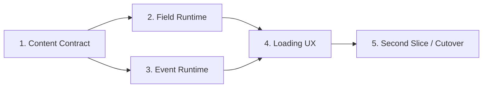

# Stage 2: Data-driven World

## Use when

Stage 1で永続化したSignal Ruinsを、Sceneとruleへ埋め込まれた固有値から、schema validation済みのcontent dataへ移行するときに使う。新しいRPG systemを増やすStageではなく、mapとeventを安全に追加できる制作基盤を作るStageである。

## 目的とプレイヤー価値

場所、会話、選択、反応を一つずつコード改修しなくても追加できる状態へ移行する。プレイヤーにとっては、Signal Ruinsの後に別の場所へ進み、選択が人物関係と後続の反応へ残る、最初の「世界の広がり」になる。

このStageは[ゲームコンセプト・設計原則](../../game-concept.md)のStage 2と、後続計画02「Map・Content Data・Asset Loading」、03「Event・Dialogue・Story Flag」を具体化する。

## Workflow

| 順序 | Delivery | 状態 | 完了時に証明すること |
| --- | --- | --- | --- |
| 1 | [Content Contract and Validation](01-content-contract-and-validation.md) | Complete | contentの形式、ID、参照、asset pathをbuild前に検証できる |
| 2 | [Data-driven Field Runtime](02-data-driven-field-runtime.md) | Complete | Signal Ruinsのmap ruleと描画がMap Definitionから動く |
| 3 | [Declarative Event and Dialogue Runtime](03-declarative-event-dialogue-runtime.md) | Complete | 会話、選択、flag、relationship、battle開始が許可済みcommandで進む |
| 4 | [Content and Asset Loading Experience](04-content-asset-loading-experience.md) | Complete | 読込中、失敗、再試行を含むcontent/asset loadingが成立する |
| 5 | [Second World Slice and Cutover](05-second-world-slice-and-cutover.md) | Complete | 二つ目のmap/eventを同じ仕組みで追加し、旧hard-codeを削除できる |



各Deliveryは独立したreview単位とし、unit testと対象範囲のintegration testを同じDeliveryで完了させる。Delivery 5だけにtestや旧経路の削除を先送りしない。

## 実装結果

- manifestとmap/event bundleを分離し、entry mapだけを先に読み込んで遷移先を必要時に取得する。
- `signal-ruins` と `relay-camp` は同一のfield/event runtimeで動作する。
- collision、entrance、checkpoint、interaction、random encounter、回復の泉は検証済みcontentから解決する。
- content/asset読込の進捗、失敗理由、Retryを起動画面と実行中map遷移の両方で扱う。
- build前validatorが重複ID、参照切れ、bundle不整合、asset欠落を検出する。

## Stage共通の設計判断

- Contentは任意のJavaScriptではなく、Zodで検証するdataと許可済みcommandの集合にする。
- Content IDは表示文言から分離し、`kebab-case`の安定IDを使う。
- 読み込んだraw dataを直接使わず、参照解決済みでimmutableな`GameContentRegistry`をruntimeへ渡す。
- `GameSession`がGame Stateのauthorityである原則を維持する。Contentは定義、Game Stateはプレイヤーごとの差分である。
- map collision、trigger条件、event進行は`shared/game`のpure ruleとする。
- Phaserはasset preload、描画、animation、inputだけを担当する。
- Signal Ruinsの既存playable pathを各Delivery後も維持し、全面rewriteしない。
- save schemaを変更するDeliveryでは同時にmigration testを追加する。

## Stage共通のNon-goals

- EXP、Level、Inventory、EquipmentなどStage 3の成長system
- status effect、属性、汎用Enemy AIなどStage 4の戦闘拡張
- Pause Menu、gamepad設定、touch UIなどStage 5のplayer interface
- server save、WebSocket、cloud content配信
- 任意script、`eval`、動的module importによるcontent実行
- 汎用tilemap editor、visual event editor、localization CMS
- procedural map生成、random encounter table

## Verification

各Deliveryの個別検証に加え、Stage完了時は次をすべて成功させる。

```bash
bun run validate:game-content
bun run verify
bun run verify:e2e
```

期待結果:

- schema不正、重複ID、参照切れ、asset欠落が`validate:game-content`でexit code 1になる。
- 正常contentでは既存Signal Ruinsと二つ目のmap/eventを最後まで進行できる。
- 選択で変化したStory FlagとRelationshipがcheckpoint save、reload後も維持される。
- content/asset取得失敗時に白画面や無限loadingにならず、理由とRetryが表示される。
- coverage 95%以上と既存認証・save/load testを維持する。

## Avoid

- Scene内で`mapId`や`eventId`を分岐し、data-driven化を見かけだけにすること。
- schemaを通さないtype assertionでraw JSONをruntimeへ渡すこと。
- Content Definitionへfunction、Phaser object、DOM referenceを含めること。
- 不明なcommand、参照切れ、重複IDを黙って無視すること。
- map移行と同時にBattle ruleや成長systemまで書き換えること。
- 二つ目の実例がないまま汎用性を完了扱いにすること。

## Stage完了条件

- Signal Ruinsのmap、collision、entrance、trigger、dialogue、asset参照がcontent dataから構築される。
- 二つ目の小規模map `relay-camp` と選択を含むeventが同じschema/runtimeだけで動く。
- flag条件によりSignal Ruinsクリア後の進路とfield反応が変化する。
- relationship変化がGame Stateへ保存され、reload後のevent条件から参照できる。
- build時validatorとruntime loaderが同じschema・参照検証を使用する。
- 旧Scene固有のmap/dialogue定数とSignal Ruins専用分岐が削除される。
- `bun run verify`と`bun run verify:e2e`が成功する。
