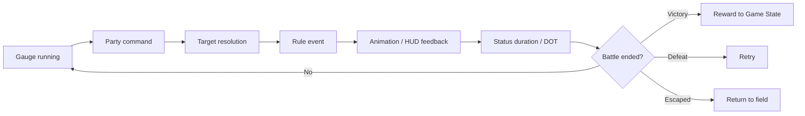

# Stage 4: Tactical Battle

| 項目 | 内容 |
| --- | --- |
| 対応計画 | Battle System・Enemy AI・Reward / Visual Animation |
| 状態 | Complete |

## 目的とプレイヤー価値

Attackを繰り返すだけの戦闘から、MP、属性相性、回復、buff/debuff、状態異常、item、対象選択、逃走を判断するwait型command battleへ拡張する。通常戦とboss戦で敵数、危険な行動、逃走可否を変え、画面だけで結果を追えるようにする。

## 実装範囲

- physical、fire、lightning、arcane、restorationの属性と敵ごとの倍率を導入した。
- damage、heal、status Abilityと、enemy/allyのsingle/all/self target ruleを導入した。
- Attack/Defense/Speed補正、継続damage、duration、上書きを持つstatus effectを実装した。
- 複数敵encounterと、敵ごとの循環AI pattern、低HP target選択を実装した。
- battle item、Defend、escape可否、MP不足や無効targetのrule errorを実装した。
- side-view縦並びHUDにHP/MP、action gauge、status、boss HP、command/Ability/item/target windowを表示する。
- 攻撃の前進、武器軌跡、属性effect、support ring、被弾flash、damage/heal表示をSemantic Eventから再生する。
- 固定条件の自動battle simulationを全encounterに実行する品質gateを追加した。

## Battle flow



logical timeはparty command選択中と演出中に停止する。rule engineは描画に依存せず、Sceneは`BattleEvent`をaction演出と後続のdefeat/victory更新に分割して順序を保つ。

## 戦術の成立

- Ash WispとBrass Houndはlightning弱点を持ち、Spark Shotが通常Attackより有効になる。
- Signal Wardenはphysical/arcane耐性とlightning弱点を持ち、Lunge、全体Slow、全体Ruin Pulseを順に使う。
- Guard BreakでDefenseを下げ、Rallying Lightでparty Attackを上げ、Mendとitemで立て直せる。
- Defendは次の被damageを半減する。通常戦だけはEscapeを選択でき、boss戦では拒否する。

## Determinism・failure・performance

- 同じinitial stateとCommand列ならdamage、AI行動、status判定は同じ結果になる。
- simulationは最大tick数を持ち、進行停止をCI failureとして検出する。
- 一度のtimeline更新で処理するready enemyは一体に限定し、frame stallと演出の重なりを避ける。
- effect objectはaction完了後に破棄し、Game StateへPhaser objectを保存しない。

## Verification

```bash
bun run validate:battle-balance
bunx vitest run shared/game/battle-engine.test.ts web/src/game/presentation/battle-presentation.test.ts
bun run verify
bun run verify:e2e
```

完了条件:

- single/all/self target、属性倍率、MP、status、item、escape、AI patternをunit testで固定する。
- 通常戦とboss戦のsimulationが上限内で終了し、不正stateやstallを起こさない。
- command結果、弱点・耐性、HP/MP、status、次のboss行動をbattle UIから判断できる。
- 勝利、敗北、逃走の各結果がGameSessionへ一度だけ反映される。

## Non-goals

- real-time action battle、position/rowによる範囲判定
- elemental combo、summon、limit break、複雑なboss phase scripting
- 音声、音量設定、演出速度設定を含むStage 5のpresentation設定
