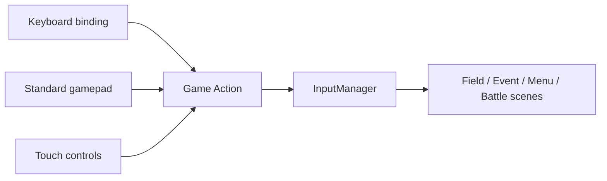

# Stage 5: Complete Player Interface

| 項目 | 内容 |
| --- | --- |
| 対応計画 | Menu・Input・Audio・Accessibility・Display |
| 状態 | Complete |

## 目的とプレイヤー価値

keyboardだけに依存していた操作をstandard gamepadとtouchへ広げ、長時間playに必要な音量、文字速度、演出、表示倍率をbrowser内で調整できるようにする。設定はgameplay stateと分離してlocalStorageへ保存し、save dataの互換性には影響させない。

## 実装範囲

- `UP / DOWN / LEFT / RIGHT / CONFIRM / CANCEL / MENU / PAUSE`を共通Game Actionとして定義した。
- keyboard、standard gamepadのbutton/D-pad/左stick、React touch controlを同じ`InputManager`へ集約した。
- key binding、touch表示、gamepad有効化をplay中に変更できる。
- Field MenuからSettingsを開け、React側の常設Settings buttonからも同じpanelへ入れる。
- Field Menu文字を高解像度canvasから生成したbitmap fontへ移し、mapのpixel samplingと文字解像度を分離した。
- BGM 4曲とUI・battle・recovery SEをCC0素材から取得し、Opus primary / MP3 fallbackへ変換した。
- Audio ManagerがBGMのcrossfadeと再開位置、master/BGM/SE/environment bus、mute、browser audio unlock状態を管理する。
- text speed、reduced motion、high contrast、fullscreen、1x/2x/3x/fit scaleを設定できる。
- reduced motion時は会話actor tween、field walk/pulse/atmosphere、battle action animation、camera flash/shakeを省略する。

## Input path



各device固有のkey/buttonはrule commandへ直接接続しない。Sceneは共通Actionだけを読み、gamepadでもkeyboardと同じ遷移を通る。

## Audio policy

- Chrome/Chromiumでdecode可能なOgg Opusを先頭URLに置き、MP3をfallbackにする。
- MIDIの作曲・synthesizerはproject scope外とする。
- 音源はCC0のみを採用し、source、creator、変換条件を`web/public/assets/game/audio/README.md`へ保存する。
- BGMはSceneを跨ぐmanager ownershipとし、Field Menu/Eventではfield BGMを止めない。battleとの切替時は420ms crossfadeし、fieldへ戻ると保存位置から再開する。
- 音声がmute/lockでもrule進行に影響を与えず、重要情報はHUD/textにも残す。

## Settings ownership

`GameSettingsStore`はversion付きsettingsだけをlocalStorageへ保存する。Game Session/save dataはparty、story、field、battleのauthoritative stateに限定し、volumeやscreen scale変更でsave revisionを進めない。

## Verification

```bash
bunx vitest run web/src/game/settings/GameSettingsStore.test.ts web/src/game/input/InputManager.test.ts web/src/game/audio/audio-catalog.test.ts web/src/game/audio/GameAudioManager.test.ts web/src/game/GameScreen.test.tsx
bun run typecheck
bun run build:web
bunx playwright test tests/e2e/smoke.spec.ts --grep "field map renders"
```

Chromium E2EはOpus/MP3 codec support、AudioContext unlock、BGM playback dataset、mute反映、375px viewportでの3x fit、touch control表示を確認する。input unit testはkeyboard/gamepad/touchが同じ`CONFIRM` Actionを発火することを固定する。

## Source locations

- Settings: `web/src/game/settings/`
- Unified input: `web/src/game/input/`
- Audio catalog / manager: `web/src/game/audio/`
- Runtime audio / provenance: `web/public/assets/game/audio/`
- Bitmap font: `web/src/game/ui/bitmap-font.ts`

## Non-goals

- browser内MIDI synthesizer、作曲機能、DAW機能
- voice acting、streaming audio、spatial audio
- platform固有gamepad glyph database、振動、Steam Input
