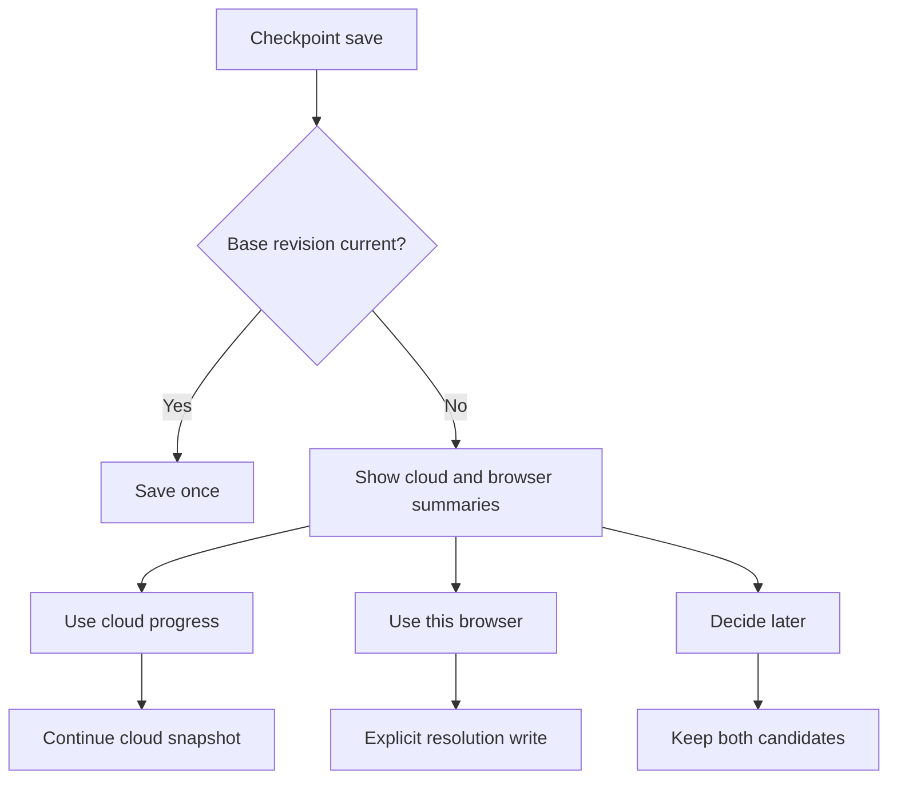

# Delivery 01: Cloud Save Conflict and Content Integrity 実装計画

| 項目 | 内容 |
| --- | --- |
| 状態 | Complete (2026-08-12) |
| 優先度 | P0: progress loss prevention |
| 主対象 | `shared/schemas`、`shared/game`、`web/src/game/save`、`web/src/game/GameLauncher.tsx`、`api/modules/game-save` |
| 依存 | 現行server-backed autosave、Game State compatibility validation |

## 1. 目的

同じaccountを複数browserまたはtabで開いた場合に、古いpending saveが新しいcloud進行を無確認で上書きする経路を閉じる。同時に、構造上は正しいが現行Map、Entrance、Ability、Itemなどを参照できないsaveをserver保存前に拒否し、cloud slotをContinue不能な状態へしない。

プレイヤー価値は、どの端末で遊んでも「Continueを押した結果、より新しい進行が知らないうちに消える」ことを防ぎ、競合時に自分で残す進行を判断できることである。

## 2. 現状と問題

- clientは409 revision conflictを受けると最新revisionを読み、同じlocal snapshotを新しいidempotency keyで一度rebaseして再送する。
- offlineで古いbrowser backupが残っていた場合、別browserの新しい進行を後着の古いsnapshotで置換できる。
- APIは`decodeGameSave()`でschemaとGame State invariantを検証するが、`assertGameStateCompatible()`が検証するcontent registry上の参照整合性までは確認しない。
- `New Game`も既存cloud slotの明示的な置換操作として区別されていない。
- save失敗結果とrevision分岐が同じ失敗表示へ畳み込まれ、プレイヤーが安全な判断をできない。

### Scope

- save protocol v2とconflict-specific result
- explicit conflict resolution UI/API
- New Gameによる意図的なslot置換
- server-side content registry compatibility validation
- legacy pending operationの安全な読込
- unit、service integration、二browser context E2E

### Non-goals

- Game Stateの三方向merge、flag/inventory単位の自動merge
- active browser lease、WebSocket、remote command
- manual save slotとsave history。Delivery 02で扱う。
- gameplay rule、reward、contentの変更

## 3. 設計判断

### 3.1 RetryとConflictを分離する

- timeout、connection loss、response lossは同じidempotency keyと同じexpected revisionで再送する。
- serverが同じidempotency keyを既に適用済みなら、保存結果を再適用せず返す。
- 異なるoperationが古いexpected revisionを送った場合は`conflict`であり、自動rebaseしない。
- conflict responseまたは直後のGETから、cloud候補とbrowser候補をUIへ渡す。

`GameSaveWriteResult`は少なくとも次を区別する。

```text
synced
queued-offline
conflict { browserCandidate, cloudCandidate }
rejected
```

### 3.2 Conflict解決は明示操作にする

Conflict UIは次の操作を提供する。

- `Use cloud progress`: pending browser operationをconflict backupとして残したうえで送信queueから外し、local active backupをcloud snapshotへ置換する。
- `Use this browser`: 現在のcloud revisionをbaseとする新しい明示的replace operationを作り、一度だけ保存する。
- `Decide later`: cloud slotとbrowser conflict backupを変更せずlauncherへ戻る。

表示には保存日時、checkpoint、map、Game State revision、保存元を使用する。party、flag、inventory全文や個人情報を画面またはlogへ出さない。

`New Game`で既存cloud saveを置換する場合も同じ明示的replace契約を使用し、単なる競合retryとして実装しない。

### 3.3 Server-side content validation

- server起動時にclientと同じversion済みcontent bundleからread-only `GameContentRegistry`を構築する。
- registry構築失敗はsave requestごとのfallbackではなくstartup/configuration failureとして扱う。
- PUT transaction開始前に`assertGameStateCompatible(save.state, registry)`を実行する。
- incompatible contentは400、server configuration failureは500として区別する。
- 検証失敗時は`game_saves`と`game_save_operations`のどちらも変更しない。
- serverとwebが異なるcontent buildを参照しないよう、content versionとbundle checksumをbuild artifactで固定する。

### 3.4 Protocol contract

- PUTへ`protocolVersion: 2`、`intent: advance | resolve-browser | reset`、`baseRevision`を追加する。
- 通常の`advance`はoperation作成時のbase revisionを保持し、409後のGETでbaseを書き換えない。
- `resolve-browser`と`reset`はserverがconflict時に発行した短命なresolution tokenを要求する。
- resolution tokenはuser、game、slot、browser候補hash、cloud revisionへ束縛し、別accountや別payloadへ再利用できない。
- protocol v1のwriteをserver enforcement後は409/426相当で拒否し、古いtabへreload案内を返す。これにより旧clientのautomatic rebaseをserver側でも閉じる。

## 4. UX flow



keyboard、gamepad、touchの`CONFIRM/CANCEL`で全選択肢を操作でき、focusはdialog内に留める。日時だけで新旧を断定せず、map、checkpoint、state revisionを併記する。

## 5. State・Schema・Ownershipへの影響

- `GameState`とsave formatは変更しない。
- Game CommandとSemantic Eventは変更しない。conflictはsave coordinationの結果でありgame ruleへ入れない。
- shared HTTP schemaとclient repository resultへprotocol version、intent、candidate summary、resolution tokenを追加する。
- browser repositoryはlocal backup/pending conflict、React launcherは選択UI、server serviceはrevision/content authorityを所有する。
- content registryはread-only validation dependencyとしてserverへ注入し、route内でfilesystemを直接読む構成にしない。

## 6. 実装手順

1. 現行response-loss、409 rebase、別browser E2Eをcharacterization testとして固定する。
2. shared schemaへconflict resultとsave candidate summaryを追加する。
3. `ServerGameSaveRepository`からautomatic rebaseを除き、pending queueを維持した`conflict` resultを返す。
4. explicit conflict resolution APIをrepositoryへ追加し、idempotency keyの再利用条件をtestする。
5. `GameLauncher`へcloud/browser候補の比較と三つの解決操作を追加する。
6. `New Game`の既存slot置換へ確認とexplicit replaceを接続する。
7. server用content registry providerを追加し、API startupで一度だけ構築する。
8. save routeでschema validation後、transaction前にcontent compatibilityを検証する。
9. unit、service integration、二browser context E2Eを追加する。

## 7. Acceptance Criteria

- browser Aがrevision 2を保存後、revision 1をbaseにしたbrowser Bのsaveは409相当のconflictになり、server revision 2のpayloadが変化しない。
- conflict後に`Use cloud progress`を選ぶと、server書込みなしでcloud snapshotから再開できる。
- conflict後に`Use this browser`を選ぶと、明示操作一回につきserver revisionが一回だけ増える。
- `Decide later`後も両候補を失わず、再度launcherで選択できる。
- response loss後の同一idempotency key再送は既存どおり一度だけ適用される。
- unknown map、entrance、event、encounter、ability、item、equipmentを含むsaveは400になり、直前の正常saveを維持する。
- content version/checksum不一致を診断可能なerror codeで返す。
- user Aがuser Bのcandidate summary、save、conflict backupを取得できない。
- legacy local saveの初回cloud移行は、server slotが空の場合に限り継続する。

## 8. Failure・Recovery・Security・Performance

- candidate summary取得に失敗してもpending browser backupを削除せず、offline状態として再試行できる。
- resolution token失効時は新しいcloud candidateを再取得し、古いtokenで上書きしない。
- content registry unavailable時はsaveを受け付けず、既存slotを維持する。
- summaryとdiagnosticsにemail、save JSON、Story Flag全文を含めない。
- content registryはprocess単位でcacheし、save requestごとにbundle全体をparseしない。
- conflict dialogはDOM UIとし、screen reader label、focus trap、keyboard/gamepad/touch操作を持つ。

## 9. Migration・Rollout

1. clientのpending queue decoderをv1/v2両対応にし、v1 operationの元expected revisionを`baseRevision`として保持する。
2. serverへprotocol v2とcontent validationを追加する。enforcement前にv2 integration testを通す。
3. web clientをv2へ切り替え、古いtabのwriteにreload案内を表示できるようにする。
4. 同一releaseでprotocol v1 writeを拒否し、automatic rebase経路を削除する。
5. 安定後にv1 encode経路と旧automatic rebase testを削除し、v1 pending readだけをmigration期間維持する。

DB schemaとGame State migrationは不要である。deployment時はserverとwebのcontent checksum一致をhealth checkへ含める。

## 10. 検証

```bash
bunx vitest run web/src/game/save/ServerGameSaveRepository.test.ts web/src/game/GameLauncher.test.tsx
bunx vitest run api/modules/game-save api/routes/game-save.route.test.ts
bun run validate:game-content
bun run verify
bunx playwright test tests/e2e/smoke.spec.ts --grep "separate browser|conflict|checkpoint"
```

## 11. Rollback条件

- migrationなしで現行正常saveを読めなくなる場合
- offline backupを読み出す前に削除する経路が残る場合
- conflict解決操作が二重revisionまたは二重rewardを発生させる場合
- server content bundleがweb buildと独立して更新される場合

上記が一つでも残る場合はautomatic rebaseだけを先に無効化し、UIは安全側の`Use cloud progress`とbrowser backup downloadを提供した状態でDeliveryを分割する。

## 12. 未決事項と不採用案

- 未決: conflict summaryへplay timeを加えるか。現行Game Stateに信頼できるplay timeがないため、追加する場合は別計画でschema化する。
- 未決: content bundle checksumをmanifest fieldに持つかbuild metadataに持つか。server/webが同じartifactを参照できる方式をspikeで決める。
- 不採用: `savedAt`が新しい方を自動採用する。端末時計とoffline期間を信頼できず、進行量も判断できない。
- 不採用: last-write-winsを維持して警告だけ出す。警告表示前に進行を失うため目的を満たさない。
- 延期: active browser lease/WebSocket lock。明示的conflict解決で安全性を確保し、同時play頻度を計測してから追加する。

## 13. 実装結果

- protocol v2で`intent`、`baseRevision`、`expectedRevision`、idempotency keyを必須化し、v1 writeとautomatic 409 rebaseを削除した。
- browser/cloud候補を保持した明示的resolution UIとNew Game置換確認を実装した。
- server起動時に同一content artifactからregistryを構築し、保存前にmaster参照を検証する。
- unit/service/route testに加え、二browser context E2Eでstale writeが自動上書きされないことを確認した。
- 残存risk: active browser leaseは未導入だが、同時編集は安全な明示的conflictへ収束する。
