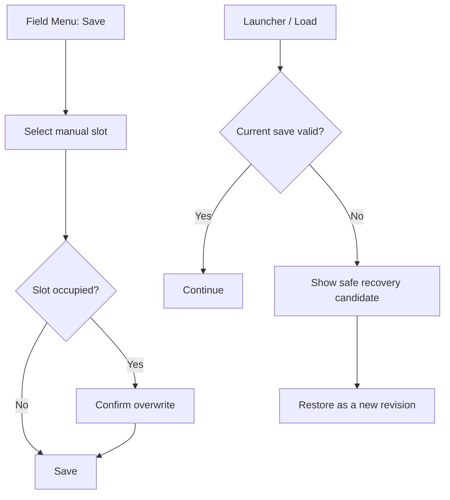

# Delivery 02: Save History, Timeout, and Retention 実装計画

| 項目 | 内容 |
| --- | --- |
| 状態 | Complete (2026-08-12) |
| 優先度 | P1: save durability and bounded operations |
| 主対象 | `shared/game/save-codec`、`shared/schemas`、`web/src/game/save`、Field Menu、save API、Drizzle migration |
| 依存 | Delivery 01 conflict contract |

## 1. 目的

autosave一件だけに依存する状態を終わらせ、通信停止、誤操作、破損、migration失敗から直前の安全な進行へ戻れるようにする。同時に、save requestが無限待機せず、save historyとidempotency operation logが有限容量で運用される契約を作る。

プレイヤー価値は、通信障害でplay開始を妨げられず、重要な選択の前後を自分で保存し、現在のsaveに問題があっても直前の安全地点へ戻れることである。

## 2. 現状と原則

- APIが`autosave`以外を404にし、履歴と復元APIがない。
- cloud loadとwriteにapp-level timeoutがなく、browser fetchがsettleしない間launcherがloadingを続ける。
- operation rowが結果save JSONを毎回保持し、slot削除までpruneされない。
- client local backupは一件と最大32 pending writeであり、server current破損時の世代復旧には使えない。

本Deliveryは「autosaveとmanual saveの役割を分ける」「直前の安全なsnapshotへ戻れる余地を持つ」「failureを正常系として扱う」という原則を満たす。Game State authorityは引き続き実行中の`GameSession`、永続snapshot authorityはrevision付きserver slotとする。

## 3. Scope

- save requestのapp-level timeout、abort、retry policy
- autosaveとmanual saveの役割分離
- `manual-1`から`manual-3`までの固定slot
- server-side save historyと復元
- current save破損時の安全なhistory候補提示
- idempotency operation logの保持期間・件数上限
- save metadata一覧APIとField MenuのSave/Load UI
- DB migration、prune、recovery test

## 4. UX flow



slot一覧は保存日時、map、checkpoint、state revisionを表示する。network unavailable時はcloud/manual操作を無限待機させず、local autosaveからのContinue可否と再試行方法を明示する。

## 5. 設計判断

### 5.1 TimeoutとRetry

- GETは10秒でtimeoutし、短いbackoffで最大一回だけ再試行する。
- PUTは同じidempotency keyを維持できる場合だけ自動再試行する。
- component unmount、logout、route離脱のabortとtimeoutを同じhelperで合成する。
- timeout後もlocal backupとpending operationを残し、launcherを無限loadingにしない。
- retry上限到達後は`queued-offline`または明示的Retryへ遷移する。

### 5.2 Slot policy

- `autosave`: checkpoint到達時に更新する。通常のContinueが使う正本候補。
- `manual-1`–`manual-3`: Field modeかつpending triggerなしの安全地点でのみ上書き可能。
- Event/Battle途中のmanual saveはこのDeliveryでは許可しない。
- manual save作成・上書き・削除には確認を表示する。
- slot IDはshared schemaで列挙し、routeの文字列判定を一箇所へ集約する。

### 5.3 History policy

- current slot更新と同じtransactionで、一つ前の正常snapshotを`game_save_versions`へ移す。
- autosaveは直近10世代、manual slotは各3世代を保持する。
- 履歴はuser、game、slot、revision、savedAt、contentVersion、stateRevision、checksumを持つ。
- restoreは履歴payloadを再検証し、新しいcurrent revisionとして書き込む。過去revisionへDB rowを巻き戻さない。
- current rowをdecodeできない場合は黙って上書きせず、最新の検証可能なhistoryを`recovery candidate`として返す。

### 5.4 Operation retention

- idempotency operationは7日間かつuser/game/slotあたり最新128件を上限とする。
- pruneは成功したwrite transaction後に実行し、現在処理中のoperationを削除しない。
- このDeliveryでは現行operation payloadを維持し、保持上限によって容量をboundedにする。version参照への正規化はmigration複雑度と実測DB容量を比較するまで行わない。
- 保持期間を超えたidempotency keyの再送は通常のrevision conflictとして安全に失敗させる。

## 6. State・Schema・Ownershipへの影響

- `GameState` schemaとgameplay Command/Eventは変更しない。save操作はSession ruleではなくsave coordinatorが所有する。
- save envelopeをformat v2へ上げ、slot IDを`autosave | manual-1 | manual-2 | manual-3`へ拡張する。
- decoderはformat v1 autosaveをformat v2へlossless migrationする。Game State v1–v4 migrationはその後に既存順序で適用する。
- shared API schemaへslot metadata、history、recovery resultを追加する。
- server serviceがhistory/retention authority、repositoryがtimeout/offline queue、React/Field Menuが選択と確認UIを所有する。
- settings、audio、presentation stateはsaveへ追加しない。

## 7. 実装手順

1. timeout/abortを合成するbrowser request helperとfake timer testを追加する。
2. `GameSaveSlotId`、slot metadata、history/recovery response schemaを追加する。
3. `game_save_versions` migration、index、foreign key、retention queryを追加する。
4. save serviceのtransactionをcurrent更新、history追加、operation追加、pruneの順で構成する。
5. slot一覧、history一覧、restore、delete APIを追加し、authorizationとsize limitを共通化する。
6. repositoryをslot単位に拡張し、autosave pending queueとmanual operationを分離する。
7. Field MenuへSave/Load画面、日時・map・checkpoint表示、上書き確認を追加する。
8. launcherへcurrent破損時のrecovery candidateと復元確認を追加する。
9. migration、retention、timeout、offline、recovery、slot isolation testを追加する。

## 8. Acceptance Criteria

- save GET/PUTが応答しない場合、10秒と定義回数内にloadingを終了し、local fallbackまたはRetryを表示する。
- PUT timeout後の再送でrevisionとrewardが一回だけ増える。
- autosaveと三つのmanual slotが混在せず、user間でも分離される。
- Battle/Event途中ではmanual save操作が無効で、理由が表示される。
- 11回目のautosave後、historyが定義した10世代を超えない。
- operationが7日または128件の上限を超えず、現在のretry keyはpruneされない。
- current saveが破損していても、最新の正常historyを候補として提示できる。
- restore後は新しいrevisionとして保存され、復元前のcurrentもhistoryから追跡できる。
- v1–v4 local migrationと現行autosave Continueが退行しない。

## 9. Failure・Recovery・Security・Performance・Accessibility

- timeout、offline、401 refresh失敗、409 conflict、413 size超過、current corruptionを別resultとして扱う。
- restore対象も現行content registryとchecksumで再検証し、不正historyを飛ばして次候補を提示する。
- list/history/restore/deleteの全routeでuser ownershipをserver側から取得し、client指定ownerをauthorityにしない。
- prune queryはuser/game/slot indexを使用し、全table scanを避ける。history一覧はpayloadを返さずmetadataだけを返す。
- slot UIはDOMまたは共通Game Action対応windowとし、focus、確認、Cancel、high contrast、compact viewportを検証する。
- manual save処理中もgame loopを永久停止せず、重複決定入力をlockする。

## 10. Migration・Rollout

1. migrationで`game_save_versions`と必要indexを追加し、現行`game_saves`からcurrent snapshotを初期versionとしてbackfillする。
2. format v1 readとformat v2 writeを先に導入し、既存autosaveを読める状態を維持する。
3. server history/retention APIを有効化してintegration testを通す。
4. launcherのrecovery UI、最後にField Menuのmanual slot UIを公開する。
5. migration rehearsalとbackup確認後にformat v1 write経路を削除する。format v1 read/migrationは維持する。

旧autosave routeは新slot routeのaliasとして一release維持し、client移行完了後に削除する。migrationはtemporary SQLite copyでrow count、checksum、current revision一致を検証してから適用する。

## 11. 検証

```bash
bunx vitest run shared/game/save-codec.test.ts web/src/game/save web/src/game/GameLauncher.test.tsx
bunx vitest run api/modules/game-save api/routes/game-save.route.test.ts api/db
bun run db:migrate
bun run verify
bunx playwright test tests/e2e/smoke.spec.ts --grep "save|checkpoint|browser|recovery"
```

migration testでは空DB、現行`game_saves`だけを持つDB、上限を超えたoperation/historyを持つDBを別fixtureで検証する。本番相当DBに対する破壊的migrationをtestせず、temporary SQLite copyを使用する。

## 12. Non-goals

- 任意数のslot、slot名編集、cloud provider間同期
- Battle/Event途中のquick save
- 複数account間のsave共有
- SQLite file自体のremote object storage backup。手順と責任範囲はDelivery 05で定義する。

## 13. 未決事項と不採用案

- 未決: autosave 10世代、manual 3世代、operation 7日/128件は初期値であり、実測payload容量と復旧頻度をDelivery 05 diagnosticsで再評価する。
- 未決: manual slotのLoadを直接Session開始にするか、autosaveへrestoreしてから開始するか。revision/history追跡が一貫する後者を第一候補とする。
- 不採用: unlimited slot/history。UIとDB容量がboundedにならない。
- 不採用: localStorageだけで履歴を持つ。別browser復旧とserver corruption診断を満たさない。
- 不採用: Event/Battle中quick save。再開可能なpresentation/runtime stateの契約が未定義である。

## 14. 実装結果

- save format v2、autosave＋manual 3 slot、v1 read migration、10秒timeout＋同一idempotency keyでの1回retryを実装した。
- `game_save_versions` migration、autosave 10世代、manual 3世代、operation 7日/128件、SHA-256 checksum、corrupt currentからのverified recoveryを実装した。
- 旧schemaのtemporary SQLite copyへ`0003`を適用し、revision/JSON backfill、integrity、foreign keyを検証した。
- 135 autosave integrationとbrowser E2Eで保持上限、history restore、manual slotからautosaveへの復元を確認した。
- 残存risk: remote object storageへの実backupはdeployment責任であり、手順とRPO/RTOはrunbookへ記載した。
