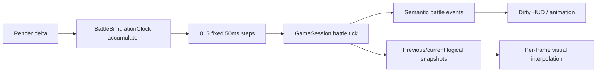

# Delivery 04: Battle Runtime Performance 実装計画

| 項目 | 内容 |
| --- | --- |
| 状態 | Planned |
| 優先度 | P1: bounded frame work |
| 主対象 | battle domain clock、`BattleScene` coordinator/HUD、GameSession subscription、performance gate |
| 依存 | Delivery 03 Session/Scene decomposition |

## 1. 目的

描画frameごとに`battle.tick`、Game State全体のclone・互換性検証・snapshot発行・HUD全文更新を行う構造を、決定論を維持した固定logical tickとdirty presentationへ変更する。描画fpsが30/60/120fpsで変わってもrule結果を一致させ、長いframeやbackground復帰時のcatch-upを有限にする。

プレイヤー価値は、端末性能やrefresh rateによって戦闘速度・結果が変わらず、長時間battleやtab復帰でも入力遅延、連続damage、frame停止を起こしにくくなることである。

## 2. Baseline

実装前に次を同じbattle fixtureで計測し、reportを保存する。

- 60秒simulationのdispatch回数、revision増加数、snapshot clone回数
- p50/p95/p99 frame time
- HUD text更新回数と生成object数
- battle開始から最初のcommand待ちまでのlogical time
- 30/60/120fps入力での最終Battle State差分
- production buildの2D entryとPhaser chunk size

計測はdevelopment debug loggingではなく、test用counterとproduction build Playwright traceを使用する。

本Deliveryは「frame処理にnetworkを要求しない」「desktop 60fps、対応mobile 30fps以上」「sprite補間をGame Stateへ保存しない」という原則を満たす。rule timeはdomain clock、animationと補間はPhaser presentationが所有する。

### Scope

- battle fixed logical clockとbounded catch-up
- action gaugeのpresentation interpolation
- Battle HUDのdirty update
- map/mode/battle phaseのselector subscription
- deterministic fps equivalence testとbrowser performance evidence
- 2D runtime/bundle baselineのno-regression確認

## 3. 設計判断

### 3.1 Fixed logical tick

- Battle ruleは50ms固定step、最大20Hzで進める。
- Sceneはrender deltaをaccumulatorへ加え、1 frameで最大5 stepまで処理する。
- 250msを超える残量はcatch-upを継続せず、diagnostics counterへ記録して上限内へ丸める。
- command選択中、action animation中、pause中はlogical clockを進めない。
- tab復帰時の大きなdeltaでenemy turnやstatus damageを無制限に連続適用しない。

### 3.2 Presentation interpolation

- sprite、action gaugeの見た目は前後のlogical snapshotからrender frameで補間できる。
- 補間値をGame State、save、semantic Eventへ書き戻さない。
- reduced motion時もrule tickは変えず、presentation補間だけを省略する。

### 3.3 Dirty HUD

- HP、MP、status、command、boss intent、messageを個別dirty flagまたはview model比較で更新する。
- `setText()`、window再描画、layout計算を値が変わった場合だけ行う。
- animation中も変更のないHUD全文を毎frame更新しない。

### 3.4 Subscription granularity

- React shellがbattle gauge更新ごとにmap/mode state setterを呼ばないよう、map、mode、battle phaseのselector subscriptionを提供する。
- Sceneがdispatch結果を直接処理する経路と、shellのsemantic subscriptionを区別する。
- 既存の全transition subscriptionは互換性のため維持し、新しいselector APIへconsumerを段階移行する。

## 4. Runtime flow



player commandは次のlogical stepを待たず、awaiting-command中に一度だけGameSessionへdispatchする。input lockとanimation lockはpresentation stateでありsaveへ含めない。

## 5. State・Command・Ownershipへの影響

- `GameState`、Battle State、save format、content schemaを変更しない。
- `battle.tick { deltaMs }` CommandとBattle Event shapeを維持し、Sceneが渡すdeltaを50ms固定値へ変える。
- accumulator、interpolation ratio、dirty flagはPhaser runtime local stateとし、snapshotへ保存しない。
- GameSession selector subscriptionはruntime API追加であり、既存subscriptionを破壊しない。
- Battle Engineはfixed deltaからのpure transition、Scene clockはwall time変換、HUDはpresentation更新を所有する。

## 6. 実装手順

1. battle performance fixture、counter、30/60/120fps equivalence testを追加する。
2. pure `BattleSimulationClock`へaccumulator、step上限、pause/resetを実装する。
3. BattleSceneからframe deltaの直接dispatchを除き、clockが返すfixed stepだけをdispatchする。
4. gauge interpolation用presentation modelを追加する。
5. BattleHudをview model比較またはdirty updateへ変更する。
6. GameSessionへselector subscriptionを追加し、GameScreenをmap/mode/phase selectorへ移行する。
7. browser performance scenarioとbuild budget reportを品質gateへ接続する。
8. battle balance simulation、全battle E2E、reduced motionを再検証する。

## 7. Acceptance Criteria

- 同じinitial snapshot、seed、command時刻列なら、30/60/120fps入力で最終Battle Stateとsemantic Event順序が一致する。
- 60fps時のrule dispatchが毎frameではなく最大20回/秒になる。
- 1秒以上のdelta入力でも一frameのlogical stepが5回を超えず、二重reward、二重status tick、main-thread catch-up loopを起こさない。
- command選択中と演出中にbattle elapsed timeとgaugeが進まない。
- Battle HUDは値が変わらないframeでtext/windowを再描画しない。
- desktop Chromiumの代表battleでp95 frame time 16.7ms以内を目標とし、最低条件として20msを超えるframe比率が1%未満である。
- compact viewport/emulated mobile条件で30fpsを下回る連続区間がなく、inputからcommand受付まで100ms以内である。
- existing balance simulation、victory/defeat/escape、retry、save resumeの結果が退行しない。

## 8. Failure・Recovery・Security・Accessibility

- background復帰、大delta、NaN/負delta、pause/resume、Scene restartをclock unit testへ含める。
- catch-up clamp時も最新の有効Game Stateを維持し、補間snapshotをsaveしない。
- performance diagnosticsにparty名、save payload、dialogueを含めない。
- fixed tick導入でgamepad/touch/keyboardのcommand受付順を変えず、input lock中の押下を二重適用しない。
- reduced motionは補間/animationを省略してもrule timeを変えない。high contrast、font scale、compact layoutはHUD dirty化後も同じ情報を表示する。

## 9. Migration・Rollout

data migrationはない。runtime optionでtest時だけ旧variable tickと新fixed tickを比較し、equivalence fixtureが通った後にproduction defaultをfixed tickへ切り替える。one releaseの検証後に旧variable tick pathと比較optionを削除する。

rolloutはclock、interpolation、dirty HUD、selector subscriptionの順とする。性能改善を一括mergeせず、各段階でbalance simulationとplayable pathを通す。

## 10. 検証

```bash
bun run validate:battle-balance
bunx vitest run shared/game/battle-engine.test.ts shared/game/game-session.test.ts web/src/game/presentation
bun run verify
bunx playwright test tests/e2e/smoke.spec.ts --grep "battle|choices|checkpoint"
bun run build:web
```

性能thresholdはCI machine差を考慮し、単一frameの絶対値だけでfailさせない。固定step回数、上限、dirty update回数は決定的unit testでfailさせ、実時間は複数sampleのpercentileと既存baselineからの退行率で判定する。

## 11. Non-goals

- Battle rule、damage式、AI pattern、balanceの変更
- worker threadまたはserverへのbattle simulation移動
- 120fps描画の保証
- Canvas rendererからWebGL rendererへの強制変更

## 12. 未決事項と不採用案

- 未決: 50ms stepは現行battle speedでの第一候補。25/50/100msをfixtureで比較し、command timingとCPUの条件を満たす最も粗いstepを採用する。
- 未決: selector subscriptionをGameSession本体へ置くかweb adapterへ置くか。shared domainのbrowser非依存を維持できる小さいAPIを選ぶ。
- 不採用: variable render deltaをそのままruleへ渡す。refresh rateとtab復帰で結果が変わる。
- 不採用: compatibility assertionをproductionだけ無効化する。性能のために破損検出を失う。
- 延期: Web Worker。現在のstate transfer量と複雑性に対する必要性をbaselineが示していない。
