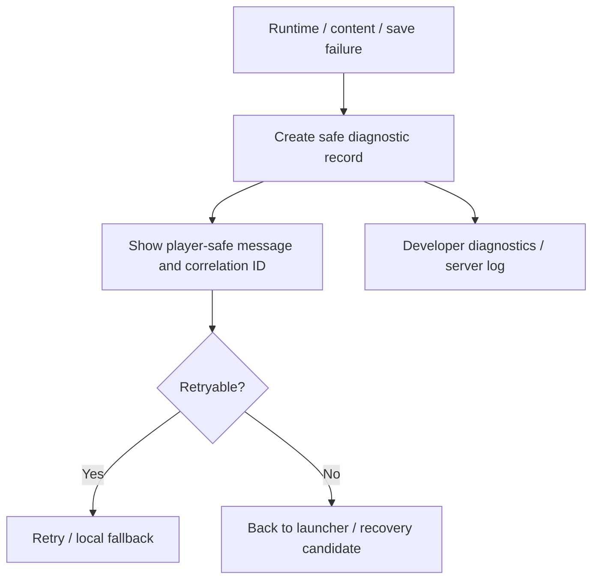

# Delivery 05: Quality, Observability, and Release Gates 実装計画

| 項目 | 内容 |
| --- | --- |
| 状態 | Planned |
| 優先度 | P1: repeatable release evidence |
| 主対象 | component/E2E test、diagnostics、visual regression、bundle budget、runbook |
| 依存 | Delivery 01–04 |

## 1. 目的

unit testが一度通ることだけでなく、保存競合、content failure、runtime error、性能退行をrelease前と障害発生後に再現・診断できる状態を作る。既存の95% coverage gateを維持しながら、Phaser SceneやCanvas表示のようにcoverage対象外の領域をbrowser evidenceで補う。

プレイヤー価値は、白画面や進行消失を「再現できない問題」で終わらせず、原因を特定して安全なsaveへ戻れること、またvisual・操作・loading性能の退行をrelease前に止められることである。

## 2. 現状と原則

- unit/component gateは高coverageだが、focus assertionが全suiteで一度失敗し単独再実行では成功した。
- Phaser runtime/Scene/inputはcoverage対象外で、主にE2Eへ依存する。
- buildは成功するがapplication entryとPhaser chunkに500KB超のwarningがある。
- save/content/runtime failureを横断するstructured diagnostics、correlation ID、recovery runbookがない。

本Deliveryはfailureを正常系として扱い、visual・performance・accessibility・reliabilityをrepository gateの一部にする。diagnosticsは観測だけを行い、Game State authorityやrule結果を変更しない。

### Scope

- focus regressionを含むtest stability
- vendor非依存diagnostics schema/sinkとcorrelation ID
- deterministic visual regression fixtures
- production bundle/performance budget
- SQLite backup/migration/save recovery runbook
- `verify`と`verify:e2e`のrelease evidence統合

## 3. Test stability

- 非retryable runtime error時のfocus契約を、effect timingに依存しないcomponent実装と`waitFor` assertionで固定する。
- focus testを単独、全web suite、全repository suiteの各条件で反復し、失敗時にactive elementを診断出力へ含める。
- fake timerとreal timerを同じtest内で曖昧に混在させない。
- Playwrightのretryで隠さず、各2D scenarioが一回目で成功することをrelease条件にする。
- flaky testをskip、long timeout、広いselectorで回避しない。

## 4. Failure UX flow



error UIは最初の有効actionへfocusし、Retry、Back、Recoveryをkeyboard/gamepad/touchで操作できる。色だけでseverityを表現しない。

## 5. Diagnostics contract

vendor非依存の`GameDiagnosticsSink`を定義し、development collectorとproduction adapterを分離する。

対象event:

- runtime start/stop/error、Scene transition failure
- content manifest/map/asset load duration、retry、fallback
- save load/write/timeout/offline queue/conflict/explicit resolution/recovery
- session ID、semantic sequence、Game State revision、mode、map ID
- battle catch-up clamp、p95 frame bucket、active texture/object count

禁止data:

- access token、cookie、email
- Game State/save JSON全文
- Story Flag、relationship、inventoryの全内容
- dialogue本文や自由入力文字列

fatal error UIには短いcorrelation IDを表示し、diagnostics recordと対応できるようにする。development限定overlayではmap/tile、mode、revision、sequence、RNG draw count、FPS、pending save件数を確認できるようにする。

## 6. State・Schema・Ownershipへの影響

- `GameState`、save format、Game Command、Semantic Event、content schemaを変更しない。
- diagnostics専用version付きschemaを追加し、unknown field拒否、size上限、redaction testを持つ。
- shared domainは任意のerror sink interfaceだけを知り、browser collector、server logger、development overlayはapplication adapterが所有する。
- visual baseline、performance report、bundle manifestはtest artifactでありsave/content artifactへ混ぜない。
- diagnostics送信失敗はgameplay、save commit、recovery UIを失敗させない。

## 7. Visual regression

次のdeterministic screenshot fixtureを固定する。

- Signal Ruins FieldとMap background
- Relay Camp Field
- Event dialogue、choice window
- normal battle command、target selection、boss intent、victory summary
- Field Menu、item、equipment、manual save/conflict/recovery dialog
- 320×192基準、desktop fit、375px compact viewport
- normal/high contrast、normal/reduced motionの主要組合せ

RNG seed、save fixture、animation停止時刻、font/audio unlockをtest fixtureで固定する。意図的なvisual変更はbaseline更新理由を同じchangeへ記録する。

## 8. Performance and bundle budgets

現行production build baseline:

| Chunk | Raw | Gzip |
| --- | ---: | ---: |
| application entry | 約880KB | 約252KB |
| Phaser runtime | 約1.45MB | 約378KB |

最初のgateは既存値からの退行防止とする。

- application entry: gzip 260KB以下
- Phaser runtime: gzip 390KB以下
- Phaserはgame launch前にdownloadされない。
- Action3D heavy runtimeは2D launchと初期routeから分離されたままにする。
- content/asset request数とmapごとの転送量をreportし、新規map追加時に差分を表示する。

budget scriptはVite manifest/build outputから対象chunkを識別し、hash付きfilenameをhard-codeしない。最適化後にthresholdを下げる場合はbaseline reportと同じchangeで更新する。

## 9. Operations and recovery runbook

次を`spec/runbooks`または運用documentへ追加する。

- SQLite WALを含む整合したbackup取得方法
- migration前backup、migration dry run、rollback判断
- user/game/slot単位でcurrent/history/operationを診断するread-only command
- corrupt currentからhistoryを復元する手順
- idempotency log/history pruneの確認方法
- content version mismatch時のdeploy rollbackまたはcompatible bundle復旧
- diagnostics correlation IDからclient/server logを対応付ける方法
- backup retention、復旧責任、RPO/RTOの明記

runbook commandはuser ID、game ID、slotを明示的に要求し、database全体を誤って削除・上書きする既定値を持たせない。

## 10. Repository gate変更

`bun run verify`へ決定的で短い検証だけを残し、browser/visual/performanceを`verify:e2e`へ接続する。

```text
verify
├ content / model / balance validation
├ domain boundaries
├ typecheck / lint / format
├ unit / component / coverage
├ save migration and retention tests
├ deterministic battle performance contract
└ build and bundle budget

verify:e2e
├ playable path and reload
├ map/asset failure Retry
├ two-browser conflict and explicit resolution
├ manual save/history recovery
├ visual regression
├ compact viewport/accessibility
└ runtime isolation and performance evidence
```

## 11. Acceptance Criteria

- focus regression testが単独20回、web suite 5回、repository suite 2回連続で成功する。
- save conflict、timeout、recovery、content failure、runtime fatal errorにcorrelation IDとstructured diagnosticsが残る。
- diagnostics payloadに禁止dataが含まれないことをschema testで保証する。
- 主要Field/Event/Battle/Menuのvisual baselineが決定論的に比較できる。
- application entryとPhaser chunkが定義したbudgetを超えるとbuild gateが失敗する。
- PhaserとAction3Dのroute/launch isolationがnetwork request assertionで維持される。
- temporary production-like SQLite copyからbackup・migration・history restoreをrunbookどおり実行できる。
- `bun run verify`と`bun run verify:e2e`がclean checkout相当の環境で連続成功する。

## 12. Failure・Security・Performance・Accessibility

- collector/transport failure、offline、storage quota、log endpoint 4xx/5xxをsilent gameplay failureへ変換しない。
- diagnostics endpointを導入する場合はauthorization、rate limit、payload size、retentionをserverで強制する。
- correlation IDにuser ID/emailをencodeしない。save JSON、token、cookieがschema testとredaction testを通過しない限り送信できない。
- diagnostics自身のframe costを計測し、productionで毎frame objectを生成しない。performance sampleはbucket/intervalで集約する。
- development overlayはproduction buildで無効化または厳格に保護し、keyboard focusをgameplayから不意に奪わない。
- visual baselineはhigh contrast、reduced motion、compact viewport、focus indicatorを含む。

## 13. Migration・Rollout

1. focus testとdiagnostics schemaを導入し、既存error pathを一つずつadapterへ接続する。
2. development collectorでpayload/redactionを検証してからproduction adapterを有効化する。
3. visual baselineを既存画面から採取し、意図した差分をreviewして初期baselineとする。
4. bundle budgetを現行値より少し上のno-regression thresholdで有効化する。
5. runbook rehearsal後にrelease checklistへ`verify:all`、backup、migration、recovery確認を追加する。

Game State/save/content migrationはない。diagnostics schemaは独立versionを持ち、古いrecordをgameplay復元へ使用しない。旧ad-hoc `console`/dataset diagnosticsは新sinkへ移行完了後に削除する。

## 14. 最終検証

```bash
bun run verify
bun run verify:e2e
bun run build:web
```

実装完了時は、test件数、coverage、E2E scenario数、bundle size、battle performance percentile、save recovery rehearsal結果をこの文書へ記録する。

## 15. Non-goals

- 特定monitoring vendorの導入を完了条件にすること
- production databaseへの自動破壊的recovery
- すべてのpixel差分を無条件にrelease blockerにすること
- coverage除外を増やして数値だけを維持すること

## 16. 未決事項と不採用案

- 未決: production diagnosticsの保存先と保持期間。vendor導入前にschema、redaction、adapter、local/server contractを確定する。
- 未決: visual diff thresholdを画面一律にするか領域別にするか。pixel artのnearest-neighbor領域は厳格、動的effect領域はmaskを第一候補とする。
- 未決: entry chunk削減のtarget。まず260KB gzipで退行を止め、bundle analyzerでroute/library ownershipを確認してから下げる。
- 不採用: flaky testへのretry追加だけで完了とする。focus契約のraceを残す。
- 不採用: Game State全文をerror reportへ添付する。privacyとpayload上限を満たさない。
- 不採用: monitoring vendorが未選定であることを理由にdiagnostics contractを延期する。
