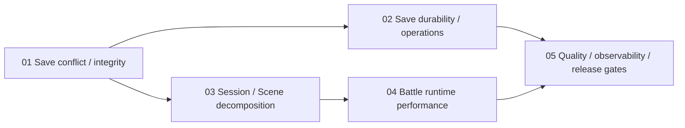

# RPG Foundation Hardening 実装計画

| 項目 | 内容 |
| --- | --- |
| 対応Stage | Stage 6: Server-backed Session hardening / Stage 8: Production Readiness |
| 状態 | Complete (2026-08-12) |
| 対象 | `shared/game`、`web/src/game`、`api/modules/game-save`、品質gate |
| 前提 | Stage 1–5 Complete、Stage 6 server-backed autosave実装済み |

## 1. 目的

現行2D RPG基盤の評価で確認した、保存競合、server-side content整合性、責務集中、frame単位の更新cost、save運用、品質gateの不安定性を解消する。新しいgameplay機能やcontent量を増やす前に、進行を失わないこと、同じ入力から同じ結果になること、障害を検出・復旧できることをrelease可能な契約へ引き上げる。

この計画の完了目標は、基盤評価85点相当のvertical sliceを、長期的なcontent追加とserver運用に耐える状態へ移すことである。

## 2. 評価指摘とDelivery対応

| 評価指摘 | 対応Delivery | 完了時の状態 |
| --- | --- | --- |
| 複数browserの古い進行が新しい進行を上書きし得る | 01 | revision分岐を自動上書きせず、明示的に解決する |
| serverがcontent参照まで検証していない | 01 | 保存前に現行registryとの意味的互換性を検証する |
| autosave 1枠、世代backupとrollbackがない | 02 | manual slotと有限履歴、安全な復元経路を持つ |
| save fetchにapp timeoutがない | 02 | 読込・保存が有限時間で成功、fallback、再試行へ遷移する |
| idempotency operation logが増え続ける | 02 | 保持期間・件数上限とprune testを持つ |
| `GameSession`とSceneへ責務が集中している | 03 | facadeと小さなreducer/controllerへ挙動を変えず分割する |
| subscriber例外がcommit後のdispatchを失敗に見せ得る | 03 | listener障害をstate commitから隔離する |
| battle中に毎frame全state clone・検証・HUD更新する | 04 | 固定logical tickとdirty presentationへ分離する |
| focus testが全suiteで断続的に失敗する | 05 | focus契約を決定的にし、反復testで固定する |
| bundle警告、runtime監視、復旧runbookが未整備 | 05 | 性能予算、diagnostics、release/recovery gateを持つ |

## 3. 実装順序

1. [Delivery 01: Cloud Save Conflict and Content Integrity](./01-cloud-save-conflict-and-content-integrity.md)
2. [Delivery 02: Save History, Timeout, and Retention](./02-save-history-timeout-and-retention.md)
3. [Delivery 03: Session and Scene Decomposition](./03-session-and-scene-decomposition.md)
4. [Delivery 04: Battle Runtime Performance](./04-battle-runtime-performance.md)
5. [Delivery 05: Quality, Observability, and Release Gates](./05-quality-observability-and-release-gates.md)

Delivery 02と03はDelivery 01完了後に独立して着手できる。Delivery 04は責務境界を先に確定するためDelivery 03へ依存する。Delivery 05は全変更のrelease gateを確定する最終Deliveryとする。

| Milestone | Delivery | 相対規模 | Release判断 |
| --- | --- | --- | --- |
| M1 Progress Safety | 01 | Large | stale saveが自動上書きされず、serverが意味的に不正なsaveを拒否する |
| M2 Save Durability | 02 | Extra Large | timeout、manual slot、有限history、recoveryが成立する |
| M3 Maintainable Runtime | 03–04 | Extra Large | 挙動互換の責務分割後、固定tickと性能条件を満たす |
| M4 Production Gate | 05 | Large | visual、diagnostics、bundle、runbookを含むrelease evidenceが揃う |

相対規模は日程見積りではなく、reviewとrollback checkpointの必要量を示す。各Milestoneを独立したrelease候補とし、M1とM2を完了する前に新しい長編content制作へ進まない。

## 4. 全Delivery共通の制約

- 既存の現行saveとv1–v4 migrationを維持する。schema変更時は新migration testを先に追加する。
- stale saveを無確認でserver authorityへ上書きしない。
- idempotent retryとrevision conflictを別の状態として扱う。
- frame単位のsimulation、input、animationをbrowser内に残す。
- `shared/game`はReact、Phaser、browser API、database driverへ依存しない。
- refactor中もSignal RuinsからRelay Campまでのplayable pathを維持する。
- Action3Dのroute isolation、test、bundleを退行させない。
- monitoring vendorや別databaseへの移行を前提にしない。

## 5. 全体Acceptance Criteria

- 二つのbrowser contextが同じrevisionから分岐しても、後着saveが自動的に先行進行を消さない。
- response lossによる同一operation再送は一度だけ適用される。
- contentVersionまたはmaster IDが現行contentと互換でないsaveをserverが拒否し、既存saveを維持する。
- networkが応答しない場合もlauncherとsave statusが有限時間でfallbackまたはRetryへ進む。
- autosave、manual save、直前の有効履歴から復元できる。
- operation logとsave historyが定義した保持上限を超えない。
- Session/Scene分割の前後で同一snapshot・command・seedのtransitionが一致する。
- battle logical tickは描画fpsに依存せず、catch-up上限を超えてmain threadを占有しない。
- runtime error、save conflict、content failure、recoveryをPIIやGame State全文なしで診断できる。
- `bun run verify`と`bun run verify:e2e`が連続実行で安定して成功する。

## 6. Non-goals

- WebSocketによるremote gameplay command
- server-authoritativeなframe simulation、MMO同期
- PostgreSQL、Redis、queue製品への移行
- AI Game Master、生成content
- 新chapter、大量のmap、character、enemy制作
- 戦闘ruleやgame balanceの全面変更
- Phaser、React、Honoのframework置換

## 7. Status更新規約

各Deliveryは`Planned`、`In Progress`、`Complete`のいずれかを記載する。`Complete`へ変更する際は、実装結果、migration結果、品質gate出力、残存riskを同じ文書へ追記する。途中で設計判断を変更した場合は、Acceptance Criteriaを弱めず、理由と互換性への影響を記録する。

各Deliveryは`game-concept.md` 20.1の必須項目を満たし、player value、原則、Scope、UX、schema、ownership、migration、failure/recovery/security、test、performance/accessibility、rollout、未決事項を実装開始前に確定する。

## 8. 実装結果

Delivery 01–05を完了した。最終的な変更点、migration rehearsal、test・coverage・E2E・bundle evidence、残存riskは[実装証跡](./implementation-evidence.md)に集約した。
