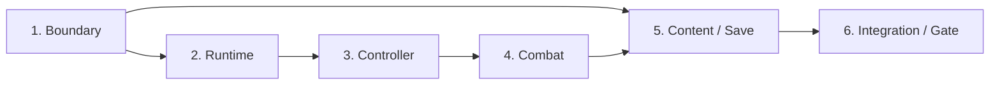

# Stage A1: Browser Action Vertical Slice

## Use when

既存2D RPGを維持したまま、ブラウザ上で三人称3Dフィールドアクションの操作感、性能、制作workflowを検証するときに使う。作品全体を3Dへ移行するStageではなく、継続判断に必要な一つのplayable sliceを作るStageである。

## 目的とプレイヤー価値

ログイン後に独立したAction3D routeを開き、小規模fieldで移動、camera操作、jump、sprint、dodge、通常攻撃、敵1体との戦闘、checkpoint保存、再開までを途切れず体験できる状態を作る。

```text
Login
  → Action3D Launcher
  → Field load
  → Move / Look / Jump / Sprint / Dodge
  → Lock-on / Attack / Enemy defeat
  → Checkpoint Save
  → Exit / Reload / Continue
```

## Delivery plan

| 順序 | Delivery | 状態 | 完了時に証明すること |
| --- | --- | --- | --- |
| 1 | [Domain Boundary and Shared Platform Contract](01-domain-boundary-and-shared-platform.md) | Implemented / Gate pending | 2D/3Dの依存方向、route、共有可能範囲をtestで固定できる |
| 2 | [WebGL Runtime and World Bootstrap](02-webgl-runtime-and-world-bootstrap.md) | Planned | Babylon runtimeを遅延起動・破棄し、独立Canvasへ小規模3D worldを描画できる |
| 3 | [Player Controller, Camera and Collision](03-player-controller-camera-and-collision.md) | Planned | 三人称移動、camera、静的collision、基本animationが安定して動く |
| 4 | [Action Combat Vertical Slice](04-action-combat-vertical-slice.md) | Planned | dodge、attack、lock-on、敵AI、勝敗をAction3D domainで成立させる |
| 5 | [Action3D Content and Save](05-action3d-content-and-save.md) | Planned | 3D contentを検証して読み込み、独立saveからcheckpoint再開できる |
| 6 | [Dual Runtime Integration and Quality Gate](06-dual-runtime-integration-and-quality-gate.md) | Planned | 2D回帰、bundle分離、性能、accessibilityを検証し継続判断を出せる |



## Stage共通の設計判断

- routeは`/games/action-3d`とし、既存`/game`を変更しない。
- Action3D Game Stateのauthorityは`shared/action3d`のSessionに置き、React、Babylon Scene、mesh、animation、localStorageへ分散しない。
- simulationは固定stepを使い、render frame rateとdomain更新を直接結合しない。
- camera、post effect、mesh、animation mixerはpresentation stateでありsaveしない。
- world collisionとtarget queryはruntime port経由とし、Babylon objectをdomainへ渡さない。
- content/saveのversionとstorage keyは2Dから完全に分離する。
- 共有化はsource行数削減ではなく、同じ契約・failure・lifecycleを持つかで判断する。

## Stage共通のNon-goals

- 既存2D RPGの3D置換、2D sourceの削除・移動
- seamless open world、world streaming、procedural terrain
- character切替、party、element reaction、inventory、quest system
- dynamic rigid-body physics、破壊表現、cloth、vehicle
- network multiplayer、frame同期、server-authoritative combat
- native mobile/console build、touch UI
- server save、2D/3D間のsave migration
- WebGPU専用effect、photorealistic rendering、完成asset量産
- Unity相当の汎用editorや独自engineの先行開発

## Provisional performance budget

計測環境、browser version、resolution、device pixel ratio、asset revisionを証拠へ記録する。絶対値はDelivery 2でbaseline取得後に確定するが、A1の暫定合格線は次とする。

- desktop reference environmentでsteady play中60fpsを目標とし、p95 frame time 20ms以下。
- mobile-class reference environmentで30fpsを最低目標とし、p95 frame time 33.3ms以下。
- field開始後のsteady playで50ms超のmain-thread long taskを継続発生させない。
- `/game`を開いた時にBabylon package、Action3D GLB、Action3D textureを取得しない。
- resize、route離脱、React StrictMode再mount後にCanvas、listener、render loop、GPU resourceを重複保持しない。

## Verification

各Deliveryの対象testに加えて、Stage完了時は次をすべて成功させる。

```bash
bun run validate:game-content
bun run validate:action3d-content
bun run validate:domain-boundaries
bun run verify
bun run verify:e2e
```

performanceは通常CIの単発値だけで合否を決めず、同一環境で複数回計測し、中央値とp95を記録する。3D visualはPlaywright screenshotと人間による実機操作確認を併用する。

## Stage完了条件

- 認証済みuserが`/games/action-3d`でNew GameとContinueを利用できる。
- 一つのfieldで移動、camera、jump、sprint、dodge、攻撃、敵撃破、checkpoint保存が成立する。
- reload後に安全なcheckpointから再開し、実行中physics stateを復元対象にしない。
- 2D `/game`のNew Game、Continue、Field→Event→Battle→Fieldが回帰していない。
- dependency validationが2D/3Dの相互importを拒否する。
- 2D routeで3D bundleとassetがloadされない。
- performance、bundle、memory、制作工数の実測結果から、Web継続・scope縮小・engine再選定の判断を記録できる。

## A1後の判断基準

次のすべてを満たす場合はWebGL基盤を継続候補とする。

- performance budgetを無理な画質低下なしで満たす。
- character/controller、animation、collision、combatの変更がdomain boundary内で行える。
- asset importとfield調整を再現可能な手順で行える。
- 2Dと3Dのbundle、save、content、testが独立して保守できる。

次のいずれかがblockingになる場合は、content量産前にUnity等を再評価する。

- target deviceで性能budgetを満たせず、原因がbrowser/runtime制約にある。
- 大規模terrain streaming、native mobile/console、artist向けvisual editorが必須になる。
- animation graph、physics、profiling、asset pipelineの自作保守が作品制作より大きくなる。
- 共有repository内の2D/3D分離がrelease速度を継続的に下げる。
