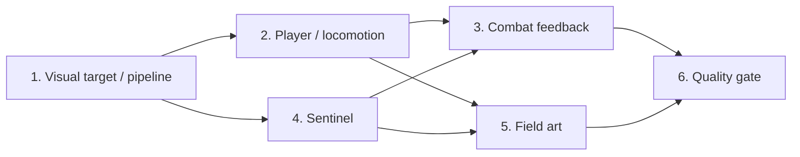

# Stage A2: Character & Combat Presentation

## Use when

Stage A1のplayableな三人称action基盤を維持したまま、仮プリミティブ、root transformだけのanimation、意味の読めないenemy silhouetteをproduction候補の表現へ置き換えるときに使う。

A2は機能数を増やすStageではない。player、enemy、motion、combat feedback、field lightingを一つのart directionで統合し、「操作できる技術demo」から「見た目と動きで遊びたいと思えるvertical slice」へ引き上げる。

## Problem statement

A1はCanvas/WebGL、domain、combat、content、saveの成立を証明したが、visual assetは意図的に最小だった。

- playerは少数のprimitive meshで、顔、髪、衣装、関節、武器の造形が粗い。
- Idle、Walk、Run、Jump、Dodge、Attackはroot nodeの上下・回転が中心で、骨格による身体motionではない。
- enemyはpolyhedronと発光球だけで、何者か、どこが正面か、何を使って攻撃するかが読めない。
- attack trail、impact、hit stop、telegraph、sound、shadow、materialが一つの演出systemとして統合されていない。
- fieldの形状とgameplayは成立しているが、player/enemyを引き立てるlighting、ground variation、prop compositionが不足している。

これはCanvas/Babylonのrenderer限界ではなく、DCC assetとpresentation pipelineを省略した結果である。A2ではruntimeの作り直しではなく、asset制作とanimation/presentation contractを正式な開発対象にする。

## Art direction

仮称を次で固定し、他作品のcharacter、costume、enemy、effectを直接複製しない。

- Player: `Aether Runner`。旅装、短いcape、片手剣、青緑のenergy accentを持つ若いfield scout。
- Enemy: `Aether Sentinel`。古代遺跡を守る石と金属の人型automaton。頭部、胸部core、weapon arm、脚部が離れた距離でも判別できる。
- Field: `Aether Courtyard`。湿った青緑の石、暖色の夕方光、beaconのcyan、enemy coreのamberを基調にする。
- Style: anime-stylized low-poly。photorealismではなく、明確なsilhouette、整理された面、抑えたtexture detail、読みやすいmotionを優先する。

## Player-visible target

```text
Launcher
  → production asset preload
  → readable player silhouette and locomotion
  → Sentinel approach with visible weapon and telegraph
  → three distinct attack motions with trail / impact / hit stop
  → stagger / defeat motion and readable victory composition
```

1280×720の通常playだけでなく、390×844のcompact viewportと128px相当のscreen-space silhouetteでも、playerとenemyの正面、武器、攻撃準備、被弾、撃破を識別できることを品質基準にする。

## Delivery plan

| 順序 | Delivery | 状態 | 完了時に証明すること |
| --- | --- | --- | --- |
| 1 | [Visual Target and Asset Pipeline](01-visual-target-and-asset-pipeline.md) | Implemented | source asset、export、clip/node/material contract、license、validatorを再現できる |
| 2 | [Rigged Player and Locomotion](02-rigged-player-and-locomotion.md) | In Progress | playerの造形、骨格、skin、移動motion、crossfadeがgameplay stateと一致する |
| 3 | [Combat Animation and Feedback](03-combat-animation-and-feedback.md) | In Progress | 3段attack、dodge、hit、trail、impact、sound、camera feedbackが一つのevent pipelineで動く |
| 4 | [Sentinel Identity and Motion](04-sentinel-identity-and-motion.md) | In Progress | enemyの正体、正面、武器、telegraph、state、撃破が見た目だけでも読める |
| 5 | [Field Art, Lighting and Materials](05-field-art-lighting-and-materials.md) | Planned | characterを引き立てるfield、PBR material、shadow、fog、prop compositionが成立する |
| 6 | [Visual Integration and Quality Gate](06-visual-integration-and-quality-gate.md) | Planned | visual review、animation contract、failure、accessibility、bundle、performanceの証拠が揃う |



## Source ownership

- `art/action3d`: editable DCC source、concept、export preset。binary sourceを置く場合はGit LFSの採否をDelivery 1で決める。
- `web/public/assets/action3d`: runtime用GLB、texture、audio。手編集せずexport結果として扱う。
- `web/public/action3d-content`: stable asset ID、node/clip/material contract、size、license、source metadata。
- `web/src/action3d/presentation`: animation controller、VFX、audio bus、shadow/quality profile。
- `shared/action3d`: gameplay authority、combat timing、semantic event、stable entity state。mesh、bone、AnimationGroupを持たない。
- `scripts`: export、inspection、content/model validation、budget report。

## Stage invariants

- animation完了callbackをdamage、invulnerability、victoryのauthorityにしない。
- root motionをlogical positionへ直接適用せず、domain positionへvisualを追従させる。
- clip名、bone名、socket名、material slot名をruntime codeへ散在させず、versioned asset contractで検証する。
- A1のprocedural model generatorはproduction asset生成に使わない。model load失敗時のdiagnostic fallbackとしてだけ残す。
- 2D RPGのart、Phaser scene、content、saveへ依存しない。
- 原神を含む既存作品のcharacter design、costume、enemy silhouette、animation、effectを直接再現しない。
- strong flash、camera shake、chromatic effectはreduced-motion/visual comfort settingで抑制できる。

## Non-goals

- 新しいweapon種、ability、element reaction、projectile、boss mechanic
- 複数playable character、costume switch、character customization
- motion matching、runtime retargeting platform、full-body IK、ragdoll
- cinematic cutscene、voice、facial dialogue、lip sync
- seamless open world、terrain streaming、weather cycle
- custom shader graph editor、汎用particle editor、Unity相当の内製editor
- native mobile/console package

## Provisional asset and performance budget

| 対象 | A2暫定上限 |
| --- | ---: |
| Player runtime GLB | 2.0 MB transfer、50k triangles、70 deformation bones |
| Sentinel runtime GLB | 1.5 MB transfer、35k triangles、60 deformation bones |
| Vertex influence | 原則4 bones以下 |
| Individual texture | 最大2048×2048、UI以外はpower-of-two |
| A2 field初回3D asset合計 | 8 MB transfer以下 |
| Steady draw calls | 60/frame以下 |
| Steady active meshes | 100以下 |
| Desktop p95 frame time | 20 ms以下 |
| Compact p95 frame time | 33.3 ms以下 |

budgetは品質を落とすための最終値ではなく、asset制作中に逸脱を早く発見するgateである。compression、texture resolution、shadow map、particle countは同じreference captureを比較して決める。

## Stage completion criteria

- Aether Runnerが顔、髪、衣装、cape、剣、身体関節を持つskinned humanoidとして表示される。
- Idle、Walk、Run、Jump Start/Loop/Land、Dodge、Attack 1–3、Hit、Defeatがpose bone animationとしてexport/再生される。
- locomotion切替がcrossfadeし、通常速度で目立つfoot sliding、rest-pose pop、clip restart jitterを残さない。
- Sentinelが人型automatonとして識別でき、正面、core、weapon、wind-up、attack、recover、stagger、defeatを色なしでも判別できる。
- sword trail、impact、hit stop、SFX、camera feedback、HUDがsemantic combat event一回につき一回だけ発火する。
- lighting、shadow、material、fog、propがplayer/enemy silhouetteを損なわず、compact viewportでもcombatを読める。
- model/clip/socket/material欠落をbuild validatorが拒否し、runtimeの白画面やsilent animation failureにしない。
- A1のfull playable、save/reload、context loss、bundle isolation、2D routeを回帰させない。
- visual evidence、performance evidence、asset license/source、制作時間を残し、A3へ進むか再評価できる。

## Verification

```bash
bun run validate:action3d-content
bun run validate:action3d-models
bun run validate:domain-boundaries
bun run test
bun run test:coverage
bun run build
bun run test:e2e -- tests/e2e/action3d.spec.ts
bun run test:e2e -- tests/e2e/action3d-visual.spec.ts
```

自動testだけでart qualityを合格にしない。固定cameraのbefore/after capture、turntable、全clip contact sheet、通常速度のgameplay captureを人間がrubricで確認する。

## Implementation progress

2026-08-11にA2-1を完了し、A2-2/A2-4はconceptとの差を縮めるgeometry quality passまで実装した。Runnerは顔・髪・teal/ivory衣装・split cape・剣、Sentinelは楔形兜・同心core・積層装甲・shield・bladeを実画面へ反映済み。A2-3は剣保持姿勢、横倒しを除いた3段attack motion、combo別trail、clip間の全身pose resetまで実装した。残りのfeedback layerは継続中であり、現時点のasset・runtime・検証値と未完了項目は[A2 Implementation Evidence](A2-implementation-evidence.md)を正本とする。
