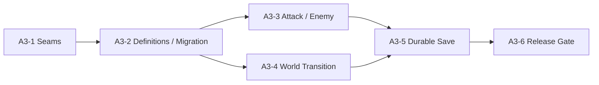

# Stage A3: Scalable Gameplay Foundation

## Use when

A1/A2で成立したAction3D vertical sliceを、敵・攻撃・worldを一種類ずつ追加できる製品基盤へ進めるときに使う。抽象化そのものを目的にせず、第二の実コンテンツを追加した結果として必要な境界だけを固定する。

## 目的

現行のAether Courtyard、Aether Runner、Sentinel、3段通常攻撃を壊さず、次のsliceを成立させる。

```text
Aether Courtyard
  → light combo / heavy slash
  → melee Sentinel / ranged Sentinel
  → north gate transition
  → Aether Causeway（第二world）
  → checkpoint save
  → reloadまたは別browserからContinue
```

第二world・第二enemy・第二attackの追加が、巨大な`simulation.ts`または`Action3dGame.ts`へ条件分岐を足す作業にならず、versioned definition、局所的なdomain処理、presentation adapterの追加で完結することをStageの中心的な成功条件とする。

## 変更前baseline

A3開始時に次を記録し、各Deliveryの比較基準にする。

- `bun run verify`と`bun run verify:e2e`の結果、実行時間、失敗test。
- Aether Courtyardの初期state、60秒の固定入力列による最終state/event列。
- 3体戦闘のdesktop/compact p95、long task、draw calls、active meshes、JS heap。
- Home、Action3D launcher、field開始後のnetwork resource一覧とtransfer量。
- New Game→victory→local checkpoint→reload Continueのsave fixture。
- 現行GLBのbytes、triangles、primitives、materials、bones、clips。

baselineはmachine-readable artifactと短い人間向けsummaryを同じrun IDで保存する。計測環境、browser、viewport、DPR、asset/content versionを必ず含める。

## Delivery plan

| 順序 | Delivery | 状態 | 完了時に証明すること |
| --- | --- | --- | --- |
| 1 | [A3-1 Runtime and Simulation Seams](01-runtime-and-simulation-seams.md) | Implemented | 現行挙動を変えず、simulation/runtimeの責務を小さなmoduleへ分割できる |
| 2 | [A3-2 Versioned Gameplay Definitions and Save Migration](02-versioned-gameplay-definitions-and-save-migration.md) | Implemented | attack/enemy archetypeをversioned dataにし、既存checkpointを失わずstate V2へ移行できる |
| 3 | [A3-3 Second Attack and Enemy Archetype](03-second-attack-and-enemy-archetype.md) | Implemented | heavy attackとranged enemyを既存分岐の複製なしで追加できる |
| 4 | [A3-4 Second World and Transition Lifecycle](04-second-world-and-transition-lifecycle.md) | Implemented | 第二worldをon-demand loadし、安全に遷移・破棄・再開できる |
| 5 | [A3-5 Durable Save Repository and Server Sync](05-durable-save-repository-and-server-sync.md) | Implemented | local fallbackとrevision付きserver checkpointで別browser Continueが成立する |
| 6 | [A3-6 Observability, Performance Budgets, and Release Gate](06-observability-performance-and-release-gate.md) | Implemented | product event、failure、容量・性能予算を自動Gateとして運用できる |

実装結果と検証値は[A3 implementation evidence](A3-implementation-evidence.md)を正本とする。



## 設計原則

- **実例先行**: 第二consumerがないinterfaceやbase classを作らない。
- **stateとdefinitionを分離**: saveには現在値とstable IDを保存し、damageやclip名などのmaster dataを複製しない。
- **domain authorityを維持**: damage、projectile到達、invulnerability、world遷移はanimation callbackやBabylon objectで決めない。
- **semantic eventを維持**: presentation、audio、analyticsは同じdomain eventを購読し、gameplay結果を書き換えない。
- **adapter単位で交換可能にする**: renderer、asset cache、save repository、telemetry providerをdomainから参照しない。
- **versionを暗黙更新しない**: manifest、state、save format、contentの互換性を別々に扱う。
- **計測可能な予算だけを宣言する**: 記録するだけのbudgetはGateと呼ばない。

## Stage共通Non-goals

- ECS、汎用component framework、独自game engineの構築
- visual scripting、汎用level editor、Blender addon
- seamless open world、terrain streaming、procedural world生成
- skill tree、inventory、loot、quest、element reaction、複数playable character
- dynamic rigid-body、ragdoll、cloth、vehicle、network multiplayer
- A2の造形・animation・field art polishの便乗修正
- 2D/Action3DのGame State、combat、content schemaの統合
- vendor固有analytics SDKをdomainへ直接importすること

## Stage completion criteria

- 既存のlight combo/melee Sentinel/Aether Courtyardが同じ入力列で同じ結果を返す。
- attackとenemy instanceはstable definition IDを参照し、異なるarchetype追加でsave stateの構造を増やさない。
- heavy attackとranged enemyが新しいdefinitionと局所的なbehavior/presentation追加で成立する。
- 第二worldへ遷移した後、旧worldのmesh、animation、listener、asset参照を重複保持しない。
- V1 local checkpointがV2へ一度だけmigrationされ、失敗時に元payloadを保持する。
- 認証userが別browser contextから同じcheckpointをContinueでき、revision競合を明示的に扱う。
- telemetry無効時もgameplayが完全に成立し、有効時はPIIなしのsession/failure eventを一度だけ送る。
- desktop p95 20.5 ms、compact p95 33.3 msを各3計測window中2以上で満たし、その2 windowでは50 ms超long task 0、draw calls 60以下、active meshes 100以下をCI referenceでassertする。
- Home/launcherではBabylon runtime、world GLB、enemy GLBを取得せず、第二world assetは遷移開始まで取得しない。
- `bun run verify`と`bun run verify:e2e`が成功し、Stage文書と実装状態が一致する。

## Stage verification

```bash
bun run validate:action3d-content
bun run validate:action3d-models
bun run validate:domain-boundaries
bun run typecheck
bun run test
bun run test:coverage
bun run build
bun run test:e2e -- tests/e2e/action3d.spec.ts
bun run verify
bun run verify:e2e
```

追加するA3 E2Eは、V1 save migration、heavy attack、ranged enemy、world transition、第二world checkpoint、別browser Continue、asset遅延load、性能budgetを一つずつ独立testにする。全機能を一つの長いE2Eだけで検証しない。

## 実装優先度と概算

概算は既存codebaseを理解しているengineer 1名を基準とし、production model/animationの新規制作とA2 visual polishを含めない。

| Milestone | Delivery | 優先度 | 概算 | Exit gate |
| --- | --- | --- | ---: | --- |
| Foundation | A3-1 | P0 | 3–5 engineer-days | 現行golden fixture不変、GLB一回load、runtime責務分割 |
| Foundation | A3-2 | P0 | 5–8 engineer-days | definition V3、state V2、V1 migration、現行挙動不変 |
| Expansion proof | A3-3 | P0 | 5–8 engineer-days | heavy/rangedがdefinition追加で成立 |
| Expansion proof | A3-4 | P0 | 6–10 engineer-days | 第二world遷移・遅延load・往復lifecycle成立 |
| Product durability | A3-5 | P1 | 5–8 engineer-days | server正本、offline queue、競合、別browser Continue |
| Release readiness | A3-6 | P1 | 4–6 engineer-days | telemetryと性能/容量budgetが自動Gate化 |

合計は28–45 engineer-daysを目安とする。最初から全期間を確約せず、次の三つのGateで継続判断する。

1. **Foundation Gate**: A3-2完了時点で、既存挙動を保ったままhard-codeがdefinitionへ移ったか。移らなければA3-3へ進まず境界を修正する。
2. **Expansion Gate**: A3-4完了時点で、第二敵・攻撃・worldの追加工数とruntime保守工数を比較する。platform側が過半を占める場合はcontent量産前にengine/toolingを再評価する。
3. **Release Gate**: A3-6完了時点で、target端末、save復旧、failure観測、performance budgetが揃った場合だけA3 featureを既定ONにする。

最小の投資判断単位はA3-1/A3-2である。拡張構造だけを先に検証する場合はここで一度止められる。プレイヤー向けの新しい価値まで検証する場合はA3-4、外部公開する場合はA3-6までを必須範囲とする。

## Rollout

各Deliveryは単独merge可能にし、A3-3以降の新gameplayはdevelopment flagで既存sliceと分離する。flag OFFがA1/A2と同じ結果を返すことを維持し、A3-6のGate通過後に既定ONへ切り替える。rollbackはcontent versionを戻すだけに依存せず、server saveが新versionを保持したまま旧clientから安全に拒否できることを条件にする。

## 判断Gate

A3完了後、次を基にWeb基盤継続またはengine再評価を決める。

- 第二world/敵/攻撃の実装時間のうち、content制作とplatform保守が占めた割合。
- 同一assetのinstance化後のCPU/GPU/memory曲線と、12 enemies時のsimulation cost。
- world transition、save migration、server syncの障害率と復旧可能性。
- artistまたはdesignerがJSON/Blender workflowだけで反復できたか。
- target実機でのperformanceとtouch/native要件の有無。
