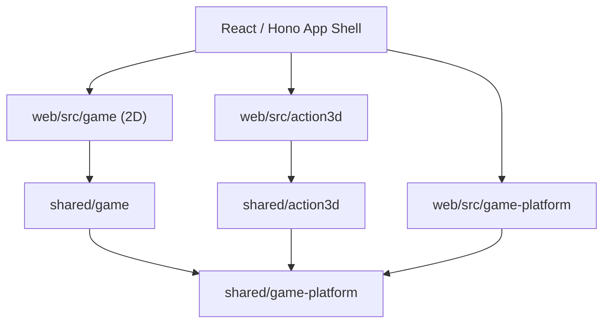

# Action3D Implementation Track

## 位置づけ

このTrackは、既存の2D RPG `Echoes at Dawn`とは別のゲームドメインとして、ブラウザ向け3Dフィールドアクションの実現性を検証し、継続開発可能な最小基盤を作るための計画群である。

ここでいう「別ドメイン」は別hostや別repositoryを意味しない。State、rule、content、save、runtimeのownershipを2Dから分離したbounded contextを意味する。同一originのReact/Hono application内で動かし、認証、app shell、browser adapterなど、意味とlifecycleが本当に同じplatform機能だけを共有する。

既存の[2Dゲームコンセプト](../../game-concept.md)とStage 1–8は変更しない。Action3Dは独立した`A` prefixのStageを持ち、2D側のStage番号や完了条件へ割り込まない。

## Source ownership

| Owner | Source | 内容 |
| --- | --- | --- |
| 2D RPG | `shared/game` | 2D Game State、grid field、event、command battle、2D save codec |
| 2D Runtime | `web/src/game` | Phaser、2D Scene、2D launcher、2D asset loader |
| Action3D Domain | `shared/action3d` | 3D actionのState、Command、Event、rule、save/content schema |
| Action3D Runtime | `web/src/action3d` | Babylon.js adapter、Canvas/WebGL、camera、input、animation、world query |
| Shared Platform | `shared/game-platform` | runtime非依存で、2D/3Dの両方が同じ意味で使う最小contract |
| Shared Web Platform | `web/src/game-platform` | React runtime boundary、local slot storageなどbrowser固有adapter |
| Action3D Content | `web/public/action3d-content`、`web/public/assets/action3d` | 3D manifest、GLB、texture、collision metadata |

既存2Dのsourceを最初に移動・改名しない。`shared/game`という一般名は2D ownerのまま互換維持し、Action3Dからimportしない。共有化は、両domainに実在する同じcontractを確認した時だけ小さく抽出する。

## Dependency rules

禁止する依存:

- `shared/action3d`から`shared/game`へのimport
- `web/src/action3d`から`web/src/game`へのimport
- 2D domain/runtimeからAction3D domain/runtimeへのimport
- `shared/game-platform`から2DまたはAction3Dへの逆依存
- Babylon、Phaser、React、DOM、Storage objectを`shared/*`のdomain stateへ保存すること

## Share policy

| 分類 | 対象 | 方針 |
| --- | --- | --- |
| 直接共有 | Hono server、認証、`useAuth`、root layout、route access、品質pipeline | 既存実装をそのまま利用する |
| 契約を抽出して共有 | runtime mount/dispose、raw local slot I/O、asset load error/progress、安定IDなど | 2つのconsumerと回帰testが揃った時だけplatform層へ抽出する |
| 共有しない | Game State、Game Session、map schema、combat、physics、input action集合、save codec、content registry | 各domainが独立して所有する |
| 後で判断 | Story Flag、RNG、settings、server save protocol | 意味、version、authorization、migrationが一致すると証明できるまで共有しない |

## Technology baseline

- 3D presentationは同じHTML Canvas上のWebGL2で動かす。
- Stage A1のbaseline rendererはBabylon.jsとし、`web/src/action3d/runtime/babylon` adapter内へ閉じる。
- WebGPUはStage A1の完了条件にせず、WebGL2経路の機能・性能が成立した後の最適化候補とする。
- Babylon packageと3D assetはAction3D routeからdynamic importし、Home、2D `/game`、auth画面の初期bundleへ含めない。
- Stage A1ではfull rigid-body physicsを導入せず、kinematic characterと静的world collisionで縦切りを成立させる。物理engineは必要性とCSP、WASM、bundle影響を測ってから別Deliveryで決定する。

## Stage plan

| Stage | 状態 | 目的 |
| --- | --- | --- |
| [A1: Browser Action Vertical Slice](01-browser-action-vertical-slice/README.md) | In Progress | 独立domain、3D runtime、移動、戦闘、content、saveを一つの小規模fieldで成立させる |

後続StageはA1の性能・制作速度・保守性の証拠を確認してから追加する。巨大world、複数character、element system、server saveなどをA1中に先取りしない。

## Track invariants

- `/game`の2D playable path、save key、content versionをAction3D都合で変更しない。
- Action3Dのsaveとcontentは2Dと別namespace、別schema version、別migration履歴を持つ。
- renderer/physics objectではなくserializableなdomain stateだけを保存する。
- 2Dと3Dの両方で`bun run verify`と`bun run verify:e2e`を通す。
- 共通化のためだけの全面rename、directory移動、base class階層を作らない。
- A1完了時にCanvas/WebGL継続かUnity等へ移るかを、実測値と制作負荷で判断する。
